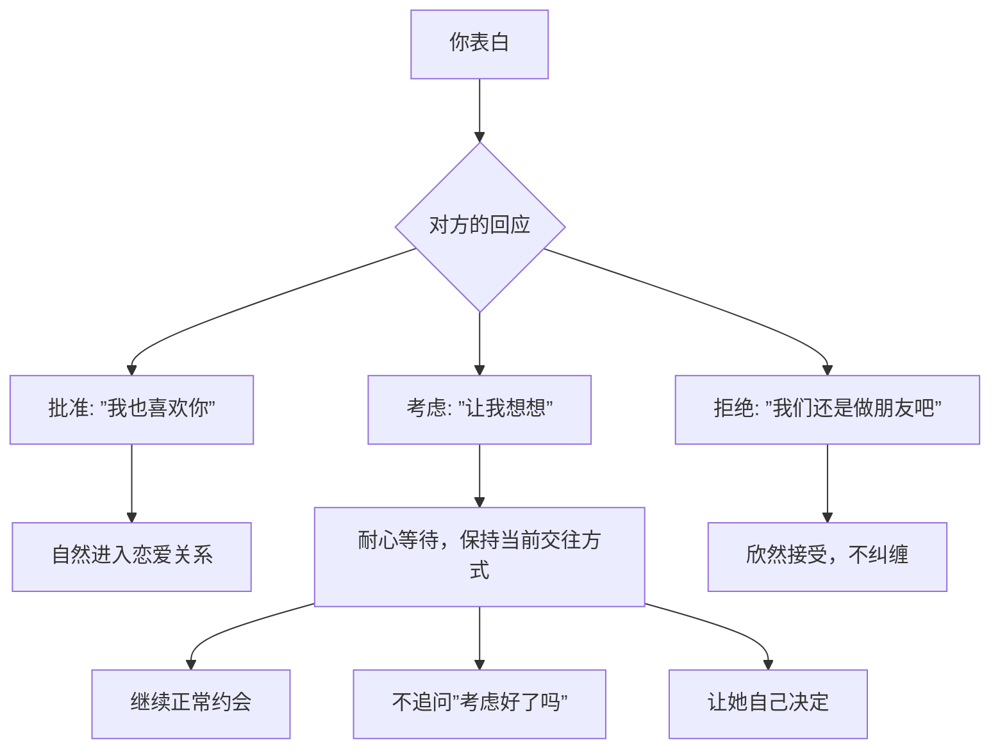

# 第29课：表白的陷阱

## Learning Objectives
- 理解"表白不是一锤子买卖"这一核心理念
- 掌握表白后三种可能回应（批准、考虑、拒绝）的正确应对方式
- 学会在对方说"考虑"时保持耐心和正常交往

## Core Idea

很多人对表白有一个致命的误解——**把表白当成一锤子买卖**。

他们以为表白就像打牌时甩出王炸，要么赢要么输，一局定胜负。这种心态导致他们在表白时极度紧张，表白后极度焦虑，最终破坏了原本良好的关系。

### 表白的本质：提交申请

不要把表白当成"宣告胜利"，而要当成"提交申请"。

### 三种回应的应对策略

#### 1. 她批准了

这是最好的结果。直接进入恋爱关系即可，不需要额外的仪式或确认。

#### 2. 她说"考虑一下"

这是最常见的回应，也是最能检验一个男人成熟度的时刻。

**错误做法**：
- 每天追问"考虑得怎么样了"
- 态度突然变得讨好，试图通过"表现好"来换取批准
- 变得患得患失，失去了原本的魅力

**正确做法**：
- 说"好的，不着急"，然后**保持之前的交往方式**
- 继续正常约会、正常聊天，就好像没发生过表白这件事
- 让她在没有压力的情况下自己得出结论

> [!WARNING] "考虑期"的大忌
> 对方说考虑时，最忌讳的是"努力表现"——你认为只要对她更好，她就会同意。但事实上，你越努力讨好，越显得不自信，她反而越犹豫。保持原状、保持自信，才是最好的策略。

#### 3. 她拒绝了

**正确做法**：欣然接受，不纠缠。
说一句"好的，明白了，希望还能做朋友"，然后潇洒退场。你的坦然反而会让她高看你一眼，甚至可能在未来改变想法。

> [!TIP] Key Insight
> 不要把表白当一锤子买卖。表白是提交申请——可能批准、可能说考虑、可能拒绝。对方说考虑时要耐心等待，保持之前的交往方式。被拒了就欣然接受。你越是不把"结果"当回事，越能保持魅力。

## Worked Example

**错误案例：** 小张和女生约会了几个月，气氛一直不错。他正式表白后，女生说"让我考虑一下"。小张第二天就开始追问"考虑好了吗"，接下来每天送礼物、献殷勤，说话也变得小心翼翼。女生觉得压力山大，一周后回复说"我们还是做朋友吧"。

**问题分析：** 小张的"过度努力"传递了不自信的信号。女生原本可能只是想多观察一下，但小张的焦虑表现让她失去了兴趣。

**正确做法：** 表白后女生说考虑，小张笑着说"没关系，你慢慢想"。然后约她出来还是正常聊天、正常相处，不卑不亢。这种态度会让女生觉得"他是真的自信，不是装的"，反而更容易做出积极的决定。

## Practice

> [!QUESTION] Self-check
> 你表白了，女生说"让我考虑一下"，你接下来应该做什么？A. 每天发消息关心她 B. 和她保持之前的交往节奏 C. 送贵重的礼物表达诚意 D. 追问她的想法

Reveal answer

正确答案：B。

保持之前的交往节奏是最佳选择。原因：
- 你继续正常相处，说明你不焦虑、自信
- 你给了她空间，她不会有压力
- 之前的相处方式让关系自然发展

错误的选项分析：
- A和C：过度的关心和送礼会显得不自信，反而减分
- D：追问会给对方压力，导致她为了逃避压力而拒绝

## Next Step

Continue with the next lesson or complete the review task above before moving on.