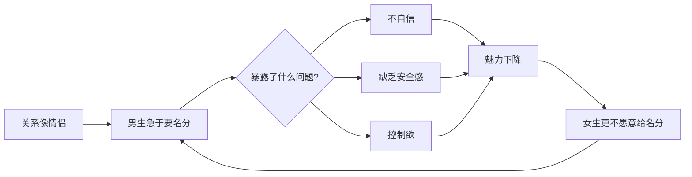

# 第30课：低安全感是男人的大忌

## Learning Objectives
- 理解"低安全感"对男性魅力的破坏性影响
- 学会在关系中展现自信和从容，不急于求成
- 掌握"享受当下"的关系心态及其背后的吸引力原理

## Core Idea

在追求和维系关系的过程中，**低安全感是男人的大忌**。

### 典型案例

阮琦老师提到一个真实案例：一个学生和女孩已经相处得像情侣一样了——牵手、拥抱、约会，亲密无间。但女孩一直没有给他"名分"（没有正式确认恋爱关系）。这个学生非常焦虑，急于"转正"，每天都在想"她到底爱不爱我"、"为什么不确定关系"。

> [!WARNING] 越努力越减分
> 这个学生的"急于转正"行为，恰恰反映了他的不自信。他越是表现出焦虑、越是努力证明自己、越是急于得到名分——就越是让女生觉得他不够自信。而"不自信"本身就是减分项。这是一个恶性循环：不自信导致急于确定关系——急于确定关系暴露不自信——不自信让他失去魅力——失去魅力让她更不愿意给名分。

### 为什么低安全感会破坏吸引力

### 正确的做法

**享受当下，顺其自然。**

当你们已经像情侣一样相处时，名分只是一个标签。如果你能享受当下的快乐——在一起的时候开心，对方快乐你也快乐——不在意那个"官方认证"，这本身就是最大的自信。

| 低安全感的表现 | 自信的表现 |
|--------------|-----------|
| "你到底爱不爱我" | "和你在一起很开心" |
| "为什么不确认关系" | "我们的关系不需要标签" |
| "你是不是不喜欢我了" | "我感受到你的喜欢就够了" |
| 急于推进关系 | 享受当前的每一步 |
| 患得患失 | 顺其自然 |

> [!TIP] Key Insight
> 学生和女孩像情侣一样了但女孩不给名分，他急于转正。这反映了男人的不自信，这种努力行为本身让女孩觉得你不自信而减分。正确做法：享受当下相处，对方快乐我快乐，顺其自然。当你不执著于"结果"时，你反而最有魅力。

## Worked Example

**错误案例：** 你和女生已经密切约会两个月，每周见2-3次，有亲密的身体接触，她也会主动找你聊天。但你总觉得没有"名分"心里不踏实。有一天你终于忍不住了，严肃地和她谈："我想知道我们到底是什么关系？"她犹豫了一下说"我觉得还不到时候"。你更加焦虑，开始加倍对她好，试图用付出来换取她的确认。结果她反而开始疏远你。

**问题诊断：** 你的焦虑让她看到了你的不安全感。当一段关系让你变得焦虑、不自信时，对方也会产生压力，想要逃离。

**正确做法：** 放下对"名分"的执念。你们的相处本身已经说明了一切——她愿意花时间陪你、愿意和你有亲密接触、会主动找你。这些比一个"恋爱关系"的标签更有说服力。继续做好你自己，享受和她在一起的每一刻，当她感受到你的从容和自信时，她反而会主动想要确认关系。

> [!NOTE] 终极道理
> 你越想抓住的东西，越容易从指缝中溜走。你越放松，越不在意结果，结果反而越好。这不仅适用于追求女生，也适用于一切人际关系的经营。

## Practice

> [!QUESTION] Self-check
> 你和一个女生已经像情侣一样相处了几个月，但她还没有正式确认关系。你感到很焦虑，以下哪个是正确的态度？A. 找个时间严肃地谈清楚，不确认就分手 B. 用加倍的好来感动她 C. 享受当下的相处，不急于要名分 D. 减少见面，逼她表态

Reveal answer

正确答案：C。

享受当下、不急于要名分，这是最吸引人的态度。

错误选项分析：
- A：强制确认，等于逼她做决定，大概率是拒绝
- B：加倍讨好，暴露不安全感，让她失去兴趣
- D：用"冷落"来施压，显得幼稚且不成熟

记住：当你们已经像情侣一样相处，"名分"只是一个时间问题。你的从容和自信会让她更愿意和你在一起。如果她始终不愿意给名分，那问题也不在于你没有"逼她"，而在于你们的吸引力基础本身需要提升。

## Next Step

完成第30课意味着你已经完成了整个《魔鬼约会学30步脱单秘籍》的学习。回顾所有课程笔记，将学到的原则应用到实际生活中，持续练习和反思才是真正的成长之道。