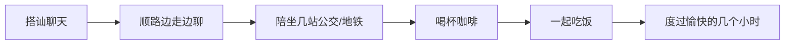
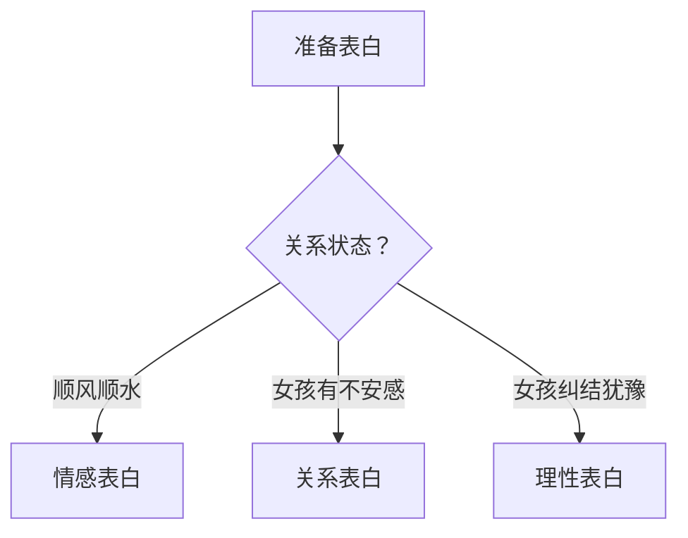

# 技巧速查

## 一、心态建设

### 双赢心态检查清单
- [ ] 我在这段关系中快乐吗？
- [ ] 对方和我在一起快乐吗？
- [ ] 我是在"付出"，还是在"分享"？

### 走出舒适圈
- 每天出门时带上"社交心态"
- 看到感兴趣的女孩，3秒内决定是否上前
- 告诉自己：90%的男人都不敢，迈出这一步已经领先

## 二、搭讪技巧

### 搭讪话术模板

**入门版（最直接）**
> "你好，我想认识你，能不能加个微信？"

**进阶版（先交流再加）**
> "你好，我刚才在那边看到你，觉得很有气质，想过来认识一下。你经常来这边吗？"
> [对方回答]
> "我很少来这，因为我工作在XX那边，今天来是因为……"

### 少问多说公式
```
提问 + 对方回答 + 自我回应 = 自然交流
```

**示例：**
- Q: "你经常来这儿逛街吗？"
- A: "偶尔来。"
- 你: "我很少来这，工作在XX那边比较远。今天来是因为有朋友推荐这边的餐厅。"

### 应对女孩常见提问

| 女孩问 | 含义 | 回答策略 |
|--------|------|---------|
| "你为什么想认识我？" | 对过去好奇 | 讲事实经过：在哪看到你、什么感觉 |
| "你有什么事？/你想干什么？" | 问未来目的 | 回答想交个朋友 |
| "你是推销的吗？" | 有戒心 | "不是，我是做XX的"（否认+说明身份） |
| "你到底想干什么？"（反复问） | 有兴趣但不确信 | 坚持同样回答不变 |

### 加微信要点

```
1. 先交流3-5分钟（观察对方态度）
2. 态度好（微笑）→ 直接说"加个微信吧"
3. 不找借口、不兜圈子
4. 简单直接是男性魅力
```

## 三、即时约会流程



## 四、微信聊天

### 首要原则
- 目标不是聊开心，是约出来见面
- 不犯错比出彩更重要
- 聊不来就放着，明天再继续

### 两条路径
```
路径A：能聊起来 → 聊好了再约
路径B：聊不起来但态度好 → 直接约
```

### 绝对禁止
- ❌ 刚认识就发长篇真情告白（情感过度）
- ❌ 对方说什么都"你好棒""你好厉害"（跪舔）
- ❌ 没话找话连续几天发"在做什么"
- ❌ 用表情包和语气词软化邀约

### 第一条微信策略
```
时间：搭讪后10分钟-2小时内
内容：与搭讪场景相关
     "上车了吗？"
     "刚才路过遇到你的地方，顺便买了个冰淇淋"
目的：利用社交惯性延续交流
```

## 五、邀约技巧

### 三步走流程
```
第一步：约意向
  "哪天出来吃饭吧"（直接干脆）
  
第二步：确认时间（过两天）
  "这周六有空吗？"
  
第三步：确认地点（提前1-2天）
  "周六中午XX酒店餐厅，我来接你？"
```

### 目的性太强判断标准
1. ⚠️ 要求是否逾越当前关系层级？
2. ⚠️ 被拒后是否还在反复要求？

**两者都不违反 → OK，不用担心**

## 六、约会实战

### 首次约会DOs & DON'Ts

| ✅ 要做 | ❌ 不要做 |
|---------|----------|
| 安排在中午（保证时长） | 看电影（零交流） |
| 轻松聊天（多笑、有表情） | 呆头呆脸 |
| 选星级酒店餐厅/咖啡厅 | 去商场随便找地方 |
| 聊得开心就延长 | 着急赶下一个场 |
| 让气氛自然放松 | 装得很完美 |

### 约会时长
> **9小时一次约会 > 3次3小时约会**
>
> 时间长了才能卸下伪装，流露本性

### 电影选择（中后期）
```
✅ 喜剧片 → 轻松愉快
✅ 恐怖片 → 有利于推进关系
❌ 性感明星主演的电影 → 分散注意力
```

## 七、关系进阶

### 送礼策略

| 关系状态 | 送礼时机 | 效果 |
|---------|---------|------|
| 未追上 | 出其不意（非节日） | ⭐⭐⭐⭐⭐ |
| 未追上 | 重大节日（情人节/圣诞） | ⭐（差） |
| 已追上 | 重大节日 | ⭐⭐⭐⭐ |

### 表白方式选择



### 表白后应对
```
对方反应 → 你的策略
批准了   → 恭喜！
说考虑   → 耐心等待，保持现状
拒绝了   → 欣然接受，体面退出
```

> [!IMPORTANT]
> 表白不是一锤子买卖，而是提交一份申请。耐心和从容是最有力的武器。