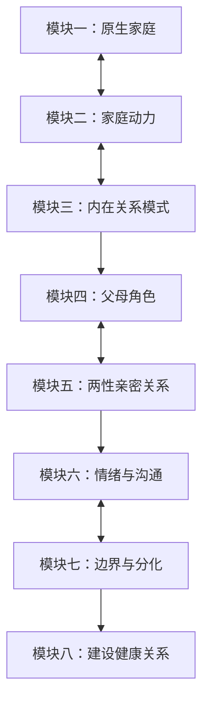

# 课程地图与学习路径

## 学习路径

本课程按"觉察 → 理解 → 行动"的逻辑递进组织：

## 模块详情

### 模块一：原生家庭与早期关系模式
| 课节 | 主题 | 知识点 |
|------|------|--------|
| 发刊词 | 超越原生家庭 | 中国式家庭结构、走出原生家庭的路径 |
| 01 | 家庭里的忠诚 | 命运复制、跨代忠诚、子女对父母的忠诚 |
| 02 | 满足感和攻击性 | 攻击性的来源、未被满足的需求 |
| 03 | 理想化与贬损 | 分裂机制、理想化与贬损的交替 |
| 04 | 不健康的自恋 | 健康自恋vs恶性自恋、"为你好"的控制 |
| 05 | 认同和投射性认同 | 认同的心理机制、投射性认同的互动 |
| 06 | 权力和权力剥夺 | 家庭中的权力斗争、存在感证明 |
| 07 | 被照顾与自给自足 | 过度照顾的伤害、独立与依赖 |
| 08 | 自我价值的冲突 | 付出不被认可的困境、价值感来源 |
| 09 | 内疚感冲突 | 内疚的根源、健康内疚vs病态内疚 |

### 模块二：家庭动力系统
| 课节 | 主题 | 知识点 |
|------|------|--------|
| 10 | 家庭动力不足 | 死气沉沉的家的特征 |
| 11 | 家庭动力涣散 | 各自为营、缺乏凝聚力 |
| 12 | 动力崩溃 | 一点就爆炸的家庭、情绪爆发机制 |
| 13 | 谁是最需要照顾的人 | 家庭中的"病人"角色 |
| 14 | 为什么有些家庭成员老生病 | 疾病的心理功能 |
| 15 | 未出生的家庭成员的影响 | 流产、夭折对家庭的影响 |
| 16 | 三角关系 | 三角关系的四种类型 |
| 17 | 核心恐惧 | 家庭中的相互牵制 |
| 18 | 脱离家庭丑闻的影响 | 如何应对家庭羞耻事件 |

### 模块三：内在关系模式
| 课节 | 主题 | 知识点 |
|------|------|--------|
| 19 | 个体化与依赖 | 相爱又独立的秘密 |
| 20 | 强迫性重复 | 性格行为模式的原生家庭根源 |
| 21 | 客体内化 | 被对待的方式就是对待世界的方式 |
| 22 | 依赖满足的人和完美父母 | 配对关系模式一 |
| 23 | 友好顺从的人和溺爱赞赏的父母 | 配对关系模式二 |
| 24 | 破坏性的人与惩罚性的父母 | 配对关系模式三 |
| 25 | "孤儿"和以自我为中心的父母 | 配对关系模式四 |
| 26 | 失控愤怒的人与无能的父母 | 配对关系模式五 |
| 27 | 控制性全能自我和虚弱他人 | 配对关系模式六 |
| 28 | 攻击竞争性自我和惩罚报复性他人 | 配对关系模式七 |
| 29 | 走出全能自我和全能父母的幻觉 | 幻灭与成长 |
| 30 | 完成分离才能更好地成长 | 个体化分离的完成 |
| 31 | 疗愈童年创伤 | 接受、修复、阻断 |

### 模块四：父母角色与亲子关系
| 课节 | 主题 | 知识点 |
|------|------|--------|
| 32 | 产后抑郁症和原生家庭 | 产后抑郁的心理根源 |
| 33 | 我为什么会是我 | 自我认同的建构 |
| 34 | 爸爸的五个功能 | 供养、护佑、规训、传道、胜利 |
| 36 | 为什么有的女孩容易吸引渣男 | 父爱缺失的影响 |
| 37 | 父爱缺失带来的无力感 | 男性成功障碍 |
| 38 | 妈宝男的形成 | 母子依恋过度 |
| 39 | 缺席的父亲 | 父亲角色缺失的弥补 |
| 40 | 为什么我总要去哄父母 | 亲子角色颠倒 |
| 41 | "男人都不是好东西" | 母亲话语的代际影响 |
| 42 | 单亲妈妈如何做好父亲角色 | 好爸爸形象的创造 |
| 43 | 孝顺与爱 | 孝顺≠爱 |
| 44 | 妈妈为什么焦虑 | 理想妈妈的崩塌 |
| 45 | 脱离被强迫的角色 | 自由选择自己的角色 |
| 46 | 家庭角色混乱问题 | 角色厘清的方法 |

### 模块五：两性亲密关系
| 课节 | 主题 | 知识点 |
|------|------|--------|
| 47 | 依恋类型测试 | 安全型、迷恋型、冷漠型、恐惧型 |
| 48 | 亲密关系就是你的内在关系模式 | 对立模式vs合作模式 |
| 49 | 期待是亲密关系的杀手 | 不合理期待的危害 |
| 50 | 亲密关系的阶段和挑战 | 关系发展周期 |
| 51 | 性的模式就是关系的模式 | 性心理与关系质量 |
| 52 | 爱的勒索者/操控者 | 情感勒索的识别与应对 |
| 53 | 婚姻中的讨好与指责 | 不良互动模式 |
| 54 | 为什么无法好好恋爱 | 恋爱障碍的深层原因 |
| 55 | 另一半出轨的几种可能 | 出轨的心理动因 |
| 56 | 出轨后的愧疚与回归 | 修复的路径 |
| 57 | 为什么离不开伤害你的人 | 创伤依恋 |
| 58 | 男人女人在追求什么 | 性别差异与需求 |
| 59 | 处理离婚事件 | 离婚的心理调适 |
| 60 | "男孩丈夫"如何成为男人 | 男性心理成长 |
| 61 | "女孩妻子"如何成为女人 | 女性心理成长 |
| 62 | 夫妻关系是第一位的 | 家庭序位 |
| 63 | 让爱情保鲜 | 长期关系维护 |
| 64 | 他为什么需要那么多女人 | 花心的心理根源 |
| 65 | 总结：父母关系是模板 | 关系模式的代际传承 |

### 模块六：情绪与沟通
| 课节 | 主题 | 知识点 |
|------|------|--------|
| 66 | 显性情绪和隐形情绪 | 情绪的双层结构 |
| 67 | 家是垃圾场还是蓄水池 | 家庭的情绪功能 |
| 68 | 为什么对待家人情商为零 | 安全环境下的情绪宣泄 |
| 69 | 回家的压抑感 | 家庭情绪氛围 |
| 70 | 表达情绪vs情绪式表达 | 情绪表达的健康方式 |
| 71 | 暴力还是沟通 | 非暴力沟通 |
| 72 | 长期不表达情绪 | 情绪压抑的危害 |
| 73 | 吵吵更健康 | 建设性冲突 |
| 74 | 没有笑脸的家人 | 情绪冻结 |
| 75 | 情绪蔓延与阻断 | 家庭情绪管理 |
| 76 | 同情与嫌弃 | 复杂的家人情感 |
| 77 | 共情的重要性 | 情绪相互影响 |

### 模块七：家庭边界与自我分化
| 课节 | 主题 | 知识点 |
|------|------|--------|
| 78 | 叛逆的机会 | 健康的叛逆是自我确立 |
| 79 | 父母与我们住在一起 | 代际同住的边界 |
| 80 | 小金库与敲门 | 隐私与边界的建立 |
| 81 | 爸妈吵架不要拉上我 | 三角关系的破解 |
| 82 | 妒忌妈妈抢了爸爸 | 俄狄浦斯情结 |
| 83 | 凤凰男与樊胜美 | 原生家庭负担与亲密关系 |
| 84 | 太负责任是在剥夺家人 | 过度负责的负效应 |
| 85 | 互相纠缠的伤害 | 纠缠型家庭的特征 |
| 86 | "老敬小"的智慧 | 家庭中的自我负责 |
| 87 | 边界与开门 | 边界设立的矛盾 |
| 88 | 无法面面俱到 | 取舍的智慧 |
| 89 | 期望家人改变是自寻烦恼 | 改变自己vs改变他人 |
| 90 | 有些亲戚不要也罢 | 选择性断绝关系 |
| 91 | 边界与自尊 | 边界的价值 |
| 92 | 冰山原理 | 理解家人隐藏的感受 |

### 模块八：建设健康关系
| 课节 | 主题 | 知识点 |
|------|------|--------|
| 93 | 四种不良沟通模式 | 讨好、指责、超理智、打岔 |
| 94 | 一致性沟通 | 萨提亚健康沟通模式 |
| 95 | 家庭仪式感 | 仪式的情感连接功能 |
| 96 | 成全与滋养 | 爱的双向流动 |
| 97 | 告别消耗式关系 | 识别和离开消耗关系 |
| 98 | 救世主与委屈的人 | 拯救者心态的陷阱 |
| 99 | "我们"的表达方式 | 合作的开端 |
| 100 | 接纳、看见和链接 | 爱的三个维度 |

### 彩蛋：亲子关系专题
| 课节 | 主题 | 知识点 |
|------|------|--------|
| B01 | 孩子如何失去自信 | 自信培养 |
| B02 | 家有宅孩子 | 孩子社交回避 |
| B03 | 穷人家的富二代 | 不合理溺爱 |
| B04 | 不敢反抗的孩子 | 顺从的危害 |
| B05 | 男孩穷养女孩富养 | 性别教育误区 |
| B06 | 家有二孩 | 手足竞争处理 |
| B07 | 孩子几岁分床睡 | 分离个体化时机 |
| B08 | 青春期叛逆的谎言 | 叛逆的本质是成长 |

---

## 学习建议

1. **按顺序学习**：概念层层递进，前面的知识是后面的基础
2. **做笔记**：每个核心概念结合自身经历反思
3. **练习**：学完沟通和边界模块后，尝试在生活中应用
4. **回顾术语表**：遇到不熟悉的概念随时查阅 [[reference/0000-glossary]]

---

*课程来源：胡慎之《重建亲密关系》（喜马拉雅）*