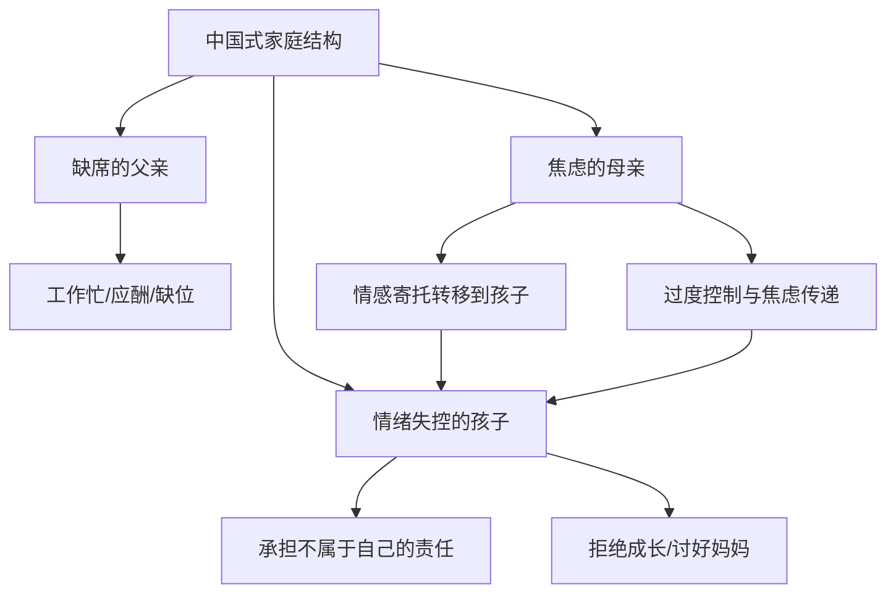
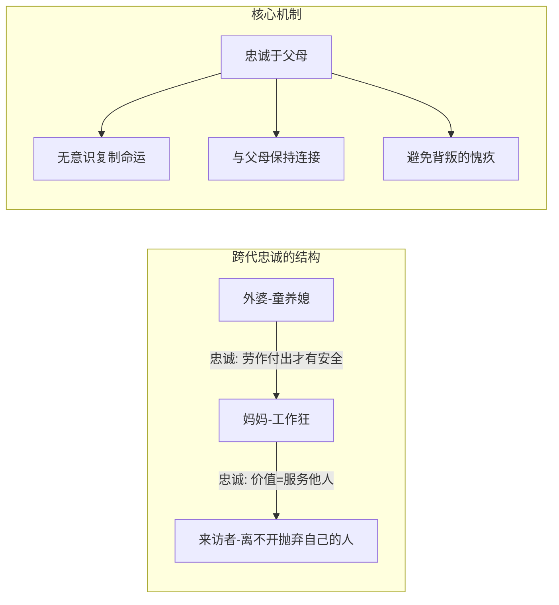

# 第01课：原生家庭的影响——家庭忠诚与命运复制

## 超越原生家庭的误区

> [!WARNING]
> 心理学界对"原生家庭"存在严重的误解：许多人把一切人生问题归咎于原生家庭，抱怨"父母皆祸害"，却从不寻求改变。这种极端原生家庭论者从来不提解决方法，只会告诉你"我们永远无法摆脱原生家庭"。

**核心命题**：不是原生家庭主动影响你，而是你选择了原生家庭对你的影响。大多数人不愿意承认这个事实。

正如蔡康永所说：我们花一辈子的时间等待父母和我们道歉，而他们也花了一辈子的时间等我们说谢谢，最终我们都得不到想要的那句话。用原生家庭当挡箭牌不难，真正难的是从中走出来。

## 中国式家庭结构

胡慎之总结的中国式家庭特征：

> [!NOTE]
> **缺席的父亲 + 焦虑的母亲 = 情绪失控的孩子**

### 父亲缺席

- 在原始社会，父亲要带孩子出门打猎，帮助孩子探索世界
- 现实中，父亲加班、陪酒、打麻将，变成了一个"影子"
- 调查显示：80%的父亲认为自己工作忙，没有时间与孩子交往
- 一半以上的家庭中，母亲是子女教育的绝对主角

### 母亲焦虑

- 当丈夫隐形，妻子对情感的寄托全部转移到孩子身上
- 年轻妈妈活得很累：老公依赖不了，带孩子的责任全在自己身上
- 压力越来越大，最终让孩子也很紧张

### 孩子情绪失控

- 孩子一方面要承担起不属于自己的责任
- 另一方面又不由自主地陷入"永远做妈妈的好孩子"的状态，拒绝成长

### 中国式关怀的无力本质

小时候在外面摔了一跤，回家听到的不是关心，而是指责"叫你不要乱跑"。这不是父母不爱我们，而是他们无力甚至无能的体现——他们无法控制那些伤害我们的人和事，只有通过骂你让你反省，才能让他们掌握控制感。

## 家庭忠诚：命运复制的心理机制

> [!TIP]
> 心理学家弗兰克·卡德勒说："生命中最不幸的一个事实是，我们所遭遇的第一个重大的磨难，大都来自于家庭，并且这种磨难是可以遗传的。"

### 忠诚的定义

子女对父母通常都是忠诚的。小时候最可怕的事情不是鬼，而是被父母抛弃。一句"妈妈不要你了"会吓哭多少小孩。为了避免被抛弃的恐惧，小孩子会对父母表现出许多认同、服从和忠诚。

这种忠诚常常导致我们无意识地复制父母的很多东西，**包括命运**。

### 案例一：失败男人的命运复制

一个中年男人，打工、创业多次，每次遇到大困难就放弃。他把一切归因于"命不好"：
- 父亲酗酒，常殴打母亲，母亲一辈子很少笑
- 他也几乎没有笑容——如果快乐，就会有对不起母亲的愧疚感
- 父亲总说他笨、没出息，他潜意识里认可了这个评价
- 每次遇到挑战，耳边响起父亲那句"你这么笨能有什么出息"，然后提前放弃

> [!QUESTION]
> 案例中的男人为什么在创业遇到困难时选择放弃？
> 

> 他对父亲有着深层的忠诚——父亲说他没出息，他的潜意识就用行为来证明自己没出息。这让他与父亲深深连接在一起，不"背叛"父亲。
> 

### 案例二：跨代忠诚——三代人的命运复制

一位来访者的困惑是离不开抛弃自己的人。追溯三代：

1. **外婆**：旧社会的童养媳，身份卑微，唯有不停劳作付出才能得到安全
2. **妈妈**：忠诚于外婆的价值观，把工作看得比孩子重要，认为给别人提供价值比什么都重要
3. **来访者**：认同了妈妈，认为给别人提供价值比自己的尊严更重要。在两个月大时被送到日托机构，在漠视中长大，价值感低、安全感低

三代人的命运惊人的相似，背后看不见的原因就是一代又一代的忠诚。

## 核心概念总结

| 概念 | 含义 | 表现 |
|------|------|------|
| 中国式家庭 | 缺席父亲+焦虑母亲=情绪失控孩子 | 父亲缺位，母亲过度关注孩子 |
| 家庭忠诚 | 子女无意识复制父母的命运 | 过得不好才觉得"对得起"父母 |
| 跨代忠诚 | 忠诚跨越三代以上传递 | 童养媳→工作狂→卑微服务者 |
| 命运复制 | 忠诚导致行为模式代际传递 | 失败、痛苦、关系模式的重复 |

## 对父母的特别提醒

如果和另一半吵架，**一定要尽量避开孩子**。不能避开的话，要给孩子解释，让他明白这种冲突与他无关。

由于忠诚的存在，孩子面对父母之间的冲突不知道该站在哪一边。比如：
- 妈妈强势，骂爸爸
- 女儿作为"爸爸前世的小情人"，有忠诚于异性父母的本能（性别分化）
- 女儿也很爱妈妈，且必然认同强者
- 左右为难，内心非常痛苦

## 应用练习

1. **觉察练习**：列出你身上三个最困扰你的特质或行为模式，思考它们是否与你的父亲或母亲高度相似。这种相似是"忠诚"的体现吗？
2. **书写练习**：给父母写一封信（不需要寄出），诚实表达你对他们的情感，既包括感谢，也包括怨恨。观察自己在书写过程中的情绪变化。
3. **打破练习**：选择一个你认为是"命运复制"的行为模式，在这一周内刻意做出相反的选择，并记录结果。

## 下一课推荐

下一课我们将探讨家庭冲突的心理真相：攻击性的来源与未被满足的需求，以及理想化与贬损的交替机制。

> [!TIP]
> 参考 [[../reference/0000-glossary|术语表]] 了解更多相关概念。