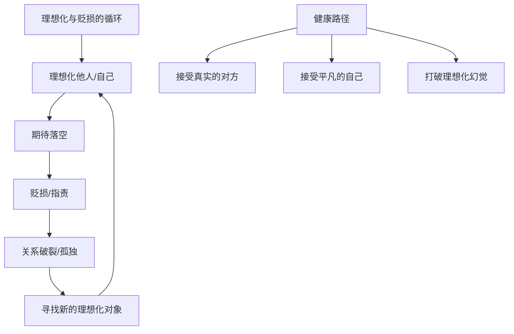

# 第02课：家庭冲突的心理真相

## 攻击性的来源与本质

> [!NOTE]
> 从心理动力学来讲，**人人都有攻击性**。攻击性是人的一种重要的内驱力。人们的攻击性往往会释放在家人身上，因为攻击家人是相对安全的。

### 攻击性与生命力

婴儿从出生开始就有攻击性，因为他要感受到自己的存在。如果这种攻击性没有被父母（尤其是妈妈）接纳，会造成很多问题：
- 要么压抑内化为对自己的攻击
- 要么变成补偿性的朝外的攻击

> [!TIP]
> **攻击性是生命力的象征。** 很多"老好人"的生命缺少激情，是因为他们的活力被父母的攻击性压抑了。这样的人生命力不会太强。

### 亲密关系中的攻击性

留意你的亲密关系：
- **打是亲骂是爱、吵吵闹闹型**：不错。认同打是亲骂是爱的，更多是在证明自己安全或被爱。彼此吵吵闹闹反而能带来一些激情。
- **死气沉沉、没有交流型**：很难受，可能离婚不远了。吵架也是在释放攻击性，释放出来了就不会在自己内心里面攻击自己。

> [!QUESTION]
> 为什么说死气沉沉的夫妻关系比吵吵闹闹的夫妻关系更危险？
> 

> 因为争吵是在释放攻击性。释放出来就不会在内心里攻击自己。死气沉沉意味着攻击性没有释放渠道，长期压抑会导致更大的问题，也说明双方已经不愿意做价值交换了。
> 

### 攻击性释放与网络游戏

很多成年人和青少年沉迷网络游戏，与内在的攻击性有关。在游戏中可以过关斩将、打怪物，充分释放攻击性。

**独生子女更难养**的原因：城市生活中被分割在格子间里的孩子们，缺少了足够的释放攻击性的团体性游戏活动。

### 攻击性与链接

> [!WARNING]
> 施虐也是链接。当父母没有理睬孩子，孩子的言行对父母没有任何影响时，会产生一种特别的**虚空感**。只有当我们能影响对方，才能体会到自我价值感和存在感。

一位女性来访者，妈妈从小把她固定在一个地方就去忙别的事，她半天不敢离开。只有在犯错时妈妈才会理她（打她）。于是她慢慢学会：要跟别人产生链接，方法就是施虐——试探这个人会不会被我虐走。如果施虐对方还能承受，那就是稳定的、不会离开她的人。

### 婚姻中攻击性与性满足

婚姻中的攻击性往往与性的满足有关：
- 性得到满足，攻击性就弱很多
- 暴脾气的男人/女人背后，往往是性没有得到满足的表现
- 爱和恨是一体的，得到的爱越多恨就越少
- **性首先应该是满足自己**，而不是满足对方的

## 理想化与贬损

### 什么是理想化与贬损

理想化和贬损常常发生在生活中各种人际关系中。这两种做法看似矛盾，却相生相伴。**越是理想化，就越容易发生贬损**，延伸出来就是相爱相杀。

### 理想化的来源

理想化一定是被忽视的结果。人们构建理想化的自己或他人，是为了得到安全，让自己感觉到有力量。**越是现实生活中不如意，越容易把一些东西理想化。**

- 为什么金庸作品受欢迎？让很多男性在青春期的虚空中找到力量
- 中国人长期处在被控制、被否定的环境中，精神虚弱，看到武功高强的侠客形象容易将自己代入

### 亲子关系中的理想化与贬损

> [!NOTE]
> "我们的爸爸妈妈并不想养育我，他们只想养育他们理想中的孩子。"

- 父母对孩子过分的期待就是理想化
- 一旦孩子达不到要求，马上变成各种指责——贬损
- "别人家的孩子"永远不会令父母失望，因为那是理想化的孩子
- 有的女人在别人面前夸老公和孩子（理想化），回到家却充满抱怨和指责（贬损）

### 夫妻关系中的理想化与贬损

**案例**：妻子买打折衣服，回家后急忙闪进卧室，跟丈夫解释"不贵的，我等了很久商场打折"。丈夫因此很不爽。

表面上妻子很懂事，实际上贬损了丈夫——"我没能力让你过更好的生活"

生活中很多鸡毛蒜皮的争吵都是这样发生的。

### 理想化的危害

- **对婚姻的期待理想化**：毁掉很多婚姻
- **对伴侣的理想化**：亲密关系一地鸡毛，都在指责对方不好
- **对他人的理想化**：直接行为就是改造和雕塑对方，不能就指责
- **对自己的理想化**：经常体验到恼羞成怒

> [!TIP]
> 哲学家周国平说的：人的成长有三次——
> 1. 接受这个世界不围着我转
> 2. 接受有些事我们怎么努力都达不到
> 3. 发现我们平凡，并接受平凡的自己

## 如何打破理想化与贬损的怪圈

> [!EXAMPLE]
> **练习**：想象你的父母或伴侣就在面前，对他们说："我已经做到了我能做的，我做得足够好了。"同时也对自己说。说三遍或五遍，可能会难过得流眼泪——但这就是打破的开始。

如果发现父母或伴侣对你有理想化，**温柔坚定真诚地告诉对方**："抱歉，我做不到。"看看接下来会发生什么。

## 核心概念总结

| 概念 | 定义 | 家庭中的表现 |
|------|------|-------------|
| 攻击性 | 人的重要内驱力，生命力象征 | 家人间争吵、冷暴力、施虐式链接 |
| 满足感 | 性、情感、价值的满足 | 性满足降低攻击性 |
| 理想化 | 把他人/自己想象成完美 | "别人家的孩子"、"好老公"期待 |
| 贬损 | 理想化落空后的指责 | 从"完美伴侣"到"一无是处" |

## 应用练习

1. **觉察练习**：回顾你与伴侣或父母最近的一次冲突，是否能从中识别出理想化和贬损的交替？你对他们有哪些隐藏的理想化期待？
2. **打破练习**：选一个你对家人"理想化"的期待，直接告诉对方："我接受你做不到。"观察对方的反应和你内心的变化。
3. **攻击性释放**：找到一种健康的攻击性释放方式（运动、创作、工作成就等），这一周有意识地使用它，观察家庭关系是否因此改善。

## 下一课推荐

下一课我们将探讨自恋、认同与投射性认同——"有一种冷，叫妈妈觉得你冷"背后的心理机制。

> [!TIP]
> 参考 [[../reference/0000-glossary|术语表]] 了解更多相关概念。