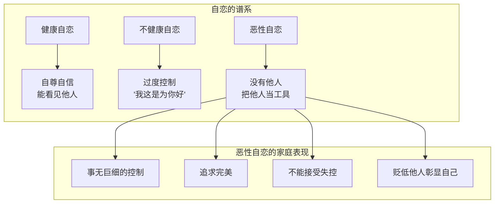
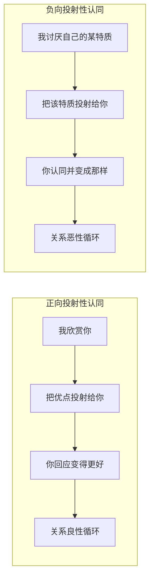

# 第03课：自恋、认同与投射性认同

## 自恋：从水仙花到家庭控制

### 纳西斯的隐喻

> [!NOTE]
> 希腊神话中，纳西斯被诅咒不能看到自己的样子。他在水塘边看见自己的倒影后被迷住，最后死在水塘边变成水仙花。他的恋人叫Echo（回音），暗示自恋的人听不到别人的声音，永远听到的都是自己的回音。

心理学家科胡特说：**每一个人一出生就有一个核心自恋，这个核心自恋是他发展的原动力。**

### 三种自恋层次

| 类型 | 特征 | 对家庭的影响 |
|------|------|-------------|
| 健康自恋 | 自信、有边界 | 能看见他人的需要 |
| 不健康自恋 | 过度控制、"为你好" | 忽视家人真实需求 |
| 恶性自恋 | 把他人当工具，没有他人 | 造成深度心理伤害 |

### 恶性自恋：母亲的控制

> [!WARNING]
> "有一种冷，叫妈妈觉得你冷。"

中国父母最理直气壮的话：**"我这是为你好。"**

**案例**：胡慎之9岁时，父亲让他搬砖，他足足搬了4小时，累得满头大汗。父亲回来一看，皱眉批评"你堆得不好"，然后把他垒好的砖推倒重来。这让他深深感受到了自己的无能和糟糕。

恶性自恋的特征：
- 事无巨细地去控制
- 相信自己的审美、感觉、智慧、能力
- 不能相信你有独一无二的审美、感觉、智慧和能力
- 要求伴侣、父母或孩子什么都听他们的
- 不能允许一点点失控的事情发生

### 自恋妈妈养出的孩子

> [!QUESTION]
> 为什么很多非常听话的孩子到了青春期突然变得叛逆？
> 

> 听话只是暂时的，是对妈妈的回避和讨好。孩子的内心一直在压抑，等到了青春期有能力照顾自己时，叛逆就来了。即使顺利度过青春期，也可能变成"拯救者"或"完美主义者"，一辈子过不上自己喜欢的人生。
> 

### 两性关系中的恶性自恋

**"直男癌"**就是恶性自恋的一种——不把女性的心声放在眼里。

一位男性朋友向胡慎之诉苦，说老婆总是指责他晚归。胡慎之问："你每周有三四个晚上在外面应酬，享受在外喝酒聊天的感觉吗？"他承认确实挺喜欢。这就是男人的自恋——明明在外面享受，却觉得自己对老婆蛮好的。

**对外友善、在家暴躁**的也是一种恶性自恋——在外戴着"好人设"面具，回到家忍不了了就摘下面具，不管家里人受不受得了。

弗洛姆认为：**恶性自恋的人没有他人，常常把他人当成自己的一部分来支配。**

## 认同：我成为你

### 认同的定义

认同就是：**我成为你，或是成为你想要的人。**

认同以你几乎觉察不到的方式，影响着你的性格、喜好、价值观和所有关系。

### 认同的类型

1. **身份价值观认同**：书香门第的孩子认同读书人的价值观；杨家将的后代认同忠诚良将的身份
2. **舒适圈认同**：
   - 胡慎之的妈妈来他家，会去买很便宜的面盆和两块钱的毛巾——这些物品有她熟悉的味道
   - 儿子上大学带了初中的旧床单，"很舒服"——带来心理上的安全感
3. **身份转型认同**：突然富裕的人会模仿富人行为，带大金链子、疯狂消费——与过去阶层划清界限

### 认同的问题

> [!WARNING]
> 认同不一定是坏事，但好的坏的都有可能被认同过来。我们的父母自身能力和见识有限，常常输出不够好的价值观——就像没有进化系统的水池，让你喝了脏水。

**思考就是我们的进化系统。** 当你了解到这一切，可能会痛苦和遗憾，但请不要怨恨。你已经长大成熟，有能力去自我进化。

### 叛逆的价值

父母过分强调认同的家庭，容易让孩子唯唯诺诺、缺乏自己的意志。**叛逆其实是给了孩子一个机会去重新建立一个真正的自我。**

> [!TIP]
> 有家长打电话说孩子小学时很乖，上初中后叛逆了。胡慎之总说："会叛逆是好事，孩子还有得救。"有的家长听完生气地挂断电话。实际上，对于太过认同父母的孩子，青春期不叛逆就麻烦了——可能一辈子没法形成独立的自我。

## 投射性认同：两个人的共谋

### 投射性认同的定义

投射性认同是两个人的关系：一个人把自己觉得很好（或很糟糕）的特质投射到对方身上，把对方真的当成这样的人去对待，对方接受这种投射后，真的变成了这样一个人。

### 正向投射性认同

**一见钟情**就是典型的正向投射性认同：
- 罗密欧把心中女神的特质都投射给朱丽叶
- 朱丽叶接受这种欣赏和爱慕，发展出最美好的一面来回应
- "情人眼里出西施"

### 负向投射性认同

一个人把自己觉得不能接受的特质（如"我很土气"、"我没有吸引力"）投射到对方身上，把对方当成这样的人去对待。最后对方接受这份嫌弃，真的变成了投射者认定的样子。

**"你既然说我很差，那么我真的差给你看。"**

### 讨好者的陷阱

> [!NOTE]
> 如果对方总是小心翼翼、不断讨好你，你并不会因此喜欢他。因为讨好者对应的是一个**欺压者**的形象——他把这个欺压者扔到你身上，你本来不是这样的人，却被泼了一盆脏水。

讨好的隐含信息是："你看我对你这么好，我什么都听你的，你不能离开我，你要帮我。"这给你带来了巨大的压力。

### 自测：投射性认同在你生活中的体现

> [!QUESTION]
> 你生对方的气，是因为他真的错了，还是你把自己不能接受的特质投射到了他身上？比如你自己特别痛恨拖拉，所以对方只要比较拖拉一点点，你就把他的拖拉行为放大到不能接受的地步？
> 

> 这就是投射性认同的典型表现。我们需要区分：是对方真的有问题，还是我们把自己不接受的部分投射到了对方身上。
> 

## 核心概念总结

| 概念 | 定义 | 核心识别句 |
|------|------|-----------|
| 健康自恋 | 核心发展动力 | "我有价值，你有你的价值" |
| 恶性自恋 | 没有他人，把他人当工具 | "我这是为你好"（实际为你自己） |
| 认同 | 我成为你或你想要的人 | "我必须像我爸爸那样" |
| 投射性认同 | 我投射→你接收→你变成那样 | "你就是我认定的那种人" |

## 应用练习

1. **自恋检测**：回顾这一周你对家人说过几次"我这是为你好"。思考：你是真的为对方好，还是为了控制对方以满足自己的不安全感？
2. **认同觉察**：列出三个你认为"理所应当"的价值观或行为方式，追溯它们是否来自你对父母的认同。这些价值观真的适合现在的你吗？
3. **投射性认同破除**：下次你对伴侣或孩子感到特别愤怒时，先问自己："我是不是把自己不喜欢的特质投射到他身上了？"

## 下一课推荐

下一课我们将探讨权力、照顾与内疚感——家庭中看不见的权力斗争如何塑造每个人的角色。

> [!TIP]
> 参考 [[../reference/0000-glossary|术语表]] 了解更多相关概念。