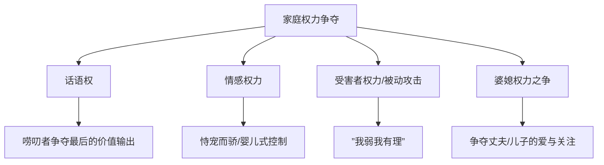
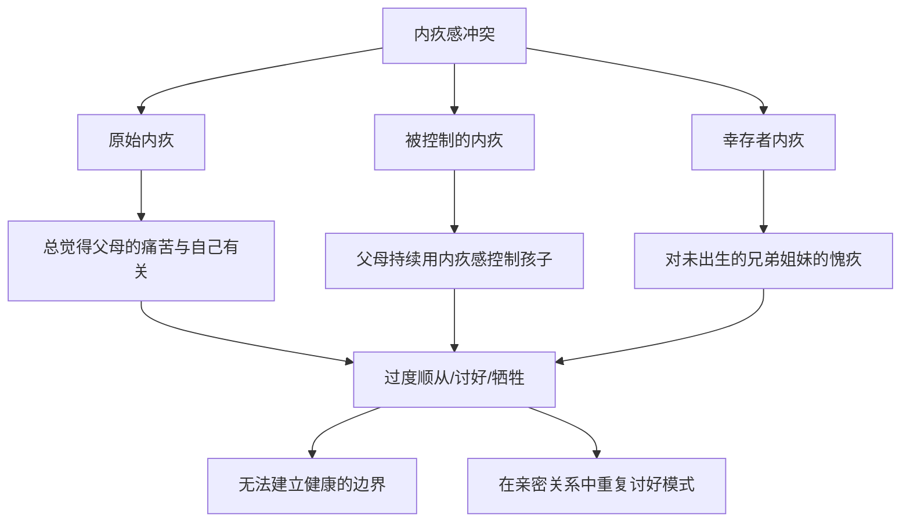

# 第04课：权力、照顾与内疚感

## 家庭中的权力游戏

### 父权文化的历史遗产

在中国传统文化中，家庭权力处于完全不均衡的状态：
- 父为子纲、夫为妻纲
- 百善孝为先——孝文化把父权推到极高的位置
- 丈夫可以按自己心意休掉妻子
- 子女完全被父亲权威控制

虽然今天男女平等是政治正确，但几千年来的文化传承不会轻易消失。

### 以爱为名的权力剥夺

> [!WARNING]
> **什么都包办，就是一种权力的剥夺**——剥夺的是孩子自主成长的权利。剥夺的后果：孩子无法对自己的生命负责。一旦不被人控制，反而手足无措，像一台机器。

电影《肖申克的救赎》中，在监狱关了四十多年的老人被放出后无法适应自由生活，最终自杀。

**啃老族**的成因：成长过程中被剥夺了自己解决问题的权利，没有权利也就没有责任。

> [!QUESTION]
> 为什么有些啃老族一方面抱怨父母管得太多，另一方面又严重依赖父母？
> 

> 权力与责任是一体的。不想父母管你，就一定要自己管好自己的事情。被剥夺了权利的同时也被剥夺了责任感，形成了依赖又不甘的矛盾心理。
> 

### 家庭中的四种权力争夺

**1. 话语权**
当一个人发现其他权力无法争夺时，会拼命抓住说话的权利。唠叨的人是在争夺话语权——他别的权利得不到保证，话语权是最后要维护的。爱唠叨的家人，其实是在抗议你对他的忽视。

**2. 情感权力**
婴儿时代的无所不能自恋造成——婴儿一哭妈妈就会回应。长大后这种模式没有被打破，就可能变成"巨婴"。

**3. 受害者权力（被动攻击）**
"我穷我有理"、"我弱我有理"、"好男不跟女斗"——利用弱者身份进行被动攻击。

**4. 婆媳权力之争**
- 表面争的是厨房管理权
- 实质争的是丈夫/儿子的爱和下一代的爱
- "小喜鹊尾巴长，娶了媳妇忘了娘"——老妈的失落和妒忌
- 婆婆和媳妇可能在争夺孩子的爱——比如母乳喂养的争议

**关键提醒**：如果你父母之间的关系不够亲密，你就要小心了——不要跟妈妈之间关系过于紧密，让她把情感寄托都放在你身上，你会很累。

## 被照顾与自给自足的冲突

### 核心矛盾

> [!NOTE]
> 爱一个人会愿意照顾他，被一个人爱会愿意接受照顾。每个人的潜意识里都渴望被照顾。但如果一直被人照顾，没有自主的机会，自我实现的成就感也会被剥夺。

### 三岁孩子的反抗

三岁的孩子，当妈妈给他穿上衣服或袜子时，他会很反抗，甚至生气地扯掉再自己穿。这就是孩子在**自给自足**——依靠自己的努力满足需要，宣布自己是一个独立的个体。

### 过分照顾的后果

**案例**：妈妈的困扰——儿子成年了，妈妈和丈夫仍然操心他的一切。考大学找关系、毕业安排工作。后来儿子在网贷平台借钱还不起，向妈妈求助。妈妈帮他还了，却发现还有另一笔。

关键问题：儿子为什么不敢找家里要钱，而是去风险很大的网贷平台？因为他不想被父母的念叨和责骂控制。即使物质上被父母照顾，内心却是**被照顾和自给自足在打架**。

### 亲密关系中的同样冲突

> [!WARNING]
> 被照顾和自由本来就是互相冲突的。"我养你"听上去很甜，但接受物质照顾的同时也在失去自由。

一位女性来访者：男友对她好到满足一切要求，但会限制她的活动（如不能吃麦当劳）。即使吵架男朋友也坚持自己的意见。她不舒服、愤怒，甚至有恐慌。

**错就错在没弄明白：被照顾的好处和自由的代价是一体两面。**

### 被边缘化的恐惧

> [!TIP]
> 对大部分成年人来说，如果对他人没有贡献，会有被边缘化的感觉。一群人出去野餐，所有人都忙碌准备，但你被告知"不用动手等吃的就好"——你被照顾了，但同时感觉到被边缘化了，因为无法为群体提供贡献。

### 害怕被照顾的人

有些人害怕甚至拒绝被照顾，每当被帮助就激发愧疚感。原因往往是过去得到的更多是**有条件的照顾**——"我做的一切都是为了你，为了照顾你，我失去了很多。"

## 自我价值的冲突

### 自我价值的来源

自我价值（自尊）是个人对自身价值的主观情绪评价。最初**来自别人的认同**——当有人说"因为有你我很开心"，自我价值感会很高。

如果出生和成长特别受到父母欢迎和期待，即使婴儿也能获得核心价值：**"我是一个受到欢迎的人，我是有价值的。"**

### 自我价值的冲突模式

| 模式 | 表现 | 深层心理 |
|------|------|---------|
| 被动模式 | 一无是处、多余、不重要 | 得不到认可，放弃努力 |
| 主动模式（假性自信） | 表面自信，潜藏不安全感 | 完美形象被质疑时恼羞成怒 |

### 樊胜美的困境

电视剧《欢乐颂》的樊胜美：
- 特别在意别人评价，用假名牌武装自己
- 家里重男轻女，她的出生没有被期待
- 为了被看见，不断牺牲自己满足父母
- 无论付出多少，依然得不到认可

### 高老头的悲剧

> [!EXAMPLE]
> 巴尔扎克笔下的高老头，把一切交给两个女儿，帮她们嫁入豪门。女儿们挥金如土，榨干他的一分一毫，临死前没有一个女儿来看他。

高老头的核心恐惧是**没有存在感，低价值感**——他害怕一旦停止拼命付出，就会被女儿抛弃。

### 伤害来自最亲的人

一个网络帖子："我的父母很少肯定我，买一双名牌运动鞋，我妈跟别人说是150块钱的地摊货，引起全家嘲笑。那一瞬间，我在外建立起来的一点自信又被打回了原形。"

> [!WARNING]
> 想透过改变父母来提升自我价值，可能是缘木求鱼。父母的思维往往已经固化。**我们能做的是自我拯救**，以及不伤害下一代人的自我价值感。

### 提升自我价值的方法

1. **看见自己、重视自己**——被人看见对每个人都很重要。最可怕的不是别人不接纳你，而是自己不接纳自己
2. **存在就是一种价值**——先重视自己，才能被别人看见
3. **不用拼命付出来证明价值**——拼命付出就是讨好，把对方当成需要讨好的对象，对方会不舒服，很难肯定你的价值
4. **重新选择**——如果陷入为家人无条件付出的状态，就像一个无底深渊，终将找不到自己

## 内疚感冲突

### 内疚感的心理机制

内疚是当一个人伤害了别人或妨碍了别人的需要时产生的不安感。心理学上说，内疚由**本我**（追求快乐的本能欲望）和**超我**（社会规范、道德的管理者）的冲突造成。

### 病理性内疚

有两种病理性内疚：

**1. 否认内疚的倾向**：明明应该内疚，却把责任推给别人。如妈妈对孩子说："你给我添了很多麻烦。"

**2. 顺从接受内疚的倾向**：即使错误是别人的，也倾向于责备自己。

**案例**：来访者S小姐与妈妈吵架后总是感到自责，通过满足妈妈的心愿来弥补。妈妈在争吵中说头痛、默默离开、躺在床上，S小姐就会觉得自己是个罪人，放弃自己的意见。

更深层的原因是：妈妈在生她时大出血，子宫被拿掉，抚养过程中多次提及这件事。S小姐对妈妈有一种**原始内疚感**——总觉得妈妈的痛苦跟自己有关。

### 内疚感作为控制工具

> [!QUESTION]
> 为什么每次给父母买好东西、他们拒绝时，你会感到生气？
> 

> 这是内疚感在作怪。你觉得父母糟糕的状态与你有关系，应该让他们过更好的日子。他们没有接受你的付出，你的内疚感无法消除，所以愤怒。
> 

### 幸存者内疚

在某些家庭中，母亲可能有过流产或堕胎经历，孩子出生的那一刻就有了对失去的兄弟姐妹的内疚感，经常有没来由的愧疚。

### 如何应对内疚感冲突

1. **分清三个点**：这是谁的事？谁的责任？父母的人生是他们的，不是我们的
2. **他人的痛苦是他们需要付出的代价**——妈妈选择生你，子宫被拿掉是她需要承担的代价，与你无关
3. **意识到是否被利用内疚感控制**——选择做一个真实的人，而不是一个好人
4. **必要时寻求专业帮助**

## 应用练习

1. **权力觉察**：这一周留意自己在家庭中使用"被动攻击"（如沉默、拖延、生病）的次数。你通过这些方式在争夺什么权力？
2. **被照顾与自主平衡**：如果你习惯于照顾家人，试着停止做一件你常做的照顾事项，观察家人的反应和你自己的不适感。
3. **内疚感检测**：回忆最近一次你对家人的妥协（放弃自己的想法）。问自己：我是真心同意，还是因为内疚感在驱动？
4. **自我价值书写**：写下三个"不需要为任何人做任何事、仅仅因为存在"就值得被爱的理由。每天读一遍。

## 下一课推荐

下一课将进入模块二，探讨家庭动力系统——为什么有些家死气沉沉，有些家一点就爆。

> [!TIP]
> 参考 [[../reference/0000-glossary|术语表]] 了解更多相关概念。