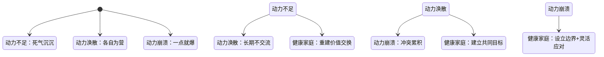
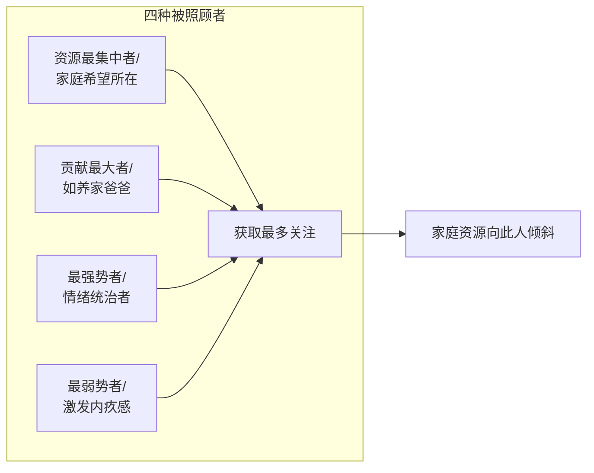

# 第05课：家庭动力系统

## 家庭动力的本质

每个人的行为背后都有基本的心理动力。在家庭中，这些动力相互影响，体现为相互交流或不交流。**相互交流是心理动力的流动，是生命力的流动。** 当动力能够在成员之间顺畅流动时，家庭形成相互支持的健康发展局面。

## 三种家庭动力失调状态

### 一、家庭动力不足：死气沉沉的家

> [!NOTE]
> 曾经温馨的家，如今变成彼此的黑洞。谁先开口说话，对对方都是一种伤害。

**案例**：一对夫妻在朋友圈里很幸福，却突然离婚了。他们说："我们心里都知道，他有情绪我也有情绪，但我们两个人都不愿意去做一些改变。家里的空气仿佛是凝结的，生命力也被消耗殆尽。"

**动力不足的深层原因**：家庭成员不愿交换资源，尤其是不愿交换**情绪价值**。

#### 情绪价值的定义
情绪价值就是包容、关注、支持和安抚。为什么有些条件很好的女孩选择条件一般的男生？因为这个男生提供了更多情绪价值。

#### 动力不足的三大特征

1. **不愿意交换资源**——伴侣之间的资源交换像"你挑水我种地"，当双方都不愿拿出自己的东西交换，关系变成一潭死水，背后已经有恨意在流动
2. **争夺说话的权利**——沉默本身就是一种权力的宣示："我不想被你期待，也不愿意被你影响"
3. **沉默是最深的攻击**——沉默已经是最深的攻击

#### 如何改变

| 策略 | 行动 |
|------|------|
| 明确归属 | 这段婚姻是谁的？你是否需要为这段关系负责？谁痛苦谁改变 |
| 先给予 | 想要获得必须先给予。先提供资源给对方 |
| 你的体验是你的 | 意识到你认同了原生家庭的氛围，你可以为自己做改变 |
| 利用平衡原则 | 像拔河一样，一个人松手，另一个人必须调整姿态 |

### 二、家庭动力涣散：各自为营

> [!NOTE]
> 一个家没有共同的目标、共同利益、共同的兴趣爱好、共同的欢乐——只能共患难，不能同富贵。

#### 共患难容易同富贵难

穷的时候夫妻同心——有共同目标（买房子、脱离贫困），分工明确。目标实现后，各自追求自己想要的东西，动力不流向对方而流到外面去了。

#### 智能手机时代的涣散

在电视时代，家庭还有共同欢乐——围坐看电视、传递零食、一起笑。智能手机时代，一部手机一个世界，大家各自掉进手机里，忘记了身边的家人。

> [!WARNING]
> 长时间不交流情感，就会对交流感到尴尬和害怕，不知从何说起，最终采取回避。家里的情感反应能力和情感卷入程度都很低。

#### 家庭动力涣散的影响

1. **自我隔离**——不能与最亲近的人分享喜怒哀乐，慢慢变得封闭
2. **冷漠**——只关注自己的世界，家人互相忽视
3. **被消耗感**——家庭不是支持和滋养，更像一个黑洞
4. **自私**——在这样的家庭长大，孩子可能变得自私

#### 如何改变

- 谁痛苦谁改变，谁有能力谁改变——星星之火可以燎原
- 从隔离或回避状态中走出来，重新投入家庭
- 带家人旅行、做大家想做但没时间做的事
- 举办家庭聚会、开家庭会议
- **不要彼此责备**，更多地理解家人
- 让问题成员看到自己可能被放弃——有时这反而让他醒悟

### 三、家庭动力崩溃：一点就爆

#### 环状模式理论

美国明尼苏达大学奥尔森教授提出，家庭有三个中心要素：

| 要素 | 定义 | 出问题时 |
|------|------|---------|
| 家庭亲密度 | 家庭成员之间的情感关系 | 过高导致无边界 |
| 家庭适应性 | 改变权力结构/角色/规则的能力 | 低导致缺乏灵活性 |
| 家庭沟通 | 信息交流 | 不畅加剧前两者问题 |

#### 亲密度过高的问题

> [!WARNING]
> 当亲密度过高，希望对方跟自己是一体共生的，希望对方能帮自己解决问题。这就导致家人之间没有边界。

妻子在家照顾孩子很累，希望丈夫回来帮一把。丈夫满身酒气回来，不仅帮不了还要被照顾。妻子指责，丈夫对抗。一点点小事就可能把整个家炸掉——像生活在火药桶中间。

**愤怒能给我们带来力量**，帮我们隐藏愧疚、无力、沮丧、委屈。所以人们选择愤怒。

#### 适应性不足的问题

> [!QUESTION]
> 为什么有些家暴受害者明知道说出某些话会挨打，还是忍不住要说？
> 

> 一方面是因为积累了太多负面情绪，没法控制。另一方面是适应性或灵活性不够——灵活性意味着有很多选择。当你知道你的行为会引发某些后果时，你是可以选择避免的。
> 

#### 如何应对动力崩溃

1. **注意边界问题**——亲密度过高时，分不清哪些事情是自己的，哪些是别人的。不只是空间边界，更是心理边界
2. **尝试用不同方式解决冲突**——都是固执的人、冷漠的人或暴脾气的人在一起，需要更多样的思考方法和解决方式
3. **分清是解决问题还是发泄情绪**——一个妻子疏忽导致孩子去世，丈夫抱住妻子安慰她："她的疏忽结果已无法挽回，如果再责怪，只会让两个人更糟糕。把这视为我们共同面对的事，我们就变成相互支持的人。"

## 家庭中谁是最需要照顾的人

### 四种需要被照顾的类型

1. **家庭资源最集中的人**——家庭赋予他最大希望，如被期待光宗耀祖的孩子。中国家庭中因性别期待，男孩更多成为这样的人
2. **贡献最大的人**——爸爸在外打拼很厉害，回家变成最需要照顾的人。有的妻子抱怨丈夫像"巨婴"
3. **最强势的人**——喜怒无常的爸爸，一发起脾气所有人都会附和他、满足他。他强势反而成了被照顾者
4. **最弱势的人**——总是以弱势姿态出现，其他成员不照顾就会有愧疚感

### 长期被照顾的影响

| 影响 | 表现 |
|------|------|
| 成长阻力 | 无法学习自立自主 |
| 循环依赖 | 出事了被照顾→再出事再次被照顾 |
| 无用感 | 对自己和家庭没有贡献的羞耻 |
| 价值剥夺 | 自己觉得是累赘、拖累 |
| 不被真诚对待 | 照顾者心中有怨气，但不敢表达 |

### 如何改变

**停止喂养被照顾者**。一位来访者的哥哥一直被照顾，妹妹们不断帮助他。胡慎之建议：停止帮助，告诉他"我们只会做到这里，剩下的靠你自己"。之后哥哥才开始真正找工作、学习独立。

> [!TIP]
> 被照顾者心中都存在一个无助的孩子。只有当我们停止继续喂养这个无助的孩子，他才有机会成长起来，学会独立，对自己负责。

## 为什么有些家庭成员老生病

### 四种心理动力

1. **用疾病逃避压力**——压力太大无法释放，唯有通过躯体化的症状才能心安理得地休息，不被自己责怪。如公司高管失业后找不到工作，开始频繁生病
2. **用疾病获取关注**——在家中被忽略，唯有生病可以得到照顾和关注。这叫**"疾病获益"**
3. **用疾病平衡家庭关系**——孩子生病让爸妈重新在一起。如孩子经常发烧，检查不出原因，后来发现是因为爸妈关系紧张，孩子生病爸爸就会回来
4. **带病坚持工作的价值认同**——认同了"带病坚持工作是有价值的"，如一位女士的妈妈一直带病坚持工作，她也变得不把健康当回事

### 解决方案：被看见

> [!EXAMPLE]
> 那位经常发烧的孩子，父母真诚地告诉他："爸爸妈妈之间出现了问题，但我们会自己处理，不管怎么样我们都爱你。"孩子理解后，发烧情况消失了。

**三个字：被看见。** 如果家人老生病，他最需要的是诉求被看见。如果你是那个老生病的人，可以直接表达内心愿望。

## 未出生的家庭成员的影响

### 未出生孩子的影响维度

1. **对父母的影响**——对妈妈造成身心创伤，对爸爸来说可能导致夫妻信任破裂。海灵格说："如果夫妻之间有过堕胎的经历，他们之间的关系其实就已经终止了。"
2. **对出生孩子的影响**——孩子可能承载未出生兄姐的"命运"，家庭过度补偿导致孩子敏感、没有安全感
3. **对期待的影响**——独生子女要承载多子女的期待，压力巨大

### 告别仪式

> [!WARNING]
> 未出生的孩子也是家庭的一部分，需要有一个简单的告别仪式。**三句话**：对不起、请原谅、我爱你。

1. **对不起**——对未出生的孩子说对不起，可以给胎儿取名字
2. **请原谅**——很遗憾没有这个缘分相聚
3. **我爱你**——虽然没出生，但妈妈很爱你

## 应用练习

1. **动力诊断**：用下面的问题评估你家庭目前的动力状态：
   - 你愿意和伴侣交换情绪价值吗？（动力不足）
   - 你们有共同的家庭目标吗？（动力涣散）
   - 家庭氛围是否一点小事就爆炸？（动力崩溃）
2. **被照顾者觉察**：思考你的家庭中谁是"最需要被照顾的人"。他/她属于哪种类型？停止喂养他/她的一件小事，这一周试试看。
3. **疾病与情绪链接**：如果你或家人经常生病（查不出明确病因），尝试记录生病前一周内发生的压力事件或未表达的情绪。
4. **告别仪式**：如果家庭中有过流产经历，尝试做一个简单的告别仪式——取名字、说对不起、请原谅、我爱你。

## 下一课推荐

下一课将探讨三角关系与家庭核心恐惧——当两个人的冲突拉进第三个人，会如何改变家庭的结构与命运。

> [!TIP]
> 参考 [[../reference/0000-glossary|术语表]] 了解更多相关概念。