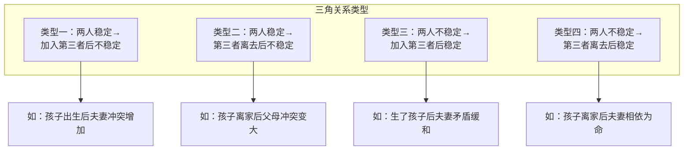
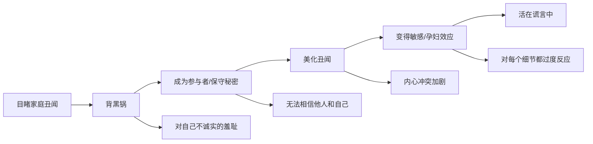

# 第06课：三角关系与家庭核心恐惧

## 家庭三角关系

### 什么是三角关系

> [!NOTE]
> 家庭治疗理论家鲍恩提出：当两人系统遇到问题时，就会自然地把第三个人扯进来，用来减轻两个人之间的情绪冲击。这样形成的关系叫**三角关系**。

李子勋老师曾指出：如果夫妻之间存在冲突和矛盾，情感分裂，孩子会为了平息家庭战争而加大与父母情感之间的穿梭。当这种拯救方式无效时，孩子可能出现**过激行为或病态行为**来与父母对抗。

父母的角色越是对峙，三角关系就越被用来攻击彼此，孩子成为**替罪羊或马前卒**，导致身心出现较大障碍。

### 四种三角关系变化类型

### 母子的联合与父亲的边缘化

> [!WARNING]
> 妈妈和孩子的联合，把爸爸边缘化，是最常见的不健康三角关系之一。

妈妈之所以这样做，通常是为了缓解丈夫关注不够带来的压力。她把全部关注点放在孩子身上，跟孩子产生紧密联合，不自觉地过度卷入孩子的生活，包办或期待孩子做很多事情。

结果：
- 孩子对妈妈产生依赖
- 爸爸在家庭中地位下降、没有发言权
- 爸爸感觉被排斥，可能疏远甚至离开家庭
- 严重时可导致婚外情或家庭破裂

### 案例：为逃避原生家庭而结婚

一位女性来访者，原来看起来有温暖的丈夫，婚后却无法提供支持。追溯发现：
- 她由爷爷奶奶带大，后来才跟父母一起住
- 父母经常争吵，她不知道该怎么办，压力很大
- 曾尝试离家出走但失败
- 在家里感到被忽略，父母不值得信任
- **嫁人是为了逃避原本的家庭**

### 如何维持健康的三角关系

1. **召开家庭会议**——坐下来坦诚交换彼此的感受，提供建设性建议
2. **夫妻问题不要转移给孩子**——如果你是这个家庭的子女，可以告诉父母："你们的问题自己解决，不要把我拉进来。"如果你已为人父母，要记住两个人的事两个人解决
3. **平衡家庭关系**——不能偏袒任何一方，不要让任何一方被边缘化。妈妈不能过多偏向孩子，也要维护与丈夫的关系
4. **选择逃离**——如果家庭冲突越来越多，可以尝试脱离这段三角关系。坚持不回到那段关系中，或许他们可以自己找到另一种相处途径
5. **在新家庭中重构健康三角关系**——你可以吸取教训，在你的新家中构建健康的三角关系

> [!QUESTION]
> 当你的父母总是向你抱怨另一方，你该怎么办？
> 

> 你可以温和地告诉父母："我知道你们之间有不开心，但这是你们两个人的事，不需要我来做裁判。我爱你们两个人，但我没办法解决你们之间的问题。"这能有效打破不健康的三角关系。
> 

## 家庭核心恐惧

### 恐惧如何导致互相牵制

当一个人恐惧时，第一反应是**抓住别人**——像小孩子害怕就跑进妈妈怀里，像溺水的人抓住稻草。恐惧让我们无法独自面对未来。

人在恐惧中的第二个反应是**想要改变别人**——恐惧带来失控感，需要改变什么来重新获得掌控感。这种感觉就像"我痛苦，你就应该跟我一起痛苦"。

### 核心恐惧的代际传递

> [!NOTE]
> 家庭中最核心的恐惧往往出现在妈妈身上——因为妈妈是养育孩子的主要角色，承担着最大责任，也决定着孩子看到的世界是美好的还是危险的。

如果妈妈认为世界充满危险，孩子就会对任何东西都保持警惕和防备。胡慎之的妈妈常说："你出去一定要小心别人骗你。"如果没有自我认知能力，就会无条件认同妈妈的说法，活在被恐惧笼罩的状态。

**案例**：一位朋友的外婆每天活在恐惧中，担心天会塌下来，担心每个孩子在外面遇到危险。结果舅舅、阿姨和妈妈都处于焦虑状态，都不敢向外拓展事业或生活，只希望安静待在家里。这一辈亲戚都没有获得比较好的成就。

### 核心恐惧对家庭的影响

| 影响 | 表现 |
|------|------|
| 压抑生命力 | 无法展现攻击性，成为"没有攻击性的好人"，无法成为更独立的人 |
| 失去安全感 | "娶错女人毁三代"——妈妈的角色影响深远 |
| 工具化他人 | 养儿防老本质上是把孩子工具化，没有看作独立个体 |

### 如何应对家庭核心恐惧

1. **自我觉察，树立良好边界**——厘清这种恐惧是否延续到你自己身上。要明确：这种恐惧是父母传递给你的，不是真实世界中产生的。**离开原生家庭不是不管不顾，而是明白照顾的界限在哪里**

2. **照顾好自己，学会"背叛"**——改变父母的可能性很低。更多的是要照顾好自己，不被恐惧影响。你完全可以创造一个美好未来，选择跟他们不一样。当然，这可能会遭受攻击，也会产生愧疚

3. **承认父母的贡献**——尽管父母的恐惧给你带来不好的影响，但他们的贡献应该被看到。当贡献被看见，他们会因为意识到自己的价值而更有力量

4. **不再传给下一代**——如果你已经做了父母，注意有没有把自身恐惧传递给孩子。只有处理好自己的恐惧，照顾好自己和情绪，才不会传递给孩子

> [!TIP]
> 一位朋友曾对父母说："我不会爱你们，但我会负责任。"这不是无情，而是因为他知道如果一直跟父母纠缠在一起，也会被淹没在恐惧里面。为了保命，也为了更美好的未来，他要建立一个边界。

## 脱离家庭丑闻的影响

### 什么是家庭丑闻

丑闻是隐私中的一种，通常是极具冲击性且不道德的事件。如：父母吵架、打架、出轨、私生子、精神病史、自杀等。

### 丑闻对孩子的心理动力链条

- **背黑锅**：事情与你无关，但出于对家庭的忠诚，你背上了心理负担
- **成为参与者**：为了保守秘密而对别人撒谎，加剧羞耻体验
- **美化丑闻**：拿着"一坨屎"却说是"黄金"，但内心无法接受
- **变得敏感**：如"孕妇效应"——自己怀孕了就觉得街上到处都是孕妇。抱着秘密时，特别关注谁会打破这个秘密
- **活在谎言中**：再也没办法真诚地对待周遭一切

### 案例：安迪与《欢乐颂》

电视剧《欢乐颂》的安迪，高挑漂亮、商界精英，却一直藏着秘密，跟人保持距离。她是私生女，妈妈和弟弟有精神病——这是她心中的"家庭丑闻"。小包总说"原来你是掉在地球上的一个精灵"，那一刻她很感动，因为这是对她最担心的事的包容。

### 案例：白天鹅的内心丑小鸭

一位来访者，长相好、成绩好，却总找不匹配的伴侣。原来她是被抱养的，外婆是自杀的——她觉得这是人生的"污点"。虽然不是她造成的，但必须隐瞒和保护，内心有巨大的痛苦，没办法真诚与人交往。

### 如何脱离丑闻的影响

1. **分清忠诚和背叛**——家里人说"这个事情绝对不能跟别人说"时，如果成为说真话的孩子可能意味着背叛家庭。但这本来就不是你的责任，你只需要不去主动扩散就够了

2. **不带主观想象去评价**——很多事之所以被看作丑闻，是因为带着自己的认知去评价。你不是评价者，你没有权利去评价，事情跟你的关系不大。**这不是你的错**

3. **找一个信任的人说出来**——一个人扛会很辛苦。当你说出来的那一刻，就像另一个靴子落地，会非常轻松。否则你像抱着一个秘密到处逃，看周围的人都像是要打破你的秘密

> [!QUESTION]
> 如何判断一个家庭事件是真正的"丑闻"，还是自己过度敏感？
> 

> 关键在于区分"事实"和"评价"。事实是什么？发生了什么？你的评价是什么？你觉得这件事"不光彩"、"丢人"——这是你的评价。尝试剥离评价，只面对事实。你会发现，只面对事实时，压力会小很多。
> 

> [!WARNING]
> 这些事情不会主动来影响你，而是你受着它的影响。你只要选择不受它影响就可以了。它不可能每天都盯着你。

## 核心概念总结

| 概念 | 定义 | 关键词 |
|------|------|--------|
| 三角关系 | 两人系统冲突时拉入第三人 | 替罪羊、三人结构、平衡 |
| 核心恐惧 | 家族中代际传递的不安全感 | 抓住别人、改变别人、压抑生命力 |
| 家庭丑闻 | 被视作不道德的家庭事件 | 背黑锅、保守秘密、羞耻 |
| 边界 | 区分自己与他人的心理界限 | 谁的事、谁的责任、谁的感受 |

## 应用练习

1. **三角关系检测**：思考你的原生家庭中是否存在"父母一方+孩子"对抗另一方的三角关系。如果你已经组建家庭，你的小家庭中是否有类似的模式？
2. **恐惧溯源**：你最深的恐惧（怕被抛弃、怕失败、怕丢脸）可能来自父母中的哪一方？你能区分这种恐惧是他们的还是你自己的吗？
3. **秘密释放**：如果你背负着一个家庭秘密多年，尝试找一个完全信任的人说出来。注意说出来之后的感受变化。
4. **边界建设**：这一周练习说三遍："这是你的事，不是我的事。"（只在心里说或对自己说即可）
5. **家庭重构**：如果你有了自己的家庭，和伴侣一起讨论：你们希望建立什么样的家庭氛围？你们的核心价值观是什么？把它写下来作为家庭宣言。

## 下一课推荐

模块二的课程到此结束。接下来的课程将进入模块三，探讨个体化与依赖、强迫性重复、客体内化等更深层的关系议题。

> [!TIP]
> 参考 [[../reference/0000-glossary|术语表]] 了解更多相关概念。