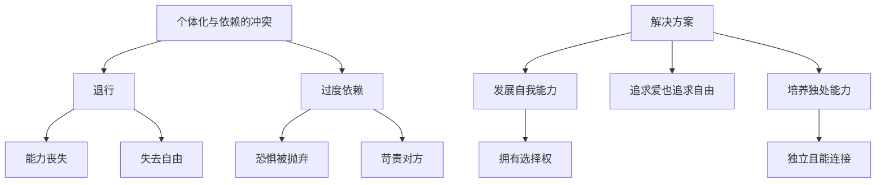
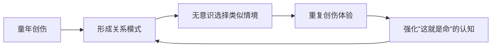
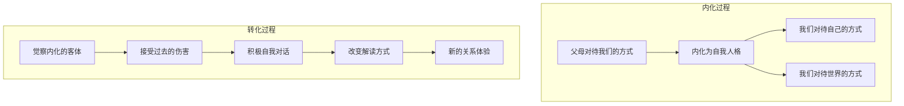
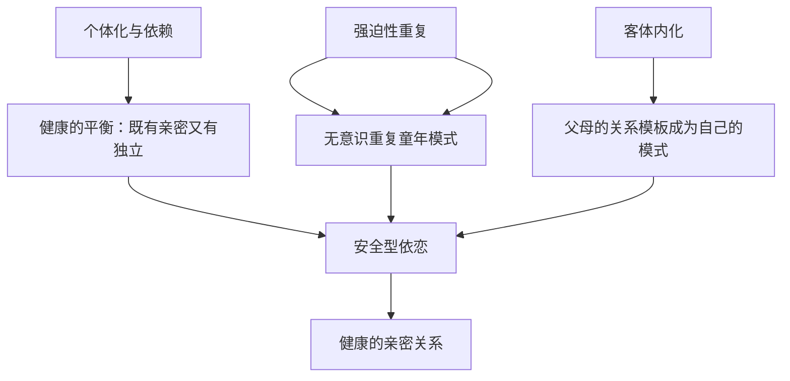

# 第07课：内在关系模式的形成

## 个体化与依赖的平衡

个体化（Individuation）与依赖的冲突是亲密关系中最常见也最矛盾的张力之一。一方渴望共生性的亲近，另一方渴望独立和自主。这种冲突并非外在的，而是每个人内心深处的拉锯战。

### 个体化与依赖的冲突表现

- 在家嫌父母管太多，离开后发现自己无法照顾自己
- 在关系里待得不舒服，独处时也不舒服
- 既渴望亲密又渴望自由，处于"两头不到岸"的困境

> [!EXAMPLE] 番茄炒蛋的留学生
> 视频中留学生凌晨四点叫醒父母视频教学做番茄炒蛋，表面是父母的爱，实则反映了双方都未完成个体化分离——父母留恋影响孩子生活的感觉，孩子未发展自我照顾能力。

### 退行与过度依赖

退行（Regression）是指一个人从成年状态退回到婴儿状态，时刻需要被关注和照顾。在恋爱关系中尤其常见——原本独立的女汉子，谈恋爱后变得什么都不会做。

> [!NOTE] 依赖与自由的悖论
> 依赖发生时，意味着你失去了自主的能力。就像口袋里没钱和朋友吃饭，会时刻担心对方走掉。依赖越深，自由越少。

### 如何解决个体化与依赖的冲突

1. **发展自己的能力**——"爹有娘有不如自家有"，有能力就有选择权
2. **既追求爱又追求自由**——爱和自由是人类两个终极目标，不应为了一个放弃另一个
3. **培养独处能力**——独处不是隔离。独处时仍能与世界保持连接，自我满足且愉悦

> [!QUESTION] 你在亲密关系中是否出现过"退行"现象？比如恋爱后变得比单身时更依赖对方？
> 

> 
思考提示

> 退行是常见的，关键在于觉察。问自己：我是否在关系中丧失了原本有的能力？我能否接受对方暂时不在身边？如果答案是"不能"，可能需要重新审视自己的依赖程度。
> 

---

## 强迫性重复

强迫性重复（Repetition Compulsion）由弗洛伊德提出，指人在经历痛苦或快乐事件后，会不自觉地反复制造同样情境以体验同样情感。它隐藏在无意识中，常被误认为是"命运"。

### 强迫性重复的三种动力

| 动力 | 说明 | 案例 |
|------|------|------|
| 忠诚的表现 | 忠于自己未了的心愿，完成童年未完成之事 | 不愿意成为妈妈那样的女人，于是活出妈妈的反面 |
| 改写剧本 | 重复是为了战胜过去的无力感 | 激怒男友，在冲突中体验力量感 |
| 渴望获得爱和关注 | 通过重复某种行为获取关注 | 哥哥不断意外受伤，只为获得父母的关爱 |

### 强迫性重复的恶性循环

> [!WARNING] 强迫性重复的识别
> 如果你发现自己反复遇到同一类人、反复陷入同样的困境，那可能不是"运气不好"，而是强迫性重复在起作用。比如总是被有家室的男性吸引，或总是把温和的伴侣逼成暴怒的人。

### 停止强迫性重复的方法

1. **看到创伤的来源**——当伴侣未及时回复信息就感到被抛弃，这种恐惧可能源自婴儿期未被完美照料
2. **建立安全的依恋关系**——在新的安全关系中，获得修正性的情感体验
3. **建立新的认知**——相信自己有能力被爱，活在当下，有权选择新的生活方式

> [!TIP]
> 觉察是改变的第一步。当你发现生命中某种现象经常发生时，不妨认真看看——这是否是强迫性重复？

---

## 客体内化

客体内化（Object Internalization）是指把父母对待我们的方式，内化成自我的一部分人格特质，成为我们对待自己和世界的方式。

### 内化的比喻

就像吃东西——把食物嚼碎、消化、吸收，转变为身体的营养和能量。单纯的觉得对方好或把对方当榜样，不叫内化。当你变得和那个人一样，他成为你的一部分，才叫内化。

> [!NOTE] 攻击者认同
> 当孩子被暴力对待时，为了消除内心的痛苦，会主动选择成为攻击者一样的人。因为那样会让自己感到有力量，抵消被暴力对待时的无力感。这是客体内化的一种特殊形式。

### 客体内化的影响

- 一个被暴力对待的孩子，长大后可能用暴力对待世界
- 一个在指责中长大的孩子，内心会有一个严厉的自我批评者
- 一个焦虑的母亲，会让孩子也把世界看成充满威胁

### 如何转化内化的客体

1. **坦然接受过去的伤害**——伤害已经发生，无法改变。接受这一点，是转化的前提
2. **积极的自我对话**——把内心指责的父母形象，转变为鼓励的、引导的形象
3. **改变解读世界的方式**——你对世界的解读决定了你的安全感

> [!QUESTION] 你发现自己身上有哪些不认可却"继承"自父母的特质？
> 

> 
思考提示

> 比如明明不想像妈妈那样唠叨，却对伴侣喋喋不休；明明讨厌爸爸的暴脾气，却在愤怒时和他如出一辙。觉察是改变的开始。
> 

---

## 核心概念关系图

---

## 术语回顾

- [[reference/0000-glossary|个体化]] - 从与父母融合的状态中分离出来
- [[reference/0000-glossary|强迫性重复]] - 无意识地重复童年创伤情境
- [[reference/0000-glossary|内在关系模式]] - 童年形成的对自我和他人的认知模板
- [[reference/0000-glossary|客体关系]] - 早期与重要他人的互动内化为关系模式

---

## 应用练习

1. **依赖程度自测**：回想最近一次和伴侣/父母的互动，你是在表达需求还是在过度依赖？尝试区分"需要帮助"和"没有对方就活不下去"。
2. **模式觉察日记**：本周留意自己是否出现重复性的情绪或关系困境，记录下来并思考：这和我童年的什么经历有关？
3. **自我对话练习**：当你内心出现批评的声音时，试着把它想象成一个可以重新编辑的录音带——你希望这个声音说什么？

---

## 下一课推荐

下一课 [[0008-ke-ti-guan-xi-pei-dui|第08课：客体关系与亲子配对（上）]] 将介绍四种常见的亲子配对关系模式，帮助你理解童年关系如何影响成年后的亲密关系。