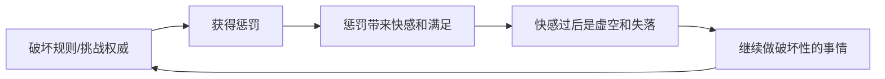

# 第08课：客体关系与亲子配对（上）

## 配对关系模式概述

客体关系理论认为，童年与父母/养育者的互动关系会在我们内心形成"配对关系模式"——一个"自我"配对一个"客体/他人"。这些配对模式会在成年后的亲密关系中被无意识地激活和重复。

> [!NOTE] 配对关系的本质
> 每个内在的"自我"形象，都对应着一个内在的"他人"形象。两者配对存在，相互影响。这不是真实的人际关系，而是我们内心投射的剧本。

---

## 配对一：依赖满足的孩子 + 完美父母

### 核心特征

内心渴望别人像完美父母一样无条件满足自己。这源于婴儿期（0-6个月）未被充分满足的需求——当妈妈未能及时回应，婴儿心中会分裂出"好妈妈"和"坏妈妈"，长大后这个分裂延续到所有关系中。

### 表现

- 期待别人能完全理解自己、满足自己
- 对方满足自己时感觉极好，稍有不足就认为对方是坏人
- 容易把权威人物理想化，幻想他们能解决一切问题
- 依赖导致反依赖——依赖越深，越苛责对方

> [!WARNING] 依赖与苛责的一体两面
> 依赖的人看似依附，实则充满苛责。越依赖，越希望对方完美，越容易因对方的不完美而愤怒。依赖中包含着改变对方的冲动。

### 溺爱的陷阱

即使是在溺爱中长大的孩子，也容易陷入依赖状态。因为溺爱让孩子从未体验到分离，养成了依赖的惯性。值得注意的是，溺爱的背后往往不是父母单方面付出——父母也在依赖孩子。

> [!EXAMPLE]
> 一位来访者极度宠溺25岁的儿子，刷掉40多万信用卡也不敢停卡。深入了解后发现，她其实在依赖儿子——因为夫妻关系不好，儿子是她唯一的依靠。

| 角色 | 信念 | 行为 | 情绪 |
|------|------|------|------|
| 依赖满足的孩子 | 别人应该满足我 | 期待、索取、苛责 | 满足时幸福，不满足时愤怒 |
| 完美父母 | 我要满足对方 | 过度付出、包办 | 被需要时有价值，被苛责时委屈 |

---

## 配对二：友好顺从的孩子 + 溺爱赞赏的父母

### 核心特征

内心是一个"乖孩子"，需要通过顺从和讨好获得赞赏。这个配对模式让人既扮演顺从的孩子，又扮演溺爱赞赏的父母。

### 两种角色的切换

| 角色 | 场景 | 问题 |
|------|------|------|
| 顺从的孩子 | 面对权威/老板时 | 没有自己的主张，为了赞美而做事，不被赞美就自我怀疑 |
| 溺爱赞赏的父母 | 面对伴侣/亲密对象时 | 看不见对方真实的样子，把对方理想化 |

> [!EXAMPLE]
> 一位来访者是典型的"乖乖女"，对老板有求必应。老板稍有质疑，她就陷入自我怀疑。在恋爱中，她却变成了"溺爱赞赏的父母"——明知男友有问题，仍然不断赞美他、维护他。

### 问题所在

1. **缺乏创造和主张**——顺从的孩子没有自己的意见，只是完成别人交代的任务
2. **无法真正信任和看见对方**——溺爱的本质是自恋的补偿，爱的不是对方，而是"爱你时的自己"
3. **情绪波动大**——别人的一个微小态度变化都会引起强烈反应

> [!TIP] 溺爱不是爱
> 溺爱是我们渴望被对待的方式，是一种自恋的投射——我们溺爱对方，其实是在溺爱自己。越是缺爱的人，越容易通过溺爱他人来爱自己。

### 改变方向

1. 认识到溺爱不是真正的爱，是对"被赞赏"的渴望
2. 将注意力从"别人的态度"转移到"事情本身"
3. 进行现实检验——你所担心的否定，可能只是你的想象

---

## 配对三：破坏性的孩子 + 惩罚性的父母

### 核心特征

内心有一个渴望破坏规则、挑战权威的"坏孩子"，对应着一个严厉惩罚的"父母"。这种配对形成了一种"破坏-惩罚"的循环。

### 破坏与惩罚的循环

### 形成原因

当父母对孩子过于严厉和苛责，孩子心中会种下破坏和报复的种子。惩罚给孩子带来的不是"下次不犯"，而是羞耻、无力和沮丧。为了补偿这种无力感，孩子通过破坏行为来获得力量感。

> [!WARNING] 教师家庭的悖论
> 北京大学徐凯文教授的调查发现：相当比例的违法青少年和自杀倾向危机样本来自中小学教师家庭。因为教师见过太多"优秀"孩子，对自己的孩子期望过高，苛责惩罚反而种下了破坏的种子。

### 生活中的表现

- 有些人平时斯文谨慎，但在亲密时刻会骂脏话——通过挑战道德感获得平衡
- 网络成瘾、赌博成瘾等成瘾行为，本质是破坏与惩罚的循环
- 事业和关系明明发展顺利，却莫名其妙地破坏掉

> [!NOTE]
> 一位38岁的来访者，三次事业成功却选择放弃，两段婚姻以离婚告终。他坦言："我就是过不了平稳安定的日子。"他的父亲曾把他吊起来打，他一生都在通过破坏来证明自己是有力量的。

### 如何打破循环

1. **看见破坏欲之下的真实需要**——破坏者真正渴望的是被宽容对待，而不是苛责
2. **重新评估自己的力量**——你已经不是当年那个无力的孩子了
3. **从破坏转向建设**——觉察"破坏是为了证明力量"的模式，选择建设性的方式表达力量

---

## 配对四："孤儿" + 以自我为中心的父母

### 核心特征

内心有一个孤独、渴望被关注却不敢主动连接的"孤儿"，对应着以自我为中心、忽视孩子需求的父母。

### 表现

| 表现 | 说明 |
|------|------|
| 不会主动联系别人 | 害怕被拒绝，但渴望别人主动联系 |
| 隔离自己 | 情感隔离或关系隔离，对人不信任 |
| 自怜又自闭 | 只关注自己的情绪，对他人挑剔 |
| 投射自恋 | 收留流浪动物，实则在"收留自己" |

> [!EXAMPLE]
> 来访者从小被父亲独自丢在广场，母亲体弱多病，大部分时间一个人待着。长大后，对每个人都隔着一层膜，觉得同事不在意自己。既希望别人不要打扰他，又渴望有人主动关心他。

### 孤独感的根源

"孤儿感"并非真的没有父母，而是童年时父母以自我为中心，未能充分满足孩子"被看见、被爱、被陪伴"的需求。这种未被满足的状态会延续到成年，即使在亲密关系中也会感到孤独。

### 改善方法

1. **与以自我为中心的父母和解**——放下对别人的期待，抱怨无济于事
2. **打破围墙**——主动尝试建立连接，哪怕只是参与一次同事的聚会
3. **练习求助**——当你孤单时，尝试向亲近的人发出求助信号

> [!QUESTION] 你是否有"宁愿和动物打交道，也不愿和人打交道"的时刻？
> 

> 
思考提示

> 动物给予的是无条件的接纳，而人际关系需要信任和冒险。但人是群居动物，长期隔离是对生命最大的消耗。试着迈出一小步，主动联系一个朋友。
> 

---

## 四种配对模式总览

| 配对 | 自我角色 | 他人角色 | 核心动力 | 童年根源 |
|------|---------|---------|---------|---------|
| 一 | 依赖满足的孩子 | 完美父母 | 渴望无条件的满足 | 婴儿期未被充分回应 |
| 二 | 友好顺从的孩子 | 溺爱赞赏的父母 | 渴望被赞赏 | 只在"乖"时才被肯定 |
| 三 | 破坏性的孩子 | 惩罚性的父母 | 通过破坏获得力量感 | 被严厉惩罚和苛责 |
| 四 | 孤儿 | 以自我为中心的父母 | 既渴望又害怕连接 | 情感需求被忽视 |

---

## 术语回顾

- [[reference/0000-glossary|客体关系]] - 早期与重要他人的互动内化为关系模式
- [[reference/0000-glossary|投射性认同]] - 诱导他人以特定方式行为来确认内心投射
- [[reference/0000-glossary|内在关系模式]] - 童年形成的对自我和他人的认知模板

---

## 应用练习

1. **配对模式识别**：回顾你最重要的亲密关系，你更常扮演哪种"自我角色"？对方又对应了哪种"他人角色"？
2. **现实检验练习**：如果发现自己陷入"顺从孩子"模式，尝试问对方："你对我真的有不满吗？"——你可能发现对方根本没想那么多。
3. **打破循环的尝试**：如果你有"破坏-惩罚"倾向，下一次想破坏时，停下来问自己："我现在真正需要的是什么？"

---

## 下一课推荐

下一课 [[0009-ke-ti-guan-xi-pei-dui-xia|第09课：客体关系与亲子配对（下）]] 将继续介绍失控愤怒的人与无能父母、控制性全能自我与虚弱他人、攻击竞争性自我与惩罚报复性他人等三种配对模式。