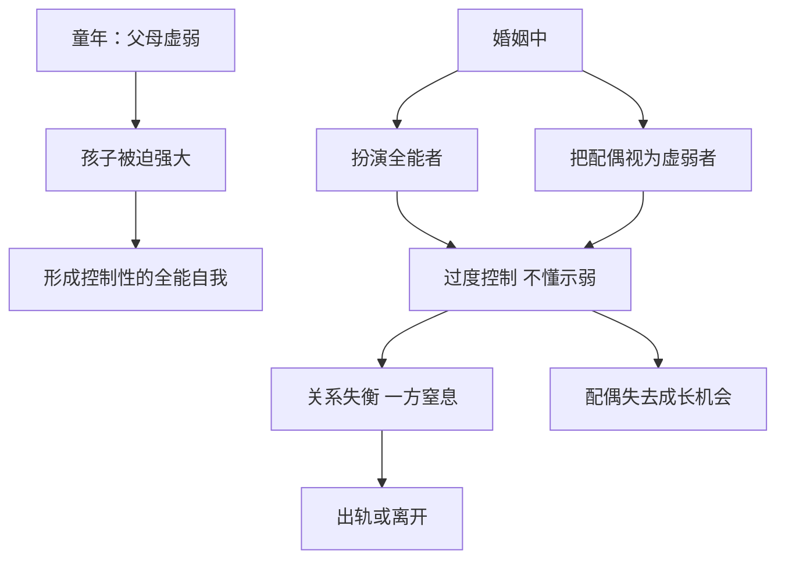
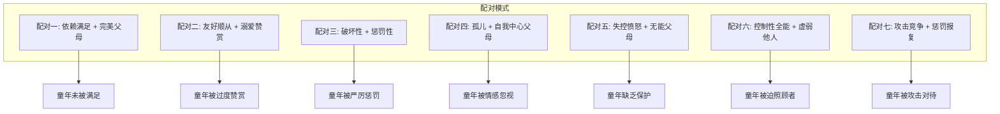

# 第09课：客体关系与亲子配对（下）

## 配对五：内心失控愤怒的人 + 无能的父母

### 核心特征

内心有一个愤怒、失控的自我，对应着无力保护孩子的无能父母。当父母无法给孩子提供安全感和保护，孩子会体验到强烈的羞耻感和不安全感。

### 无能父母给孩子带来的六种伤害

| 伤害 | 表现 |
|------|------|
| 暴露在危险中 | 父母说"我们没有能力给你好条件"，孩子独自面对世界的恐惧 |
| 功能缺失导致认知偏差 | 孩子以为世界围着自己转，一旦不是就愤怒失控 |
| 自尊缺失的受挫感 | 因父母不被尊重而感到羞耻 |
| 被迫成为拯救者 | 孩子要照顾父母，能力不够时体验失控感 |
| 承载过高期望 | 父母把自己未实现的愿望投射到孩子身上 |
| 无法建立稳定自我 | 渴望父母强大又知道不可能，变得敏感多疑 |

> [!EXAMPLE] 电影《无名之辈》
> 落魄保安马先勇拿水果求老师宽限学费，女儿看到父亲卑躬屈膝的样子感到屈辱，狠狠踩烂水果跑开。这就是无能父母带来的羞耻感和失控感。

### 愤怒的本质

愤怒是无力感的表达。当内心完全认同了父母的无能处理方式，就会通过愤怒来掩饰自己的脆弱。

### 如何应对

1. **纠正认知偏差**——世界没有绝对的公平，但也不是充满恶意的
2. **脱离失控愤怒的状态**——愤怒解决不了问题，冷静沟通往往更有效
3. **不要责怪父母，也不要责怪自己**——你无需为父母的无能负责
4. **相信解决问题的多种可能性**——愤怒不是唯一选择，尝试新的应对方式

> [!TIP] 新尝试的力量
> 一位易怒的朋友坐网约车差点误机，愤怒模式即将启动的瞬间，他意识到愤怒没有意义，改为平静表达感受、提出要求。司机不仅道歉还接受了他的要求。他发现：原来别人是愿意听自己说话的，世界不是充满攻击的。

---

## 配对六：控制性的全能自我 + 虚弱的他人

### 核心特征

内心有一个全能控制者的自我，对应着一个虚弱无能的他人。这种模式常源于童年过早承担照顾者角色——当父母虚弱无力，孩子被迫成为"小大人"。

### 形成根源

控制性的全能自我往往来自童年期被迫扮演照顾者角色的经历：

- 父母能力弱、常生病，孩子必须强大起来
- 孩子的需求和委屈无处表达，只能压抑
- 习惯了对一切负责，不敢示弱

### 生活中的表现

### 出轨的心理动力

控制性的全能自我与虚弱的他人的配对，是很多"出轨对象不如原配"现象的深层原因。出轨的一方在原有关系中是被控制的"虚弱者"，在新关系中终于可以扮演"全能者"。

> [!WARNING]
> 张先生被能干的太太全程控制，从小被妈妈过度照顾以至于无法成长。当他遇到一个柔弱的第三者时，终于可以扮演"妈妈"的角色去照顾对方——这种感觉让他觉得自己是有价值的。第三者条件未必好，但满足了他扮演全能自我的需求。

### 改善方法

| 角色 | 改变方向 |
|------|---------|
| 控制性全能者 | 允许自己表达虚弱，学会承受愧疚感，让对方完成自己的功课 |
| 虚弱的他人 | 意识到接受别人的照顾是一种成全，同时要承担属于自己的责任 |

> [!NOTE]
> 当张太太终于对丈夫说"其实很多时候我都感觉到特别累，我很需要你的帮助"时，关系开始转变。丈夫回应说："其实我也知道你很辛苦，我真的很想帮你。"表达虚弱，反而成全了对方的价值感。

---

## 配对七：攻击竞争性的自我 + 惩罚报复性的他人

### 核心特征

内心好斗、竞争，把别人视为竞争对手或潜在的惩罚者。这种模式来自童年被惩罚性父母对待的经历——父母用攻击性的方式惩罚孩子，孩子学会了"先下手为强"。

### 形成机制

1. **攻击性被压抑**——父母严厉惩罚，孩子的攻击性被压制
2. **投射到外界**——内心被压抑的攻击性投射到他人身上，觉得别人"要攻击我"
3. **先发制人**——为了保护自己，先攻击别人

> [!EXAMPLE] 杠精的心理
> 现在流行的"杠精"行为，本质上是一种攻击竞争性的表现。"抬杠"隐藏着"我是对的你是错的，我是好的你是坏的"的竞争心理。

### 生活表现

- 把身边所有人都当作竞争对象
- 用攻击性的语言沟通——反问句、指责语气
- "被动攻击"——用拖延、遗忘等方式表达愤怒
- 在亲密关系中竞争"谁贡献多""谁更对"

| 行为 | 表面 | 深层 |
|------|------|------|
| 婆婆洗过的地，媳妇重拖 | 嫌不干净 | 想证明自己更棒 |
| 用反问句回应 | 表达不满 | 攻击竞争模式启动 |
| 见不得别人犯错 | 追求完美 | 内心惩罚性父母在运作 |

### 改善方向

1. **重新看待别人**——别人不是来和你竞争的，是来帮助你的
2. **自我负责时，惩罚性他人消失**——为自己的行为负责，就不需要等待惩罚
3. **减少惩罚，建立有规则的惩罚**——对孩子的教育也是如此

> [!TIP]
> 如果你发现身边的人都是你的"竞争对手"，那世界一定是缺乏善意的。试着转换视角：也许对方只是想帮忙，而不是想和你比赛。

---

## 七种配对模式总览

### 七种配对模式对照表

| 编号 | 配对名称 | 自我角色 | 他人角色 | 童年情境 | 成年关系影响 |
|------|---------|---------|---------|---------|------------|
| 一 | 依赖-完美 | 依赖满足的孩子 | 完美父母 | 未被充分回应 | 苛求伴侣，两极分化 |
| 二 | 顺从-赞赏 | 友好顺从的孩子 | 溺爱赞赏的父母 | 只在乖巧时被肯定 | 无主见，看不见真实对方 |
| 三 | 破坏-惩罚 | 破坏性的孩子 | 惩罚性的父母 | 被严厉苛责 | 破坏与惩罚的恶性循环 |
| 四 | 孤儿-自我 | 孤儿 | 以自我为中心的父母 | 情感被忽视 | 既渴望连接又害怕连接 |
| 五 | 愤怒-无能 | 失控愤怒的人 | 无能的父母 | 缺乏保护 | 用愤怒掩盖无力 |
| 六 | 全能-虚弱 | 控制性的全能自我 | 虚弱的他人 | 被迫照顾者 | 控制与被控制的不平等 |
| 七 | 竞争-报复 | 攻击竞争性的自我 | 惩罚报复性的他人 | 被攻击对待 | 先下手为强，无法信任 |

> [!NOTE] 觉察的意义
> 了解这些配对模式不是为了贴标签，而是为了觉察。当你发现自己在关系中反复陷入某种模式时，你就有了选择——可以选择继续被模式驱使，也可以选择打破它。

---

## 术语回顾

- [[reference/0000-glossary|客体关系]] - 早期与重要他人的互动内化为关系模式
- [[reference/0000-glossary|内在关系模式]] - 童年形成的对自我和他人的认知模板
- [[reference/0000-glossary|投射性认同]] - 诱导他人以特定方式行为的心理过程
- [[reference/0000-glossary|强迫性重复]] - 无意识地重复童年创伤情境

---

## 应用练习

1. **模式对照**：对照七种配对模式，找出你最熟悉的2-3种模式。你在不同关系中扮演不同角色吗？
2. **示弱练习**：如果你通常是"控制性全能者"，试着对伴侣说一次："我今天很累，可以帮我一下吗？"注意观察你的感受和对方的反应。
3. **暂停愤怒**：下次感到愤怒即将爆发时，暂停5秒钟，深呼吸，问自己："我真正感到无力的是什么？"

---

## 下一课推荐

下一课 [[0010-fen-li-yu-liao-yu|第10课：分离、成长与童年创伤疗愈]] 将讲授如何走出全能幻觉、完成个体化分离，以及童年创伤的"接受-修复-阻断"三步法。