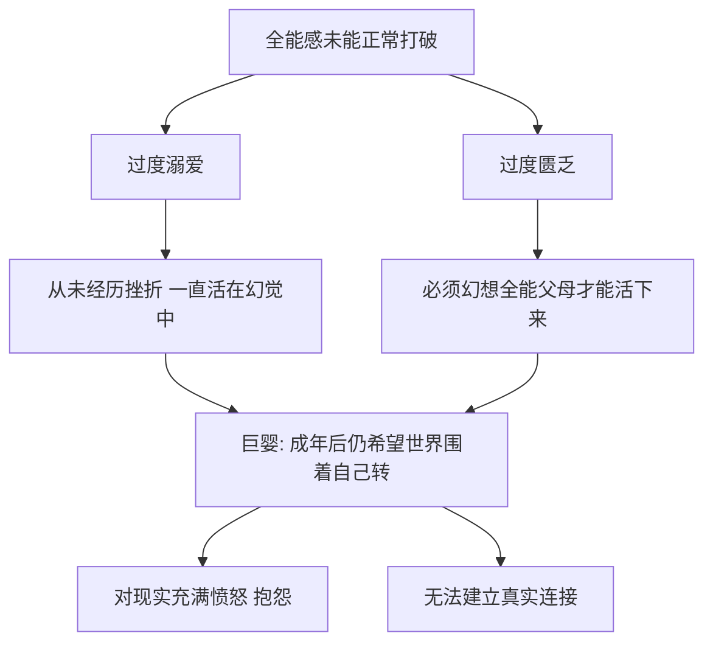
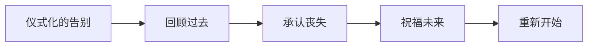
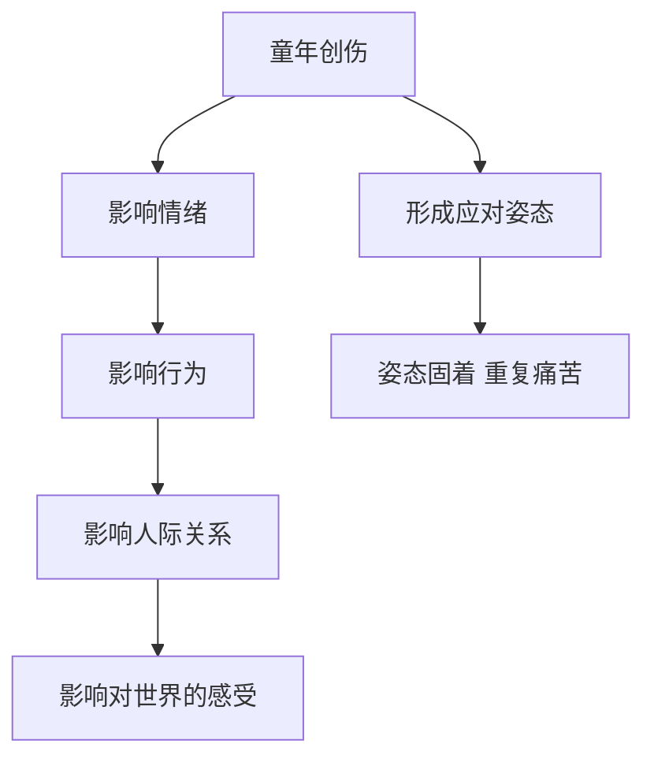
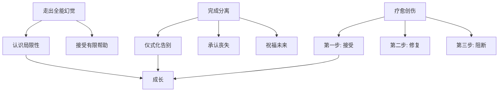

# 第10课：分离、成长与童年创伤疗愈

## 走出全能自我和全能父母的幻觉

### 什么是全能感

全能感（Omnipotence）是婴儿期的一种原始心理状态——婴儿觉得自己无所不能，妈妈是一个全能的照顾者。随着年龄增长，这种全能感应被现实逐渐打破。

### 全能感固着的两种原因

1. **过度溺爱**——父母不让孩子经历任何挫折，孩子无法打破全能感
2. **过度匮乏**——从小暴露在危险中，必须幻想出全能父母来保护自己（如卖火柴的小女孩）

### 全能自我的体验

- **停止接触真实世界**——自闭状态，不和他人产生链接
- **不断受挫**——一点点小事就被放大到"世界要毁灭"
- **对周围充满期望和要求**——对方必须无条件满足自己

> [!WARNING] "要么全给，要么全不给"
> 有些人会说"你要不给我全部，要不给我更多，不然我全都不要"——这正是全能感的表现，不愿意接受有限的帮助。

### 如何走出全能感

1. **承认自己不是全能的**——这可能会带来悲伤和丧失感，但必须接受
2. **相信自己是具备一定能力的**——虽然不是全能，但也不是无能
3. **尝试获取有限的帮助**——有限的帮助可能完成不了所有需要，但仍然有价值

> [!QUESTION] 你是否曾因为对方不能"完全"满足你，而拒绝接受对方可以提供的帮助？
> 

> 
思考提示

> 这是典型的全能感思维。试着接受"够好"而不是"完美"。在关系中，接受有限的帮助比拒绝全部帮助更能建立真实的连接。
> 

---

## 完成分离才能更好地成长

### 分离的含义

分离（Separation）是每个人必须完成的功课，贯穿一生。分离不仅是与他人分开，还包括：

- 今天的自己与昨天的自己分离
- 与理想化的自我分离
- 拥抱真实的世界

> [!NOTE] 生命是个淡淡的悲伤过程
> 分离伴随着丧失感，这与我们追求快乐的本性相悖，所以我们常常不愿意接受分离。但拒绝分离就是拒绝成长。

### 无法完成分离的表现

| 表现 | 说明 |
|------|------|
| 融合共生（退行） | 一谈恋爱就变得很粘人，恨不得24小时在一起 |
| 纠缠不清 | 分手又复合、复合又分手，无法真正分开 |
| 暧昧状态 | 不表白不拒绝，因为表白意味着可能被拒绝 |
| 害怕自由 | 自由意味着独立负责，有些人宁愿不自由 |

### 分离的场景

- **与某人分离**——分手、离婚、亲人离世
- **与某个状态分离**——毕业、换工作、离开家乡
- **与理想化自我分离**——接受自己的局限性

### 什么时候需要完成分离

1. **总是回想"如果回到从前"**——停留在过去的美好想象中
2. **无法投入新的关系**——和现任在一起，总是想着前任
3. **不敢说再见**——提前离开聚会、不敢送人

### 如何完成分离

1. **仪式化的告别**——剪头发、写信、举行告别仪式。尤其是重大分离事件（如亲人离世），一定要处理好
2. **回顾过去，承认丧失**——回顾照片、重温美好，允许自己悲伤
3. **祝福未来，重新创造新的开始**——像毕业留言一样，写下对未来的期望

> [!TIP]
> 如果你正在经历难以放下的分离，可以尝试：在心里完成一次正式的告别仪式。告诉对方（或过去的自己）：谢谢你，再见。然后转身走向新的生活。

---

## 疗愈童年创伤：接受、修复、阻断

### 童年创伤的三种类型

| 类型 | 严重程度 | 成因 | 影响 |
|------|---------|------|------|
| 期待性创伤 | 最严重 | 父母对孩子性别/身份的期待不符 | 影响自我认同、身份认同、价值认同 |
| 分离性创伤 | 中等 | 养育环境或养育者本身不稳定 | 破坏安全感，过度敏感 |
| 忽视性创伤 | 最普遍 | 感受、意愿没有被真正看见和回应 | 渴望被极度关注，希望伴侣像蛔虫 |

### 创伤的影响路径

#### 期待性创伤

对一个家庭来说，如果一直盼望男孩却生了女孩，这个女孩可能会一生都觉得自己不如男性，不断和男性竞争，甚至把问题归咎于男性。

#### 分离性创伤

养育者情绪不稳定或经常不在，孩子会产生被抛弃的体验。这种体验对婴儿来说意味着死亡。长大后对环境和人际关系的变化特别敏感。

#### 忽视性创伤

孩子摔倒想哭，父母说"不要哭，哭是羞羞的"——不允许表达感受。长大后如果对方没有及时回应自己，就会特别愤怒，希望伴侣是自己肚子里的蛔虫。

### 疗愈三步法：接受、修复、阻断

> [!EXAMPLE] 兔子被摔死的女孩
> 来访者6岁时偷偷养了一只兔子，被父亲发现后从8楼阳台摔死。父亲当时的眼神她永远记得。长大后，丈夫一个凌厉轻蔑的眼神就会让她勃然大怒、歇斯底里——那个眼神像"扳机"，激发了她曾经的创伤体验。

#### 第一步：接受

接受创伤的存在，就像接受路上有个洞——你无法把洞填平，但可以绕着走。承认创伤的存在，而不是否认或逃避。

#### 第二步：修复

与过去的自己建立链接。不是指责父母，而是以成年人的身份去保护当年的自己，让当时被压抑的感受得以充分表达。

> [!NOTE]
> 当我问那位来访者"如果回到当初，看到那个小女孩，你会对她做什么？"她说："我会走过去抱抱她，跟她说——我知道你很难过，但兔子的死不是你造成的，是你爸爸的错。"说完后她哭得很厉害，但同时也与过去的自己建立了链接。

#### 第三步：阻断

寻找支持性资源，做出新的选择和改变。勇敢打破舒适圈，因为固着的应对策略会让你不断重复过去的痛苦。

> [!TIP]
> 那位来访者选择的支持性资源是她的丈夫。她告诉丈夫自己的创伤，并希望在自己发脾气时丈夫能给她一个拥抱。他们之间的沟通进入了一个新的模式。

---

## 核心概念关系图

---

## 术语回顾

- [[reference/0000-glossary|个体化]] - 从与父母融合的状态中分离出来
- [[reference/0000-glossary|内在关系模式]] - 童年形成的对自我和他人的认知模板
- [[reference/0000-glossary|分化]] - 从家庭情感融合中独立出来的能力
- [[reference/0000-glossary|原生家庭]] - 出生和成长的家庭，对性格有深远影响

---

## 应用练习

1. **全能感自检**：回想最近让你感到愤怒的事——你的愤怒是因为"世界没有按你的意志运转"吗？
2. **分离练习**：如果你正面临一个难以放下的关系或状态，尝试做一件有仪式感的事来告别
3. **创伤三步法**：选择一个童年创伤事件，按照"接受-修复-阻断"的步骤走一遍。可以写下对那个年幼的自己想说的话

---

## 下一课推荐

下一课 [[0011-fu-qin-de-gong-neng|第11课：父亲的功能与父爱缺失]] 将进入模块四，讲解父亲的五大功能、父爱缺失对女儿和儿子的不同影响，以及妈宝男的形成机制。