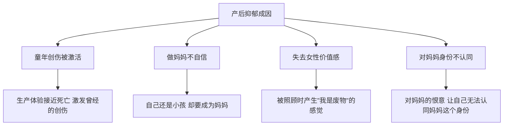
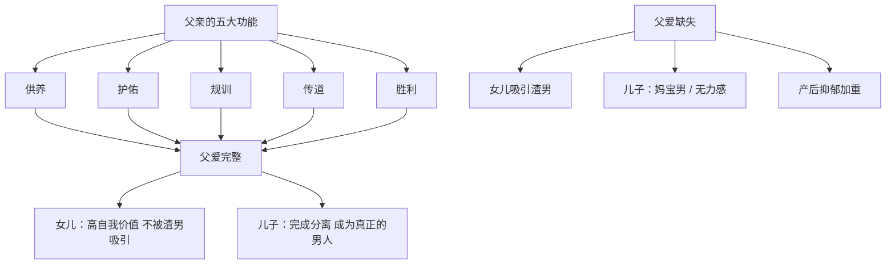

# 第11课：父亲的功能与父爱缺失

## 爸爸的五个功能

在一个家庭中，爸爸的缺失不仅指物理上的不在场，更指爸爸角色的功能缺失。即使爸爸人在家里，如果没有承担起相应的功能，仍然是一种"缺席"。

### 五大功能详解

```mermaid
flowchart TD
    subgraph 爸爸的五个功能
        F1[1、供养] --> 挣钱养家 经济支持
        F2[2、护佑] --> 保护家人 促进分离
        F3[3、规训] --> 建立规则 规则意识
        F4[4、传道] --> 传递价值观 培养教养
        F5[5、胜利] --> 树立榜样 有序竞争
    end
```

| 功能 | 含义 | 具体表现 | 与妈妈的差异 |
|------|------|---------|------------|
| 供养 | 挣钱养家 | 提供物质保障 | 现代社会父母可共同承担 |
| 护佑 | 保护家人安全 | 促进孩子分化分离，带到家庭外的世界 | 妈妈的爱指向融合，爸爸的爱指向分离 |
| 规训 | 建立规则 | "养不教父之过"，设定不可逾越的底线 | 妈妈设定规则易被打破，爸爸更有权威 |
| 传道 | 传递价值观 | 对生命的敬畏、对世界的善意、对规则的遵守 | 言传身教，潜移默化 |
| 胜利 | 树立榜样 | 让孩子认同强大的父亲形象 | 爸爸是孩子生命中的第一个榜样 |

### 护佑功能——促进分化

心理学家荣格提出：妈妈的爱指向融合，爸爸的爱指向分离。爸爸的护佑功能能让孩子：

- 独立成长，完成分化分离成为自己
- 不再以非黑即白的眼光看世界
- 知道世界不是完美的，但并不是不好的

> [!TIP]
> 刘德华一直不肯公开妻女的照片信息，这是为了保护家人不受外界干扰，正是护佑功能的体现。

### 规训功能——建立规则

美国总统特朗普曾对四个孩子说"不要喝酒"，多年来没有人敢挑战这个规则。因为孩子们知道：爸爸不轻易立规则，一旦设立就是底线，不可逾越。

### 传道功能——传递价值观

黄磊热爱读书的习惯无意间传递给了女儿多多，小小年纪已经阅读了大量书籍。教养就是一种价值观的传递。

### 胜利功能——树立榜样

刘畊宏在《爸爸去哪儿》中鼓励女儿小泡芙完成挑战，协助她完成任务。一个能给孩子鼓励的爸爸，让孩子更具备在规则中竞争获胜的能力。

### 爸爸功能缺失时的弥补方式

1. **创造好爸爸形象**——告诉孩子"爸爸是爱你的，爸爸很强大"
2. **创造替代性男性角色**——舅舅、喜欢的男性老师或公众人物（如体育明星）

> [!WARNING]
> 哪怕离婚了，你也是孩子的爸爸，这个身份永远无法摆脱。不要让你的孩子在缺失爸爸的生活中长大。

---

## 产后抑郁症与原生家庭

### 产后抑郁的成因

产后抑郁的高发期在产后3-6个月，患病比例约23%。主要有四方面原因：



### 应对产后抑郁的方法

1. **寻找支持性资源**——可以分享内心真实想法（包括羞耻的想法）的人
2. **打破"从生产后获益"的过程**——不要沉浸在被特殊照顾的报复性快感中
3. **肯定孩子提供的价值**——深情凝望、奶香、体温，这些都是孩子给你的礼物
4. **回应孩子的需要，体验满足感**——积极关注孩子，获得强烈的价值体验
5. **必要时寻求专业帮助**——产后抑郁不能硬撑

> [!NOTE]
> 一位产后抑郁的来访者经常想把自己的孩子掐死，非常痛苦。当她把这个想法告诉丈夫时，丈夫说："你怎么会有这个念头呢？你心里真的很不舒服了。"这种支持性的力量让她彻底放松下来。

---

## 父爱缺失的影响

### "我为什么会是我"——自我认同的建构

原生家庭给我们三个层次的影响：

1. **真实的家庭状况**——基因、环境
2. **家庭中的关系模式**——如何对待彼此
3. **情绪和性格的延续**——恐惧弥漫的家庭会让人没有安全感

认识自己需要明白"我从哪里来"，这包括：籍贯、家庭背景、父母对待自己的方式、家族荣誉或创伤。

### 为什么有的女孩容易吸引渣男

> [!QUESTION] 你是否曾疑惑：为什么有些优秀的女孩总是遇到渣男？
> <details>
> <summary>答案</summary>
> 这多半和父亲有关。如果父亲从小没有给女儿足够的关注和爱，女儿就没有足够的安全感和自我价值感。一旦有人关注她，就觉得对方很好，甚至不惜改变自己去讨好对方。张雨绮从小父母离异，两任丈夫都出了问题，并非巧合。
> </details>

### 好爸爸的三个维度（心理学家萨提亚）

| 维度 | 含义 | 影响 |
|------|------|------|
| 投入 | 专心陪伴女儿 | 女儿不会因被"忙"拒绝而感到委屈 |
| 可接近的 | 长时间互动、有共同话题 | 女儿体验到亲密的连接感 |
| 尽责 | 对家庭忠诚负责 | 女儿将来也会选择这样的伴侣 |

### 吸引渣男的女孩如何改变

1. **不要因渴望被接纳而失去底线**——判断对方是真心接纳你，还是你单方面的想象
2. **不要放大任何举动的含义**——送礼物是平常事，不代表对方是"盖世英雄"
3. **和父亲进行一次深入对话**——把内心的委屈表达出来
4. **接受过去，重新做出选择**——可以选择原谅或不原谅，但不再被过去影响

> [!TIP]
> 女孩子实实在在体验过被爱被宠的感觉后，才能拥有较高的自我价值，才能在一个平等的状态中建立亲密关系。

### 父爱缺失带来的无力感——男孩的困境

男孩的成长需要"踩着父亲的肩膀"才能长大。

| 缺失父爱的影响 | 表现 |
|------|------|
| 对父亲有敌意 | 失去成长中最重要的榜样，停留在男孩状态 |
| 缺少规则约束 | "老子天下第一"，没有敬畏心 |
| 创造理想父亲 | 无法得到理想父亲时陷入沮丧 |

> [!EXAMPLE]
> 19岁的男孩坚持要和父亲摔跤，父亲起初害怕赢不了。后来在拳击台上，儿子把父亲摔下去后，第一次扶起父亲并道歉。从那一刻起，儿子对待父亲的态度发生了改变——他终于"打败"了父亲，获得了长大的许可。

### 父爱的核心

- **接纳、肯定、允许、爱护**——包括契约、承诺和身份给予
- **创造安全感和"正缠时刻"**——把孩子举过头顶，让他体验危险然后看到父亲稳稳接住
- **创造学习机会**——在游戏互动中传递价值观
- **通过身体语言表达爱**——摸摸头、拍拍肩、拥抱

---

## 妈宝男是怎样产生的

### 妈宝男的本质

妈宝男是"走向父权失败后的产物"——男孩在成长过程中没有顺利地从对妈妈的依恋转向对爸爸的认同。

### 三种形成路径

| 路径 | 原因 | 结果 |
|------|------|------|
| 爸爸不在了 | 没有男性模仿和认同的对象 | 儿子只能依恋妈妈 |
| 父母关系不好 | 妈妈贬低爸爸，儿子不敢认同爸爸 | 爸爸无法进入母子关系 |
| 爸爸是妈宝男 | 爸爸本身就是个男孩角色 | 母亲强势，儿子继续被控制 |

### 妈宝男的典型特征

- "我妈说""我妈认为"——没有自己的主见
- 39岁还带妈妈进剧组——无法完成和妈妈的分离
- 老婆可以重新找，妈妈只有一个——把妻子放在对立面

### 如果伴侣是妈宝男怎么办

1. **不要逼迫老公站队**——让他选边站等于撕裂他
2. **尽量不要责怪他**——责怪会让他感到羞耻，反而跑回妈妈那边
3. **不要把责任推到他身上**——他只是无能为力，不是不在乎
4. **想清楚你在婚姻中要什么**——重新定义婚姻的意义
5. **如果一切努力都无效，离开**——改变妈宝男需要很长时间，你不必承受这个过程的全部代价

---

## 缺席的父亲——贪玩的孩子

### 贪玩父亲的特征

- 和妻子抱怨"养了两个儿子，大儿子是孩子他爹"
- 和孩子抢玩具、躲房间打游戏
- 情绪化，一不顺心就发脾气

### 妻子在其中的"共谋"

值得注意的是，丈夫变成"孩子"往往是夫妻两人共同完成的结果——妻子通过包办一切，让丈夫越来越无能。这背后可能隐藏着妻子的恐惧："如果丈夫强大了，会不会离开我？"

> [!NOTE] 权力的投射性认同
> 一方不断告诉对方"没有我你活不下去"，包办一切，直到对方真的变得无能。这个"游戏"需要双方共同完成。

### 如何帮助丈夫长大

1. **妻子要觉察自己的"共谋"部分**——是否真的希望丈夫成长？还是享受他被需要的感觉？
2. **懂得放手**——丈夫带娃笨手笨脚？让他试试，试错中成长
3. **保持清晰的边界**——"我是你妻子，不是你妈妈"
4. **给予成长的压力**——一个男孩要成为男人，必须有压力

---

## 核心概念关系图



---

## 术语回顾

- [[reference/0000-glossary|原生家庭]] - 出生和成长的家庭
- [[reference/0000-glossary|个体化]] - 从与父母融合中分离出来
- [[reference/0000-glossary|内在关系模式]] - 童年形成的对自我和他人的认知模板
- [[reference/0000-glossary|依恋理论]] - 早期情感纽带如何影响成人关系

---

## 应用练习

1. **父亲功能评估**：评估自己父亲（或自己作为父亲）在五大功能上的表现。哪些功能做得好？哪些有缺失？
2. **女儿成长反思**：如果你是女性，思考你和父亲的关系如何影响了你对伴侣的选择
3. **"妈宝"觉察**：如果你是男性，问自己：我是否在某些方面过度依赖母亲？我能否为自己的重大决定负责？

---

## 下一课推荐

下一课 [[0012-mu-qin-jiao-se|第12课：母亲角色与焦虑]] 将讲解亲子角色颠倒（亲职化）、母亲话语的代际影响、单亲妈妈如何创造好爸爸形象、孝顺与爱的区别，以及妈妈焦虑的根源。