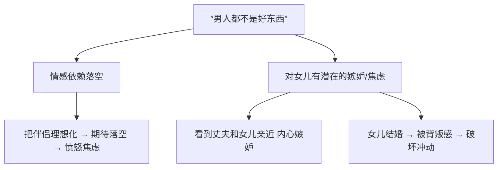
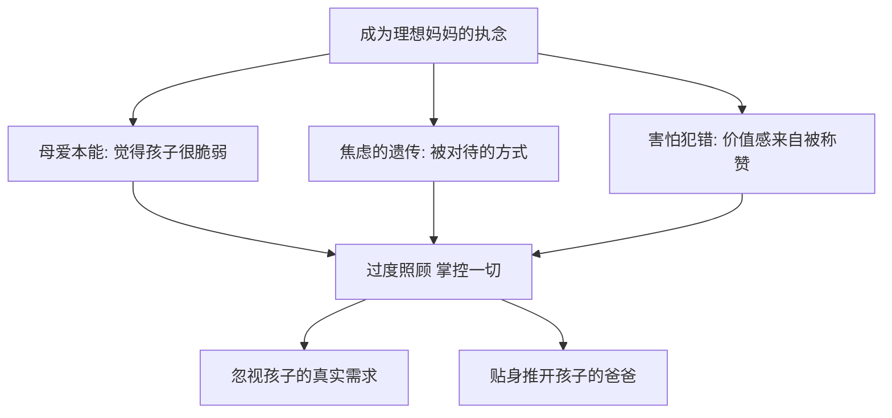
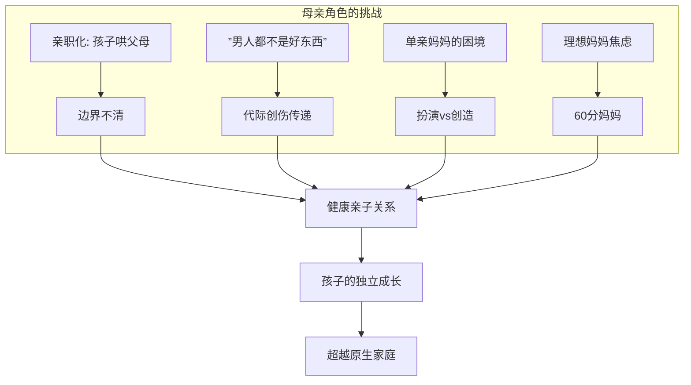

# 第12课：母亲角色与焦虑

## 为什么我总要去哄父母——亲职化

### 什么是亲职化

亲职化（Parentification）是指孩子被迫扮演父母的情绪照顾者，成为"小大人"的现象。在亲子角色颠倒的家庭中，孩子需要去喂养父母的情绪，而不是享受被父母照顾。

### 孩子哄父母的心理机制

孩子哄父母开心，既出于爱，也出于害怕——这是一种生存策略。

| 表现 | 深层心理 |
|------|---------|
| 孩子觉得自己"不懂事" | 内疚——"我给父母添了麻烦" |
| 拼命做各种事让父母开心 | 恐惧——"只有迎合父母才能得到爱" |
| 父母不开心就焦躁不安 | 责任错位——"我必须为父母的情绪负责" |

> [!EXAMPLE]
> 一位小女孩看到妈妈和爸爸吵架后闷闷不乐，来回换了很多次小丑面具逗妈妈笑。一小时过去妈妈终于笑了，孩子已经累得满头大汗。这不是温馨，而是心酸。

### 做父母时如何避免亲职化

1. **觉察自己的表情**——照照镜子，你的眉头是否紧锁？孩子看到的是不是一个"黑洞"？
2. **对自己的情绪负责**——分清你的行为是在"做事"还是在"发泄情绪"
3. **与孩子建立健康边界**——告诉孩子："妈妈可以自己完成这件事，你只需要做你的事"

### 若你曾是那个"哄父母"的孩子

- 意识到你不需要为父母的情绪负责
- 与父母建立健康的边界
- 允许自己做"不乖"的孩子

> [!NOTE]
> 胡慎之老师分享了自己的经历：小时候想买白球鞋参加运动会，妈妈哭了。他说"没关系，我不去参加了。"后来妈妈借了钱买给他，但每次穿上那双鞋，他心里都很内疚。这就是亲职化——孩子的需求被父母的情绪覆盖。

---

## 妈妈说"男人都不是好东西"

### 这句话的深层根源

妈妈说出这句话，可能源于两方面的心理动力：

### 对女儿的两个极端影响

| 影响方向 | 表现 |
|---------|------|
| 认同妈妈 | 排斥男性，拒绝接触异性，甚至发展为同性恋 |
| 不认同妈妈 | 永远停留在"女儿"角色，拒绝成为妻子/妈妈，可能成为"小三" |

### 给妈妈的三个建议

1. **停止不幸的传递**——不要把婚姻的不幸传递给女儿
2. **创造好父亲的印象**——也许他不是好丈夫，但他可能是好父亲
3. **调整认知偏差**——"这个男人不好"不等于"所有男人都不好"

> [!TIP]
> 当看到女儿和爸爸亲密时，妈妈心里酸酸的，这是人性。承认自己的嫉妒比压抑它要好得多。你可以说："看到你和爸爸这么亲密，妈妈心里酸酸的。"说出来之后，就不需要把恶意投射到女儿身上了。

---

## 单亲妈妈：创造好爸爸 vs 扮演好爸爸

### 扮演好爸爸的三个问题

| 问题 | 说明 |
|------|------|
| 复制父亲的不良模式 | 按照自己父亲的方式扮演"爸爸角色"，可能复制打骂、疏远等行为 |
| 无所不能的幻觉 | 认为"妈妈的功能我都可以做到"，但这是不可能的 |
| 把对前夫的恨意转移给孩子 | "不要学你爸爸"，这种攻击等于杀掉了孩子心中的爸爸形象 |

### 创造好爸爸的智慧

与其扮演好爸爸，不如为孩子创造好爸爸的形象：

1. **承认自己的局限性**——你不是无所不能的，不需要感动自己
2. **前夫可能不是好丈夫，但可能是好父亲**——不干预他们之间的互动
3. **创造男性榜样**——外公、舅舅、男性同事，甚至卡通英雄角色

### 创造好爸爸能给孩子的三个好处

1. **勇气**——"爸爸很强大，他一定会支持你"
2. **榜样**——接触有力量的男性，孩子会以他们为榜样
3. **规则感**——内心有一个权威形象，帮助孩子内化规则

> [!EXAMPLE] 电影《摔跤吧爸爸》
> 爸爸不能时刻保护你，爸爸只教会你如何战斗。有时候不是爸爸的方式过时了，而是爸爸老了。爸爸这样做，是为了让你们有自由，以后可以主宰自己的人生。

---

## 孝顺与爱

### 孝顺不等于爱

| 维度 | 孝顺 | 爱 |
|------|------|-----|
| 本质 | 责任和义务 | 情感连接 |
| 动机 | 避免羞耻和愧疚 | 发自内心的愿意 |
| 感受 | 压抑自己，妥协 | 身心合一，感到快乐 |
| 决策 | 看父母高不高兴 | 考虑真实需求 |

> [!WARNING]
> 不要因为不想体验羞耻和愧疚而孝顺。如果你带着恨意去孝顺，这是一种最拧巴的情感，最终可能会好心办坏事。

### 案例：婚礼上的新郎

新郎在婚礼上全程没有一丝笑意，因为新娘是父母喜欢的，不是他喜欢的。他的孝顺是对"不满足父母期待"的羞耻感和愧疚感的逃避。

### 如何从"孝顺"走向"爱"

1. **认识到每个人都有自己的功课**——父母也是成年人，有自己需要面对的问题
2. **当孝顺成为捆绑的绳索，挣脱它**——带着恨意的孝顺比不孝顺更伤人
3. **真正的自我负责**——发自内心地爱父母，而不是被"孝顺"的要求束缚

> [!QUESTION] 你对父母是"孝顺"还是"爱"？当你为父母做一件事的时候，是心甘情愿的，还是为了避免愧疚感？
> 

> 
思考提示

> 如果你对父母的付出带着委屈和牺牲感，那很可能只是"孝顺"而不是"爱"。爱是成全，是相互的，是不需要牺牲自我的。
> 

---

## 妈妈为什么焦虑——理想妈妈的崩塌

### 理想妈妈不存在

英国精神分析家温尼科特说过：世界上不存在理想的妈妈，有一个足够好的妈妈就可以了。60分的妈妈就足够好了——既能满足孩子的基本需求，又能积极回应孩子，同时承认自己有些事情做不到。

### 为什么妈妈执着于成为理想妈妈

### 理想妈妈的掌控如何伤害孩子

| 现象 | 解释 |
|------|------|
| "今天穿秋裤了吗" | 即使孩子说暖，妈妈也要强迫穿上——通过掌控缓解自己的焦虑 |
| "你饱了，再吃一点" | 否认孩子的真实感受，只关注自己的想象 |
| 孩子吃到母乳到十几岁 | 理想妈妈不是真正的爱，而是满足自己的掌控感和自恋 |

### 如何成为"60分妈妈"

1. **学会放手**——接受孩子可以离开自己去成长
2. **告诉孩子世界真实的样子**——妈妈也有做不到的事情
3. **陪伴孩子体验情绪，而不是替代他**——摔倒后，陪他感受疼，而不是说"地板坏"

> [!WARNING]
> 有一个故事：妈妈把孩子的一切都安排得妥妥当当，孩子却因犯罪要坐牢。进监狱前，孩子要求再吸一次妈妈的奶，然后咬掉了妈妈的乳头。过度保护不是爱，是淹没。

### 焦虑妈妈如何自救

1. **允许自己做"不够好"的妈妈**——60分足够好
2. **承认自己做不到的事情**——呈现真实的自己给孩子
3. **学会对情绪负责**——情绪不是孩子的责任

---

## 核心概念关系图

---

## 术语回顾

- [[reference/0000-glossary|原生家庭]] - 出生和成长的家庭
- [[reference/0000-glossary|内在关系模式]] - 童年形成的对自我和他人的认知模板
- [[reference/0000-glossary|边界]] - 家庭中个体之间的心理界限
- [[reference/0000-glossary|家庭角色]] - 家庭成员在系统中扮演的功能性角色

---

## 应用练习

1. **"哄父母"觉察**：回想你和父母的互动，你是否经常需要"看脸色"来调整自己的情绪和行为？尝试下一次不做那个"哄人"的人。
2. **话语反思**：你是否曾对孩子/自己说过类似"男人都不是好东西"的话？尝试调整为"有些人可能不怎么样，但世界上还有很多好人"。
3. **60分实验**：如果你为人父母，试着在某件事情上只做到60分——比如今天不给孩子检查作业，让他自己承担后果。观察发生什么。

---

## 下一课推荐

下一课 [[0013-jia-ting-jiao-se|第13课：家庭角色与角色混乱]] 将总结家庭中角色缺位和功能混乱的问题，并教你如何脱离被强迫的角色，重新定义自己在家庭中的位置。