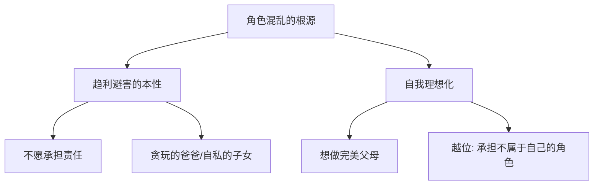
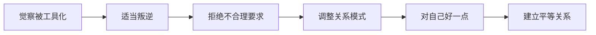
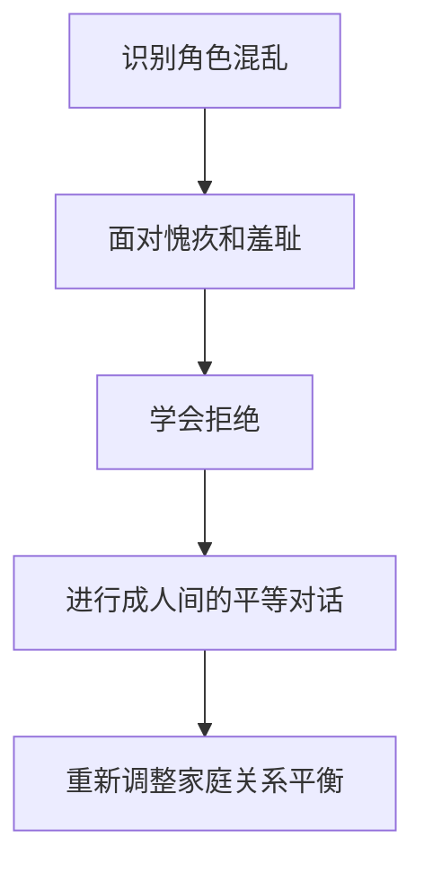
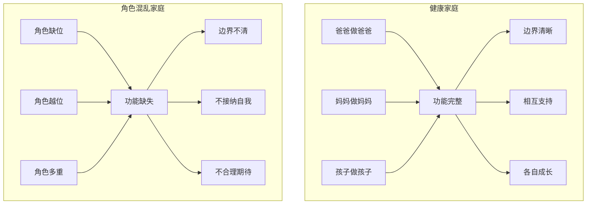

# 第13课：家庭角色与角色混乱

## 家庭角色混乱的概述

### 什么是角色缺位和角色功能混乱

| 类型 | 定义 | 例子 |
|------|------|------|
| 角色缺位 | 家庭成员的功能没有得到实现 | 爸爸缺席，没有承担爸爸应有的功能 |
| 角色功能混乱 | 家庭成员扮演了本不属于自己的角色，或被赋予多重角色 | 妈妈同时扮演妈妈和爸爸的角色，孩子扮演父母情绪照顾者 |

### 角色混乱的两个根源

1. **趋利避害的本性**——有些人（如贪玩爸爸）不愿意承担责任，逃避自己的家庭角色
2. **自我理想化**——有些人（如完美妈妈）越位承担多重角色，想把控一切

### 角色混乱带来的三个问题

| 问题 | 说明 |
|------|------|
| 边界不清 | 你我不分，彼此冲突。如妈妈过度介入孩子的作业，把做作业变成妈妈的责任 |
| 不接纳自我 | 无法承认自己有做不到的事。如不懂辅导作业也不愿意承认 |
| 不合理的期待 | 孩子被期待承担超出年龄的责任，妈妈被期待成为完美的神 |

### 如何判断家庭中是否存在角色混乱

> [!TIP] 年度家庭打分法
> 年底一家人坐下来开小型家庭会议，互相打分——看看这一年自己的角色有没有扮演好。比如胡慎之老师常问孩子："这段时间你给爸爸打多少分？剩下的几分是为什么没有？"通过这种方式了解家人的真实感受。

---

## 被工具化——脱离被强迫的角色

### 什么是被工具化

被工具化是指一个人在家庭中被视为"有用的工具"，单方面被索取贡献，而自己的感受和需求被忽略。

> [!EXAMPLE]
> 十个姐姐一起凑钱为弟弟办婚礼。姐姐们从小被教育要为弟弟、为家里做贡献，她们被工具化了——她们的价值只被用"对家庭有没有用"来衡量。

### 为什么被工具化后还持续贡献

- **被抛弃的恐惧**——"如果我不贡献，就会被抛弃"
- **渴望被认同**——越是工具化，越想通过更多付出来证明自己的价值
- **内化的模式**——"只有对别人有用，我才是有价值的"

### 被工具化的深层策略

1. **把自己视为工具**——只关注自己"有没有用"，忽略自己的感受
2. **把他人也视为工具**——觉得别人接近自己只是因为自己有用
3. **关系变成"我与它"**——而不是"我与你"的真实关系

> [!NOTE]
> 胡慎之老师分享：曾经和朋友吃饭总是抢着买单，但同时觉得朋友都是自私的——"他们喜欢和我交往，是因为我大方"。他把自己工具化了，同时也把朋友工具化了。后来有朋友直言："你没有把我当朋友，我在你身边没有存在感。"

### 如何脱离被工具化的角色

1. **适当叛逆**——学会拒绝父母不合理的要求，父母的功课让他们自己去完成
2. **调整关系模式**——关系需要资源交换，而不是单方面贡献
3. **对自己好一点**——利己不是错，在利己的基础上利他才是健康的

> [!QUESTION] 你是否曾因为"有用"而被爱？如果不做那个总在付出的人，你还相信别人会爱你吗？
> 

> 
思考提示

> 如果答案是否定的，你可能已经被工具化太久。真正的爱不是因为你有用，而是因为你是你。试着停止单方面付出，看看会发生什么。
> 

---

## 如何改变家庭中的角色混乱问题

### 从家庭系统视角看问题

家庭成员之间是相互影响的。孩子出了问题（如厌学叛逆），常常是因为父母之间的关系出了问题——孩子成了父母关系的"粘合剂"，把父母的冲突转移到自己身上。

> [!WARNING] 孩子是家庭症状的承担者
> 很多来访者一开始困扰的是"孩子厌学叛逆"，分析到最后发现，真正出问题的是父母——他们可能已经走到离婚边缘。孩子潜意识中扮演了父母关系的粘合剂。

### 改变角色混乱的三个步骤

#### 第一步：面对两种情感

在脱离被强迫的角色时，需要面对两种不舒服的情感：

| 情感 | 来源 | 应对 |
|------|------|------|
| 愧疚感 | 不去满足父母的期望，内心不安 | 这是父母的功课，不是你的 |
| 羞耻感 | 拒绝别人的要求后，被责怪 | 拒绝是每个人的权利 |

#### 第二步：学会拒绝

- 拒绝是每个人的权利
- 别人可以拒绝你，你也可以拒绝别人
- 拒绝可能会引起冲突，但这种冲突可能是建设性的

#### 第三步：进行成人间的平等对话

> [!EXAMPLE] 25岁被逼婚的来访者
> 他被父母常年逼婚，苦恼不已。后来他回家和父母建立了一个规则：当有人说话时，其他人不能打断。这个规则让他们终于把内心真实的感受说了出来，促进了彼此之间的理解。

### 健康的家庭角色分配

| 角色 | 核心责任 | 健康状态 |
|------|---------|---------|
| 爸爸 | 供养、护佑、规训、传道、胜利 | 功能完整，不缺席也不越位 |
| 妈妈 | 养育、情感支持、生活照顾 | 60分妈妈就足够好 |
| 孩子 | 成长、学习、发展自我 | 不需要为父母情绪负责 |

> [!TIP]
> 当一个家庭中的每个人都清晰自己的角色并承担相应的功能时，这个家庭就是健康的。角色混乱的时候，每个人都感到委屈，家庭充满抱怨。

---

## 核心概念关系图

---

## 应用练习

1. **角色检查**：在纸上写下你在家庭中实际扮演的所有角色（如"家务负责人""情绪安慰者""家庭调解员"等）。问自己：哪些角色是你自愿承担的？哪些是被迫的？
2. **拒绝练习**：下周尝试拒绝一次家人的不合理要求。注意观察你的愧疚感和羞耻感，并告诉自己——"这是正常的，我可以承受"。
3. **家庭会议**：建议在合适的时候和家人坐下来，像年度打分那样，坦诚地交流每个人对自己角色的感受。可以使用"我感受"句式，而不是"你如何如何"。

---

## 本模块总结

模块三和模块四系统地讲解了：

- **内在关系模式的形成**——个体化与依赖、强迫性重复、客体内化
- **七种亲子配对关系模式**——每种模式都对应着特定的童年经历
- **分离与疗愈**——走出全能幻觉、完成分离、三步法疗愈童年创伤
- **父亲的功能与缺失**——五个功能、对子女的不同影响
- **母亲的角色与焦虑**——亲职化、代际影响、焦虑的根源
- **家庭角色与角色混乱**——工具化、边界、健康角色的重新定义

> [!TIP] 模块间的关系
> 模块三帮助你理解"我的内在关系模式从何而来"，模块四则聚焦"父母在形成这些模式中扮演了什么角色"。接下来的模块五将把这些理解应用到两性亲密关系之中。

---

## 下一课推荐

接下来进入模块五：两性亲密关系。建议先阅读 [[reference/0000-glossary|术语表]] 回顾核心概念，然后学习第14课，了解依恋类型与内在关系模式如何影响你的亲密关系。