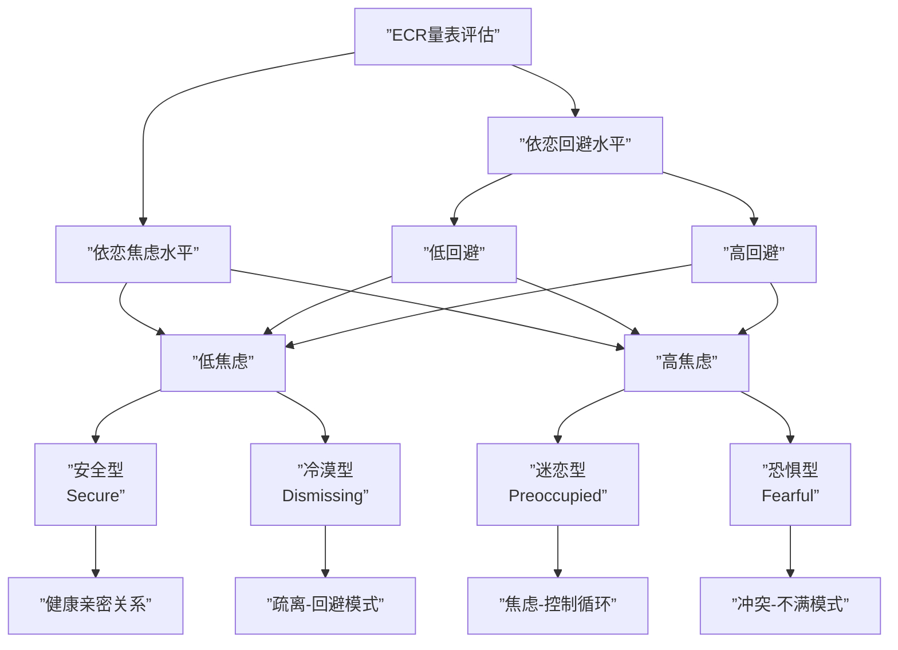
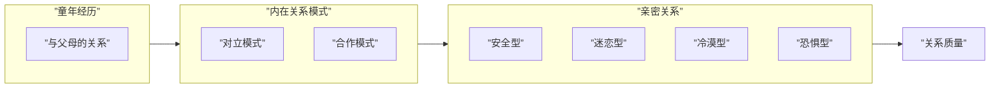

# 第14课：依恋类型与内在关系模式

## 四种依恋类型

成人依恋风格不仅影响恋爱关系，还能预测婚姻质量。通过亲密关系经历量表（ECR）可自评依恋类型，量表测量两个维度：**依恋回避**（回避与他人建立链接）和**依恋焦虑**（放大外界危险、担心被抛弃）。根据这两个维度的高低，可将成人依恋分为四种类型：

| 依恋类型 | 回避水平 | 焦虑水平 | 核心特征 | 关系表现 |
|---------|---------|---------|---------|---------|
| **安全型** | 低 | 低 | 高接纳、高放松 | 善于表达，包容对方缺点，愿意为关系努力，满意度高 |
| **迷恋型** | 低 | 高 | 焦虑、控制欲强 | 过度依赖对方，害怕被抛弃，通过控制获得安全感，形成恶性循环 |
| **冷漠型** | 高 | 低 | 回避亲密、自我封闭 | 喜欢独处，逃避冲突，表面和平实则疏离，需分清"独立"与"冷漠" |
| **恐惧型** | 高 | 高 | 既渴望又害怕亲密 | 态度消极，认为对方是错的，关系满意度最低，对亲密关系充满挑战 |

> [!NOTE]
> 安全型在人群中占比最高。四种类型中，**安全型**对亲密关系满意度最高，愿意投入更多努力维护关系；**恐惧型**则是最具挑战性的类型。

## 内在关系模式

亲密关系的原始组成部分来自依恋——如同婴儿对母亲的依恋。与父母的关系会内化为**内在关系模式**，并投射到成年后的亲密关系中。

### 对立模式 vs 合作模式

| 维度 | 对立模式 | 合作模式 |
|-----|---------|---------|
| 核心信念 | 我是对的，对方是错的 | 我们共同面对问题 |
| 对待差异 | 对方是坏的、有伤害性的 | 接纳不完美，互相调整 |
| 冲突处理 | 指责、愤怒、对抗 | 共同承担责任 |
| 关系结果 | 推向破裂 | 越来越亲密 |

> [!WARNING]
> 对立模式中容易把对方理想化，一旦期待落空就滋生敌意。这种"以自我为中心，总想对方满足自己需求"的模式，必然激发对方的对抗，关系只能走向终结。

### 调整内在关系模式的四个方向

1. **厘清关系归属**：关系是自己的，不是对方的。意识到这一点才会思考自己应为关系投入什么、做出什么妥协。
2. **厘清对方角色**：对方只是伴侣，不是治疗师或父母。不要期待对方来修复你的恐惧。
3. **接纳人性不完美**：真正理性的亲密关系是明白世界上没有完美的人，从而接纳对方的真实。
4. **选择合作而非战争**：关系中有些人是"战争模式"（凸显优越和掌控），有些人是"和平模式"（磨掉棱角匹配对方）。

> [!TIP]
> 改变内在关系模式，从问自己"这段关系是谁的"开始。当意识到"我是关系的主人"，就不会再把对方看作敌人，关系模式才会从对立转向合作。

## ECR量表自测

> [!QUESTION]
> 如果你在亲密关系中经常感到"对方没有及时回复消息就焦虑不安，担心对方不爱你了"，这可能属于哪种依恋类型的特征？
>
> 

> 
点击查看答案

> 这属于**迷恋型依恋**的特征。迷恋型的人有较低的依恋回避水平和较高的依恋焦虑水平，容易放大外界危险，常常处在焦虑情绪中，进而产生控制行为，形成"焦虑-控制-对方疏远-更焦虑"的恶性循环。
> 

> [!QUESTION]
> 小张和伴侣很少吵架，看起来相处和平，但小张总觉得两人之间缺乏激情，彼此像"各玩各的"。这可能是哪种依恋类型？
>
> 

> 
点击查看答案

> 这可能是**冷漠型依恋**。冷漠型有较高的依恋回避水平和较低的依恋焦虑水平，喜欢躲在自己的世界里，表面上看关系没问题，但容易走向疏离。关键是要分清"独立"和"冷漠"的区别。
> 

## 本课小结

- 成人依恋类型分为**安全型、迷恋型、冷漠型、恐惧型**四种，由依恋回避和依恋焦虑两个维度决定
- 内在关系模式分为**对立模式**和**合作模式**，前者把伴侣当敌人，后者与伴侣共同成长
- 调整内在关系模式需要：厘清关系归属、厘清对方角色、接纳不完美、选择合作
- 觉察自己和对方的依恋类型，更多理解、更灵活调整需求，是经营亲密关系的关键

## 推荐练习

1. 完成ECR量表自评，确定自己的依恋类型
2. 观察自己在冲突中的第一反应：是指责对方（对立）还是寻求共同解决（合作）？
3. 尝试在一周内，每次想指责对方时，先问自己"这段关系是我的吗？"

## 下一课预告

[[0015-qi-dai-yu-jie-duan|第15课：亲密关系的期待、阶段与性的维度]]