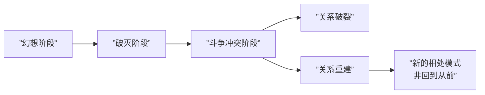

# 第15课：亲密关系的期待、阶段与性的维度

## 期待：亲密关系的杀手

加拿大心理治疗师克里斯多福·孟曾说："通往地狱之路，是用期待铺成的。"

> [!WARNING]
> 不合理的期待是亲密关系冲突的主要来源。期待落空后，很容易演变为猜疑、责怪和愤怒，将亲密合作状态转变为对立状态。

### 为何期待落空会引发愤怒？

人在成长过程中内心存在两种核心需求：

1. **归属的需求**——我能和你建立关系，我不孤单
2. **确认重要性的需求**——我值得被爱

如果幼年时期这两种需求未得到充分满足，成年后就会在亲密关系中拼命寻找。期待落空会印证"我没有归属感""我不重要"的痛感，而愤怒和责怪能让人感觉有力量，同时将责任推给对方。

### 将不合理期待转为合理需求

- **看见真实**：给自己"温柔一刀"，从妄想中走出来
- **接受真实的关系**：关系是彼此互动、有情感链接、有价值交换的
- **给予承诺**：与对方约定，当陷入情绪时互相提醒
- **回忆美好**：需求被满足时表达感激，承认对方的价值

> [!EXAMPLE]
> 一位来访者希望丈夫时刻关注自己。经引导后，她将期待调整为"希望每周有两三个晚上，睡前能有20分钟放下所有事谈谈心"。丈夫欣然接受，关系明显改善。

## 亲密关系发展的三个阶段

### 第一阶段：幻想阶段

**特征**：渴望对方满足自己的需求，彼此处于非常亲密的状态。

**压力源**：
- 渴望对方让自己开心
- 必须满足对方想要的一切
- 产生"我对你多好，你对我多好"的比较

### 第二阶段：幻想破灭阶段

**特征**：发现对方并不如想象中美好，"你变了，不再是我当初认识的那个人"。

**两大挑战**：
1. 能否接受真实的对方——包括对方的缺点和做不到的部分
2. 能否承受幻想破灭带来的情绪——后悔、沮丧、恐慌

### 第三阶段：斗争冲突阶段

**特征**：权力斗争，彼此都想控制对方成为自己想要的样子。

**表现**：
- "你在意什么，我偏不做"
- "你不喜欢什么，我偏做给你看"
- 沟通变成情绪发泄

**可能结果**：自我放逐→关系破裂，或努力修复→关系重建

> [!NOTE]
> 关系重建**不是**回到热恋期，而是进入一种**新的相处模式**。重建的前提是：彼此仍愿互相信任（有自信对方重视自己，也敢在对方面前展示脆弱），且有共同利益。

## 性的模式就是关系的模式

亲密关系包含三个元素：**激情、亲密、承诺**。性属于激情部分，是关系的纽带。

### 性的三种态度

| 态度类型 | 表现 | 对关系的影响 |
|---------|------|------------|
| **接受和享受** | 乐意享受性生活，愿让对方得到满足 | 让亲密关系更进一步 |
| **道德责任或义务** | 例行公事，不是享受 | 双方无法真正享受 |
| **抗拒和忍受** | 身体排斥，无法放松 | 表明关系已出问题 |

### 如何让性更美好

1. **真诚表达**：对性的态度、感受和想法进行坦诚沟通
2. **调整态度**：性是满足自己、愉悦自己的方式，不是满足对方的工具
3. **区分性与爱**：性是一种本能，爱是一种能力；性不和谐不一定代表不爱了
4. **学会表达诉求**：如希望完事后对方能抱抱自己或说说话，要直接表达

> [!QUESTION]
> 小雅觉得每次夫妻生活都像"完成任务"，毫无愉悦感。从性态度的角度看，这属于哪种类型？应该怎么办？
>
> 

> 
点击查看答案

> 这属于"把性看成道德责任或义务"的态度。建议：1）与伴侣坦诚沟通自己的感受；2）重新认识性是为了让自己愉悦，而非满足对方的工具；3）探索双方都舒服的方式，而不是例行公事。
> 

## 本课小结

- **不合理期待**是亲密关系冲突的主要根源，源于归属感和重要性需求未被满足
- 亲密关系经历**幻想→破灭→斗争冲突**三个阶段，重建关系不是回到从前，而是建立新的相处模式
- **性的模式反映关系模式**：接受和享受的态度促进关系，抗拒和忍受表明关系出现问题
- 学会区分性与爱，真诚表达性方面的需求

## 推荐练习

1. 列出你对伴侣的3个期待，逐一判断是否合理
2. 观察你的亲密关系目前处于哪个阶段，写下你可以做的一个改变
3. 与伴侣讨论一次对性的态度和感受

## 下一课预告

[[0016-wei-ji-yu-shang-hai|第16课：亲密关系的危机与伤害模式]]