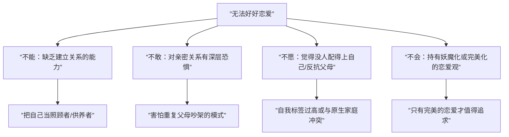

# 第16课：亲密关系的危机与伤害模式

## 爱的勒索者与操控者

操控者和勒索者都是出于恐惧——恐惧对方离开，或觉得自己不配得到爱。

### 操控者 vs 勒索者

| 维度 | 操控者 | 勒索者 |
|------|-------|--------|
| 典型话语 | "我一切都是为了你" | "你对我不够好" |
| 手段 | 把对方变弱，无法离开 | 弱化自己，指责对方的不是 |
| 背后心理 | 害怕对方离开 | 觉得自己不值得被爱 |
| 应对方法 | 适当给予掌控感；学会拒绝；给予承诺 | 读懂对方内核，给予他能提供的东西；守住底线 |

> [!TIP]
> 面对操控者，在小事上（如穿什么衣服）可适当妥协，但对方想侵入生活各个方面时要坚决拒绝。告诉对方"有什么事我想自己去完成"，同时给予"我会陪着你"的承诺。

## 讨好与指责

讨好与指责看似相反，却有一个共同点：**都把对方看成了"坏人"**。

### 讨好与指责的心理动力学

| 行为 | 表面 | 内在 | 心理根源 |
|------|-----|------|---------|
| **讨好** | "我满足你" | 间接说对方不好——认为对方像暴君 | 觉得自己不行，只有讨好才能生存 |
| **指责** | "你不够好" | 直接说对方不好 | 内心自卑，通过美化自己、惩化他人获得优越感 |

### 如何改变互动模式

1. **意识到这是自己的功课**——只能自我面对，无法要求对方改变
2. **学习真实呈现**——真实表达情绪、诉求、需要和渴望
3. **把关注点放在对方身上**——看到对方防御机制下的脆弱和无力
4. **允许对方呈现脆弱**——这才是真正亲密的基础

> [!WARNING]
> 讨好和指责都只是**反应**（reaction），不是**回应**（response）。反应是自动化的、有损害性的；回应是有意识的、建设性的。

## 为什么无法好好恋爱

无法好好恋爱，通常有四种原因："不能、不敢、不愿、不会"。

**一段好的恋爱需要三种角色**：
- **玩伴**：愿意陪伴彼此完成一些事情
- **老师**：能从对方身上学到东西，变得更好
- **互为镜像**：在对方身上看到自己（好的一面或糟糕的一面）

## 出轨的心理动因

> [!NOTE]
> 胡慎之提出一个可能让被伤害方难以接受的观点：**很多出轨是两个人的"合谋"结果**，被伤害方可能在自己没有觉察的情况下参与了这一过程。

### 出轨的几种原因

1. **生理需求未满足**：对性成瘾或单纯为满足性欲
2. **情绪表达/报复**："你做初一，我做十五"
3. **情感需要未被满足**：归属感和独特性被打破，或为释放压力
4. **"心想事成"**：一方不断猜疑污蔑，另一方"不去做点什么就对不起这个罪名"

### 哪些人容易遭遇出轨

- **情感洁癖者**：要求对方必须是想象中的人，无法接受真实的人，无法有良好亲密互动
- **生理洁癖者**：性态度不健康（认为性是羞耻的）或性观念僵化（把性看作道德问题）

### 出轨后的应对

1. 不被恐慌和羞耻感控制
2. 思考事情为何发生，判断是否可以原谅
3. 问自己：这段关系对你意味着什么？
4. **如果决定回归**：承认对关系的伤害，但不需谴责自己是坏人；从建信任是核心

## 为什么离不开伤害你的人

常见原因包括：

- **依赖者心态**：把所有都放在对方身上，世界只有对方
- **无法承载分离**：童年被抛弃创伤导致"只要不分离，怎么对我都可以"
- **受害者监牢**：希望伤害自己的人来拯救自己
- **对原生家庭的忠诚**："夫妻就是这样子的，忍着就好"
- **自恋受损**："如果我离开了，就说明我不是好的人"

> [!WARNING]
> 有时候被伤害的感觉反复出现，反而成了**舒适圈**。总幻想对方会改变，但需要醒悟的是我们自己。

### 离开伤害关系的步骤

1. 注意不要"反应大于选择"——回避有时是更好的选择
2. 重新调整认知——作为成年人，你有能力承担自己的情绪和行为
3. 获得更多支持——不要因羞耻而不敢求助
4. 创造属于自己的价值——包括生存价值
5. 改变不合理期待——对方不会突然醒悟，需要醒悟的是自己

> [!QUESTION]
> 小美明知男朋友经常骗她、劈腿、借钱不还，但就是无法离开。每次想分手，都觉得"他会改的"。这最可能是什么心理机制？
>
> 

> 
点击查看答案

> 这最可能是"受害者监牢"——希望伤害自己的人来拯救自己。同时，小美可能是一个依赖者，所有情感和经济都寄托在对方身上，害怕分离带来的孤独和生存压力。需要从创造自己的价值和获得社会支持开始改变。
> 

## 本课小结

- **操控者**通过"我都是为你好"让对方变弱；**勒索者**通过"你对我不好"指责对方
- **讨好和指责**都把对方当"坏人"，是反应而非回应
- 无法好好恋爱源于"不能、不敢、不愿、不会"
- 出轨可能是双方的"合谋"，应对的关键是看清内心、从建信任
- 离不开伤害你的人可能是因为依赖、恐惧分离或"受害者监牢"心理

## 推荐练习

1. 观察自己在冲突中是指责还是讨好居多？尝试一次直接表达需求
2. 如果你在一段痛苦的关系中无法离开，写下三个你害怕离开的具体原因
3. 思考"我在这段关系中的价值是什么？"——列出你为关系贡献的三件事

## 下一课预告

[[0017-liang-xing-cheng-zhang|第17课：两性成长与关系修复]]