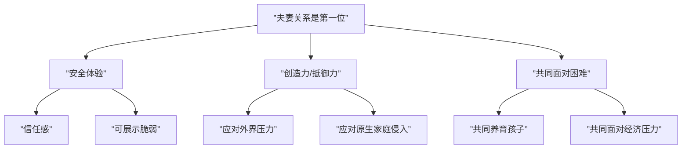

# 第17课：两性成长与关系修复

## 男人女人在追求什么

### 不同年龄阶段男性的追求

| 年龄阶段 | 在亲密关系中追求的核心 |
|---------|---------------------|
| 20岁左右 | 激情，表达爱意和关注 |
| 30岁左右 | 成家立业，给伴侣安稳环境 |
| 40岁左右 | 稳定和舒适，面对上有老下有小的压力 |
| 50岁以上 | 安稳，应对身体走下坡路的力不从心 |

### 女性的核心追求

无论什么年龄层，女性在亲密关系中追求的核心是——**"你要对我好"**。包含两点：
1. **关注我**
2. **关系稳定**

这与女性长期拥有的较低价值感有关，更多通过他人的肯定来提升自我价值。

### 所有人都在关系中追求的要素

1. **价值**——我值得被爱、被珍惜的感觉
2. **平衡**——动态的平衡，需要不断调整
3. **圆满**——我想成为什么样的人，以及成全对方成为他想成为的人
4. **自我规划**——不断问自己"我在这段关系中追求什么"
5. **真实**——追求真实的关系，而非满足想象的虚假关系

> [!NOTE]
> 好的亲密关系需要彼此扮演三种角色：**玩伴**（共同爱好）、**老师**（提供不同角度）、**分享者**（做好聆听者，接纳对方的脆弱）。

## 处理离婚事件

离婚率已高达40%以上，但离婚对大多数人仍是生活中的大事件。

### 对离婚的不良态度

| 态度 | 表现 | 背后的心理 |
|------|------|-----------|
| 天塌下来 | 极度依赖，感觉活不下去 | 把婚姻当作全部依靠 |
| 无法接受分离 | 用极端行为反抗 | 分离是极大创伤事件 |
| 人生污点 | 不允许自己有缺陷 | 完美主义，高自我要求 |

### 离婚后的不良情感反应

- **自责**："离婚是因为我没有做好"
- **否认**：无法接受关系结束
- **比较**：一定要找一个比前伴侣更好的
- **报复**：你不让我好过，我也不让你好过

### 离婚过程中要注意的要点

1. **不要被情绪主导**——冲动离婚多是情绪反应
2. **婚姻问题不等于人品问题**——离婚只是彼此不适合
3. **完成三个层面的分离**：法律分离（离婚证）→ 关系分离（重新厘清边界）→ 情感分离（接受丧失）
4. **需要一个仪式**——坐下来吃个分手饭，承认这件事结束了
5. **憧憬未来**——给自己一个新的开始

> [!TIP]
> 离婚不是人生的污点，而是一个**成长的机会**，让我们学会更成熟理智地面对和处理事情。

## "男孩丈夫"如何成为男人

### 男孩丈夫的类型

| 类型 | 原因 | 表现 |
|------|------|------|
| **不想长大** | 青春期的孩子心态 | 不想负责任，不想面对冲突，身边有"妈妈式"的妻子 |
| **被迫不长大** | 妈宝男，被妈妈控制 | 没有能力面对问题，躲在妻子或妈妈身后 |

### 帮助丈夫成长的方法

1. **设置节点**——告诉丈夫在特定时间要学会成为男人
2. **给予成长机会**——让他自己解决问题，承担结果
3. **给予肯定**——多说"幸好有你"，让丈夫有成就感
4. **收起母性**——用女人的方式对待他，而不是妈妈的方式

### 男人如何自我成长

1. **学会表达**——直接说出需要，如"我想你关心我一下"
2. **学会承担责任**——遇到问题时先自己想办法
3. **脚踏实地**——用行动证明力量，而不是吹牛

## "女孩妻子"如何成为女人

### 女孩妻子的五个特征

依赖 → 推责 → 觉得自己很弱需要保护 → 制造问题 → 无法独处

### 为什么会成为"女孩妻子"

1. **被迫的**——对方希望妻子像女儿一样被照顾
2. **缺乏成年女性模板**——母亲是不快乐的牺牲者，没有参考榜样
3. **童年宠爱缺失**——渴望退行回小女孩状态，补偿缺失的爱

### 如何成长为成熟女性

1. **问自己"我想成为什么样的人"**——在关系中想成为什么样的妻子
2. **觉察原生家庭投射**——现在与丈夫的感觉是否与童年感受类似
3. **尝试自己解决问题**——从小事开始，培养独立能力
4. **不断成长**——只有不断变化，才能持续吸引对方

> [!WARNING]
> 如果一个女孩妻子长期以小女孩角色要求对方扮演父母，只会加剧双方的矛盾和冲突。夫妻之间的爱是相互尊重、珍惜、肯定和认同，不是宠爱或溺爱。

## 夫妻关系是第一位的

### 夫妻关系序位的重要性

- 如果亲子关系凌驾于夫妻关系，妻子可能把丈夫"边缘化"，孩子无法认同父亲
- 如果与原生父母的关系凌驾于夫妻关系，容易产生"妈宝男"现象
- **家庭最好的教育就是爸爸爱妈妈**

### 把夫妻关系放在第一位带来的变化

1. **产生安全体验**——对方是最重要的人，信任产生安全
2. **增强创造力**——两个人的创造力肯定比一个人强
3. **提升抵御力**——面对外界伤害时有力量共同对抗

## 让爱情保鲜

### 爱情保鲜的三个角色

1. **欣赏者**——内心真正欣赏对方
2. **支持者**——用自己的方式支持对方
3. **知己/脑残粉**——了解和接纳对方的全部

### 实用技巧

- **创造共享时光**：留下照片或视频，在冲突时唤起美好回忆
- **形成共同习惯**：建立彼此舒服的互动模式
- **设置和解时间点**：如"吵架不过夜"，用亲密行为结束争吵
- **遵守共同契约**：信用是感情维系的基石

> [!QUESTION]
> 丈夫经常下班后跟朋友喝酒到很晚，让妻子去接。妻子很烦但又不敢拒绝。从"男孩丈夫"的角度看，妻子可以怎么做？
>
> 

> 
点击查看答案

> 妻子可以设置一个节点，告诉丈夫"如果你不按时回来，我会把门锁上"，然后坚决执行。这给了丈夫成长的机会，让他学会自己承担结果。同时，当丈夫有所改变时，妻子应给予肯定。
> 

## 复制的命运：父母关系是最初的模板

为什么会不断重复父母之间的关系模式？

1. **忠诚**——对父母的忠诚，无意识地按照父母的模板来
2. **榜样学习**——认同父亲或母亲的解决方式
3. **生存策略固化**——小时候平衡父母冲突的策略被带到成年关系中
4. **难以旁观**——无法站在第三者角度审视关系

### 如何打破复制模式

1. **意识身份转换**——区分这是"现在的我的感受"还是"曾经作为孩子的感受"
2. **重新认知父母关系**——不是全盘接受或全部否定
3. **主动变化**——成年人有自由选择的能力，可以找到属于两个人的相处方式

> [!WARNING]
> 如果你对另一半"又爱又恨、又嫌弃又离不开"，也许只是你身上"曾经的孩子"和"现在的成年人"在交替。意识到这一点，就能换个角度理解关系。

## 本课小结

- 不同年龄、性别的人在亲密关系中追求不同——男性追求稳定/激情，女性核心追求"对我好"
- 离婚需要完成法律、关系、情感三个层面的分离
- "男孩丈夫"需要妻子给予成长机会，"女孩妻子"需要自我觉察和成长
- 夫妻关系应是家庭中的第一位关系
- 爱情保鲜需要成为对方的欣赏者、支持者和知己
- 父母关系是亲密关系的最初模板，觉察才能打破复制

## 推荐练习

1. 与伴侣讨论：你们各自在关系中追求什么？
2. 如果你是"女孩妻子"或"男孩丈夫"，写下三个你可以独立完成的事情
3. 观察你的家庭中，夫妻关系是否排在第一位？如果不是，是什么关系取代了它？

## 下一课预告

[[0018-qing-xu-biao-da|第18课：情绪的表达与识别]]