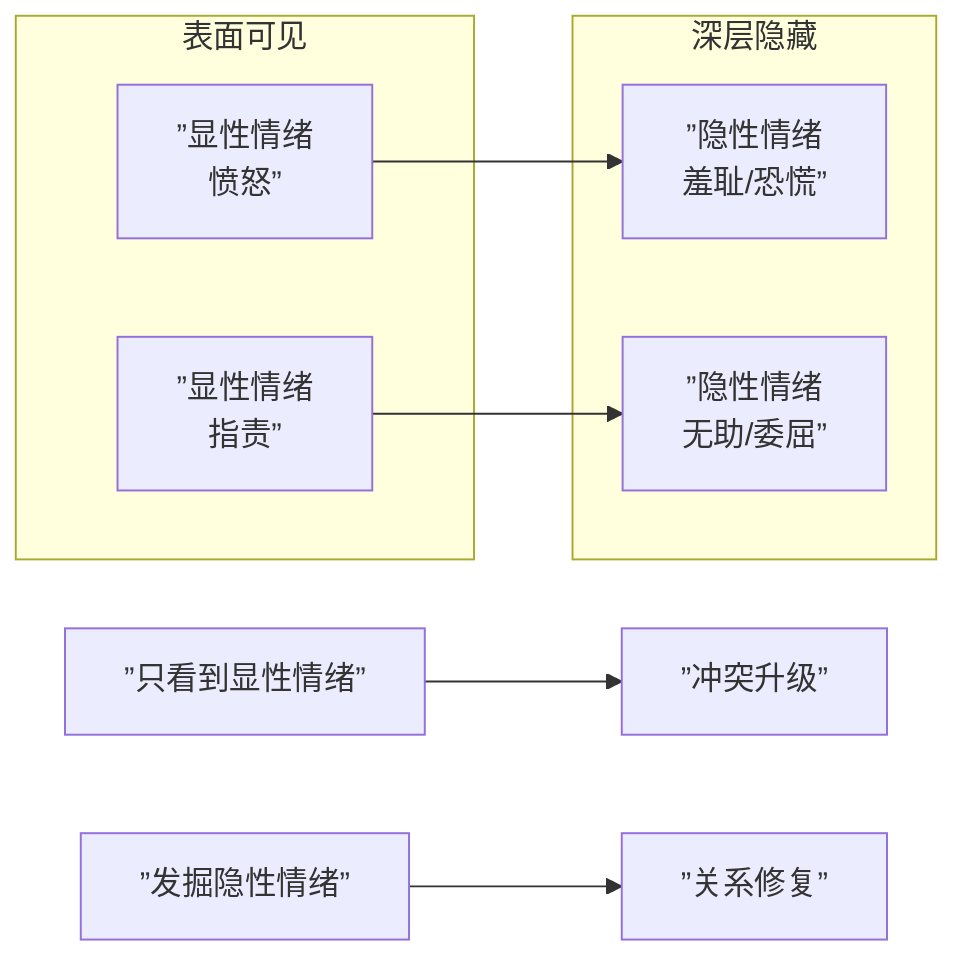

# 第18课：情绪的表达与识别

## 显性情绪 vs 隐形情绪

人类的情绪多达140多种，我们流露出来的情绪往往不是真实的情绪。**显性情绪**是直接可以看到的，而**隐形情绪**隐藏在显性情绪背后，需要通过其他方法体会。

> [!NOTE]
> 每一种显性情绪的背后都可能隐藏着各种隐性情绪：焦虑背后是失控的绝望，抑郁背后是悲伤无助，愤怒背后可能是羞耻、恐慌或沮丧。

### 隐形情绪不被看见的后果

在中国家庭中，孩子的隐性情绪从来都没有被父母看见过，甚至连表达都不被允许。这导致家庭中充满冲突矛盾，每个人都在用愤怒表达各自隐藏的意思。

### 如何发掘隐性情绪

1. **增强共情能力**——真正体会对方背后的隐性情绪
2. **从显性情绪中抽离**——不被对方的显性情绪影响
3. **改变表达方式**——直接说出内心的期盼和需求

> [!EXAMPLE]
> 妻子不断打电话问丈夫什么时候回家。表面上她在"打扰"丈夫，显性情绪是焦虑。但隐性情绪是："我很孤单，希望你能早点回来陪我。"如果她直接说"我需要你"，效果会完全不同。

## 家：垃圾场还是蓄水池

家可以是**损耗我们**的垃圾场，也可以是**滋养我们**的蓄水池。

| 类型 | 特征 | 情绪体验 |
|------|------|---------|
| **垃圾场** | 家庭成员被看成累赘；觉得自己是别人的累赘；环境脏乱 | 沉重、抗拒、想逃离 |
| **蓄水池** | 感受到爱意流动；关系和谐；彼此有价值 | 放松、惬意、被滋养 |

### 为什么我们会把家看成垃圾场

1. **把家庭成员看作累赘**——觉得他们都需要依靠你，没有自理能力
2. **把自己看作别人的累赘**——觉得自己无法提供价值
3. **环境和卫生状况堪忧**——人是环境动物，环境直接影响情绪

> [!TIP]
> 尝试换一个角度看待家人：孩子的吵闹带来看气，妈妈的唠叨带来温暖，丈夫玩手机也是在处理事务。当你改变对家的定义，家就从垃圾场变成了蓄水池。

## 为什么对待家人情商为零

### 原因分析

1. **依赖与个体化的矛盾**——想要自由但经济上依赖对方
2. **照顾与自给自足的矛盾**——一个人可以完成所有事，对方变得不那么重要
3. **工具化家人**——把家人看成自己的"一部分"，而不是独立的人
4. **边界不清**——过度承载家人的情绪感受
5. **"对外取悦，对内指责"**——害怕与外人关系断裂，但认定家人不会离开

> [!WARNING]
> 任性的人与情商高的人是天然对立的。如果在家庭中处于任性状态，情商为零是必然结果。任性的人只想满足自己，情绪不稳定；情商高的人宽容、情绪稳定。

## 回家的压抑感

### 压抑感来源

1. **渴望被照顾的需求未被满足**——回家后开启"任性模式"，退行到孩子状态
2. **复制原生家庭的相处模式**——太少主动表达，家庭氛围压抑
3. **戴着职业面具回家**——无法释放真实情绪
4. **压抑是寻求关注的方式**——用自怜的方式博取关注

### 如何应对回家的压抑感

- 思考自己的诉求是否合理
- 打破不表达的模式，主动沟通
- 不要把家人看成会指责批判我们的人，而是帮助我们的人

> [!QUESTION]
> 每次回家看到丈夫躺在沙发上玩手机，你就很生气。这是显性情绪还是隐性情绪？隐性情绪可能是什么？
>
> 

> 
点击查看答案

> 生气是显性情绪。隐性情绪可能是："我很累，我希望你能注意到我、关心我、帮我分担。"尝试直接表达需求："我今天很累，你能陪我聊会儿天吗？"而不是用愤怒去指责。
> 

## 表达情绪 vs 情绪式表达

这是本课最核心的区分。

| 维度 | 表达情绪 | 情绪式表达 |
|------|---------|-----------|
| **方式** | 直接说出内心感受 | 通过嫌弃、指责、失望等情绪传递信息 |
| **关注点** | 包含"我、你、情境"三要素 | 只关注自己，看不见对方 |
| **背后** | 坦诚表达隐性情绪 | 把情绪推给对方，让对方承担 |
| **结果** | 促进理解和连接 | 激发冲突和矛盾 |

### 情绪式表达引发的四个问题

1. 只关注自己的感受，完全忽略对方
2. 把情绪推给对方，希望对方承担
3. 固执地用同一种方式表达（像婴儿哭闹）
4. 演变成控制手段，把对方置于受害者位置

### 如何学会表达情绪

1. **自己管理情绪**——再爱我们的人也无法替代我们处理情绪
2. **接受陪伴**——别人的陪伴可以有效缓解不良情绪
3. **坦诚表达隐性情绪**——直接说出诉求，而不是通过发泄情绪让对方猜测

> [!TIP]
> 弗洛伊德讲过一个故事：小男孩在黑暗房间喊"阿姨和我说说话，这里很黑"。阿姨说"你又看不见我"。小男孩说"没关系，有人说话就带来了光。"陪伴本身就是一种疗愈。

## 本课小结

- 显性情绪背后藏着隐性情绪，发掘隐性情绪才能化解冲突
- 家可以是垃圾场（损耗）或蓄水池（滋养），取决于我们的定义和视角
- 对待家人"情商为零"源于依赖矛盾、边界不清和"对内指责"的习惯
- 回家的压抑感可能来自需求未被满足、模式复制或职业面具
- **表达情绪**是健康的沟通，**情绪式表达**是把情绪推给对方

## 推荐练习

1. 下次生气时，问自己："我真正的感受是什么？" 尝试说出隐性情绪
2. 重新定义你的家——列出三件让你觉得家是"蓄水池"的事
3. 练习用"我感到……是因为……我需要……"的句式表达情绪

## 下一课预告

[[0019-gou-tong-yu-chong-tu|第19课：沟通、冲突与情绪管理]]