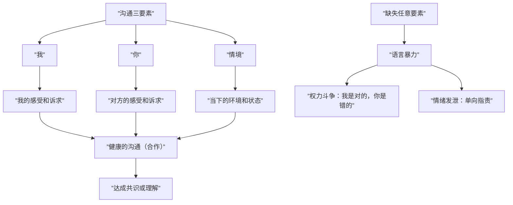
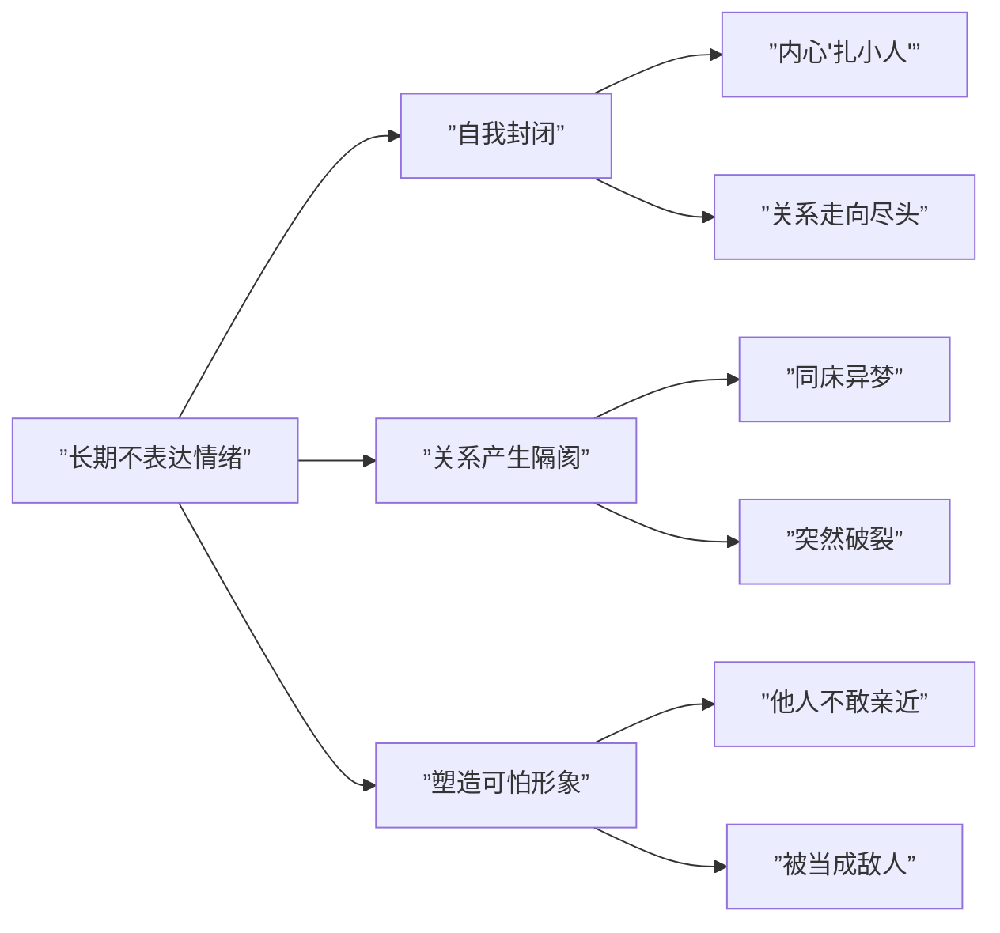

# 第19课：沟通、冲突与情绪管理

## 暴力还是沟通

真正的沟通包含三个要素：**我、你、情境**。缺少任意一个要素，沟通就会演变成暴力。

### 常见的沟通暴力

| 暴力类型 | 特征 | 例子 |
|---------|------|------|
| **权力斗争** | 我是对的，你是错的，你得听我的 | 父母控制孩子按自己期望成长 |
| **发泄情绪** | 只有"我"和"我的感受"，看不到你和情境 | "都是因为你，我才这么难过" |

### 从暴力沟通到健康沟通的四个调整

1. **不要把别人看成会伤害我们的人**——注意自己的投射
2. **保持自我觉察**——从第三者角度观察发生了什么
3. **直接告诉对方需求**——"我现在想发泄一下情绪，你能听我说吗？"
4. **注意沟通情境**——不要在双方疲惫时讨论重要问题

> [!TIP]
> 夫妻来访者总在睡前吵架。建议：不要在卧室讨论重要事情，因为疲惫时防御性高、难以保持理智。换个情境（客厅、厨房），沟通效果会完全不同。

## 长期不表达情绪的后果

长期压抑不表达情绪，对亲密关系有毁灭性影响。

### 为何不表达情绪会导致严重后果

1. **自我封闭**——为了保护自己而采取的防御，但很伤人
2. **塑造可怕形象**——面无表情让人恐慌，读不懂心思
3. **把对方放在对立面**——不表达情绪意味着不信任对方

> [!WARNING]
> 一位妻子对婚姻"很满意"，但妻子五年前因丈夫在外人面前不支持自己而心凉，从此不再表达情绪。五年后妻子提出离婚，丈夫完全不知道为什么。情绪压抑不会让问题消失，只会让关系突然死亡。

### 如何与情绪相处

1. **尊重情绪**——喜怒哀乐惊恐悲都是正常的，不能只要快乐不要其他
2. **承认情绪**——"我现在很害怕""我觉得很羞愧"，至少要对自己真诚
3. **接纳情绪**——尝试接纳对方的愤怒，觉察愤怒背后的无力和恐惧

## 吵吵更健康

吵架是表达攻击性的一种方式。如果攻击性无法向外发泄，就只能向内攻击自己。

### 吵架的积极作用

| 作用 | 说明 |
|------|------|
| **释放攻击性** | 避免向内攻击自己（如乳腺癌等心身疾病） |
| **获得关注** | 被忽视久了，用激烈方式表达情感 |
| **验证关系安全** | 测试"就算我攻击你，你也不会离开我" |
| **呈现被压抑的情绪** | 真诚面对关系，而不是隐瞒 |
| **澄清边界** | "兔子急了也会咬人"，吵架可以划清边界 |

### 建设性吵架的三个原则

1. **不使用侮辱性语言**——不人身攻击、不侮辱对方父母
2. **制定停止约定**——如"不在卧室吵""睡前必须停止"
3. **吵架后相互表达情感**——拥抱、总结、协商新的相处方式

> [!NOTE]
> 有一对夫妻，无论怎么吵，睡觉前一定会停止，并用亲密行为作为结束。他们还有一个约定：吵架后要总结这次沟通中哪里做得不够好，协商新的相处方式。

## 遇到一个没有笑脸的家人

一个面无表情的家人会影响整个家庭的氛围。研究表明，**笑容是最有魅力的表情**，可以填补其他不理想部位的空缺。

### 面无表情实验的启示

妈妈与婴儿互动时突然面无表情，婴儿的反应是：**困惑**（妈妈怎么了）→ **恐惧**（有危险）→ **回避**（想逃离保护自己）。

这也是成年人面对没有笑脸的家人时产生的三种情绪。

### 如何与没有笑脸的家人相处

1. **不承担对方的情绪**——情绪是每个人自己的，不能替对方承担
2. **如果对方是暂时失去笑容**——主动询问发生了什么
3. **如果你自己是那个没有笑脸的人**——尝试深层谈话，直接表达感受

> [!TIP]
> 可以这样说："那时你说那句话的时候，我心里非常生气，甚至想打你两个耳光。但因为我们是亲密关系，因为我爱你，所以我忍下来了。"直接表达比摆臭脸有效得多。

## 情绪蔓延与阻断

情绪是很容易相互影响的，尤其在最亲近的人之间。

### 情绪蔓延的三种方式

1. **通过互动传播**——孩子的愤怒引发父母的回避，父母的回避再次引发孩子的愤怒，形成恶性循环
2. **家庭权力最高者引发**——权威中心的情绪波动影响全家氛围
3. **部分成员主动参与**——如成年子女卷入父母的争吵

### 如何阻断情绪蔓延

1. **厘清这是谁的情绪**——每个人的情绪只能自己负责，别人无法替TA承担
2. **与家庭成员的情绪保持距离**——不是冷漠，而是避免被卷入
3. **学习承担自己的情绪**——处理好自己的情绪就是对家庭最大的贡献
4. **组织讨论**——讨论更好的相处方式

> [!EXAMPLE]
> 一位丈夫心情不好时对妻子说："我心情不太好，我知道你很关心我，但现在我想一个人静静。"这句话既看到了妻子的关心，又获得了处理情绪的空间。妻子听后先去忙别的，不打扰他，孩子也被告知待会儿再找爸爸玩。情绪蔓延就这样被阻断了。

### 家庭情绪管理的核心原则

**谁痛苦，谁改变**——而不是"我痛苦，你改变"或"你痛苦，我改变"。

> [!QUESTION]
> 丈夫下班回家被老板骂了，心情很差。回家看到孩子在沙发上跳，就骂了孩子一顿。孩子委屈，踹了猫一脚。猫跑到街上导致卡车避让时撞伤了路人。这说明了什么？
>
> 

> 
点击查看答案

> 这是典型的"踢猫效应"，展示了情绪的蔓延过程。关键在于：父亲的情绪（被老板骂的沮丧）是属于他自己的，他不应该发泄到孩子身上。阻断的方法：父亲可以告诉家人"我今天心情不好，需要一个人待一会儿"，而不是把负面情绪传递下去。
> 

## 本课小结

- 真正的沟通包含"我、你、情境"三要素，缺失任何要素就变成暴力
- 长期不表达情绪会导致关系"突然死亡"
- 吵架可以是建设性的——释放攻击性、获得关注、验证安全、澄清边界
- 无笑脸的家人会让家庭氛围压抑，需要直接表达而非压抑
- 情绪蔓延可以通过厘清归属、保持距离、自我承担来阻断
- **谁痛苦，谁改变**是家庭情绪管理的核心原则

## 推荐练习

1. 下次想吵架时，先问自己：我是想解决问题，还是想发泄情绪？
2. 练习在情绪不好时直接告诉家人你的状态和需求
3. 与家人商量并制定一个"吵架停止约定"（如：吵架不过夜）

## 下一课预告

[[0020-gong-qing|第20课：共情——连接家人的桥梁]]