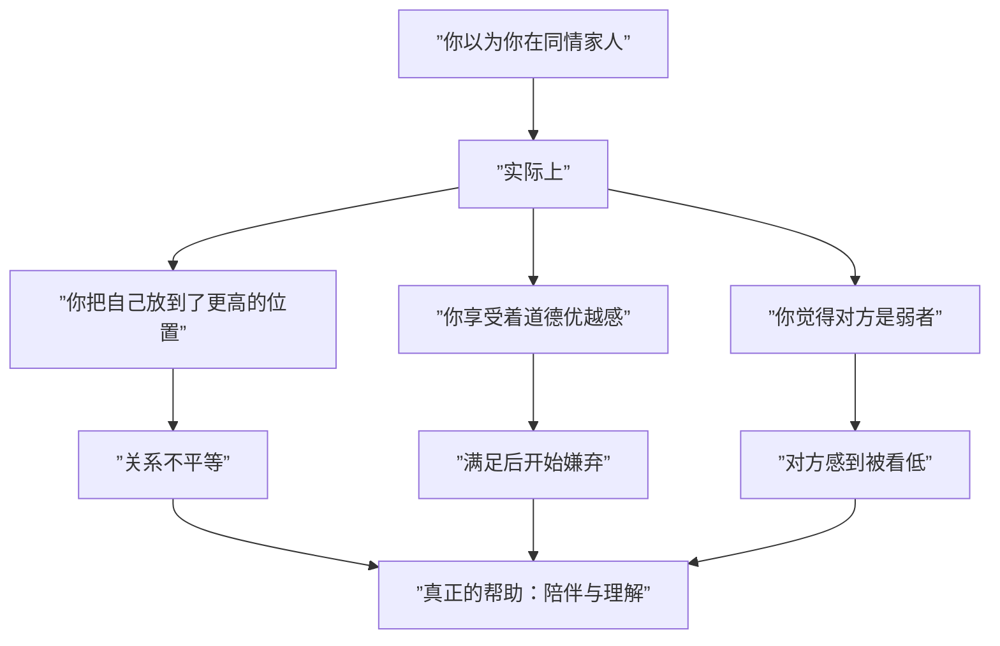

# 第20课：共情——连接家人的桥梁

## 同情 vs 嫌弃：对家人的复杂情感

很多人以为同情一个人是在表达善意，但被同情的人内心可能并不舒服——因为在对方眼里，自己是个需要被帮助的弱者，无法提供价值。

> [!WARNING]
> 同情家人时，我们很可能同时在嫌弃对方。因为同情意味着把对方放在低于自己的位置上，认为自己强大、对方弱小。

### 同情背后的三个心理需要

| 心理需要 | 表现 | 潜在危害 |
|---------|------|---------|
| **道德优势** | 把自己放在比对方高的位置上俯视 | 对方只是满足你道德感的工具 |
| **优越感** | "没有我他会死"的病态利他 | 当满足后就会抛弃对方 |
| **责任感** | "他的事必须我来做" | 给自己造成巨大压力，不做又内疚 |



### 同情 vs 共情

| 维度 | 同情 | 共情 |
|------|------|------|
| **位置关系** | 居高临下 | 平等并肩 |
| **核心感受** | "你好可怜" | "我理解你的感受" |
| **对关系的影响** | 疏远，让对方感到被看低 | 亲近，建立精神链接 |
| **背后的动机** | 满足自己的道德感、优越感 | 真正理解和支持对方 |

> [!TIP]
> 当家人陷入低落时，不要同情，而是**陪伴**。安静地陪在身边，不对事件和人发表评价。有时讲道理和安慰的话反而会加重对方的愧疚感。

## 共情：看见对方的能力

共情不是简单的"感同身受"，而是**精神上的链接**——真正体会到对方的隐性情绪，并给予回应。

### 什么是真正的共情

真正的共情是：
- 在对方身上看到他的感受，而不是你的投射
- 保持边界，不被对方的情绪淹没
- 给予陪伴和支持，而不是"我来替你做"

> [!NOTE]
> 胡慎之父亲在弟弟手术前牵着他的手陪睡——这就是共情。不是替他解决问题，而是"我知道你很害怕，我在这里陪你"。相比之下，母亲因为过度担心而陷入自己的焦虑中，反而无法真正共情。

### 共情过度 vs 共情不足

| 问题 | 表现 | 后果 |
|------|------|------|
| **共情过度** | 陷入对方情绪无法自拔 | 情绪相互感染，两人都陷入恐惧 |
| **共情不足** | 无法体会对方感受 | 对方感到被忽视、被伤害 |

## 情绪的相互影响

### 家庭中的情绪动力学

```mermaid
flowchart TD
    A[”家庭成员A的情绪”] --> B[”互动/传染”]
    B --> C[”家庭成员B的情绪”]
    C --> D[”形成情绪循环”]
    D --> E{[”是否有共情能力”]}
    E -->|”有”| F[”理解-支持-缓解”]
    E -->|”无”| G[”指责-防御-升级”]
    F --> H[”关系更亲密”]
    G --> I[”关系更紧张”]
```

### 如何与自己和他人的情绪相处

1. **注意边界**——"你的事是你的事，我的事是我的事"，不把情绪混淆
2. **不要把对方当机器**——情绪不能按一下按钮就消失
3. **厘清与父母的关系**——父母情绪不稳定是他们自己的问题，不需要你来承担
4. **觉察情绪的目的**——当下的情绪是为了吸引注意，还是真实的感受？

> [!WARNING]
> 面对家人，我们常常有一个无意识的愿望：把他们当作满足我们诉求的工具，而不是真正站在他们的角度体会感受。这时的我们更像是陷入情绪中不能自拔的小孩。

### 共情能力的培养

1. **从显性情绪中抽离**——不被对方的愤怒吓到，而是看到愤怒背后的脆弱
2. **增强对隐性情绪的觉察**——练习问自己"他真正想表达的是什么"
3. **承认自己的不足**——"我已经很顾及你的感受了"往往恰恰说明缺乏共情
4. **用陪伴代替评判**——安静地陪在对方身边，比讲道理有效

> [!QUESTION]
> 你朋友的投资失败后变得颓废在家，你小心翼翼地对待他，处处以他为先。但他反而对你发怒，这是为什么？
>
> <details>
> <summary>点击查看答案</summary>
> 因为你内心已经把他当成了"废物"，同情的同时在嫌弃他。你的小心翼翼传递的信息是"我觉得你没有未来"。没有人愿意承认自己是累赘。他需要的不是同情，而是平等的陪伴和理解。
> </details>

## 模块六总结：情绪与沟通的核心框架

```mermaid
flowchart TB
    subgraph ”情绪识别”
        A[”显性情绪”] --> B[”觉察”]
        C[”隐性情绪”] --> B
    end
    subgraph ”情绪表达”
        D[”表达情绪”] --> E[”健康沟通”]
        F[”情绪式表达”] --> G[”暴力沟通”]
    end
    subgraph ”情绪管理”
        H[”阻断情绪蔓延”] --> I[”谁痛苦谁改变”]
        J[”共情”] --> K[”陪伴与理解”]
    end
    B --> D
    B --> F
    D --> J
    F --> H
    G --> H
    E --> L[”亲密关系改善”]
    K --> L
    I --> L
```

## 本课小结

- **同情**是居高临下的，会同时产生嫌弃；**共情**是平等连接，真正理解对方
- 同情背后的三个需要（道德优势、优越感、责任感）反而会疏远关系
- 真正的共情需要精神链接和边界意识——既不冷漠也不过度卷入
- 家庭情绪管理的核心：处理好自己的情绪就是对家庭最大的贡献
- 共情是在亲密关系中最重要也最容易被忽视的能力

## 推荐练习

1. 当家人情绪低落时，尝试不评判、不讲道理，只是安静地陪伴15分钟
2. 练习每次想"同情"对方时，换成"我理解你现在很难受"的共情表达
3. 观察家庭中情绪流动的模式：是相互滋养（蓄水池）还是相互损耗（垃圾场）？

## 课程后续

祝贺你完成了模块五和模块六的学习！这些关于两性关系、情绪与沟通的知识，可以帮助你更深入地理解自己和伴侣，建立更健康的亲密关系。回顾本课程所有笔记，请访问 [[reference/0000-glossary|术语表]]。