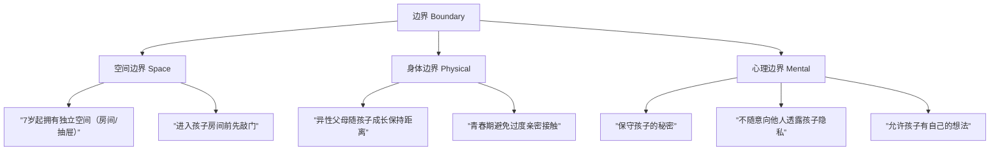
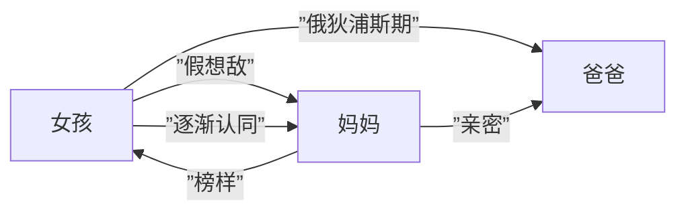

# 第21课：家庭边界与自我确立

## 健康叛逆：自我确立的必经之路

**真正的叛逆**不是单纯与父母对着干，而是包含两个核心要素：

1. **脱离忠诚**：意识到自己可以做出独立选择，有自己的目标、愿望和人生
2. **边界感的建立**：弄清楚什么是父母的事，什么是自己的事

> [!NOTE] 真正的叛逆 vs 假的叛逆
> - 假叛逆：为了得到父母关注而发泄情绪，本质上仍是需要纠缠的孩子
> - 真叛逆：有明确目标和方向，愿意为之付出行动，有足够的耐心和资本

一个28岁的女孩从老家到广州发展，父母不断安排相亲。她选择离家远、读不同专业，以为这是叛逆，但实际上她只是"对着干"，没有自己的人生方向。真正的叛逆是**脱离忠诚**和**建立边界**——知道自己要什么，并为此负责。

## 代际边界：父母同住的四大挑战

当父母与成年子女同住时，家庭组织结构改变，会引发四个方面的问题：

| 问题维度 | 表现 | 核心冲突 |
|----------|------|----------|
| **贡献感** | 父母通过过度做事证明自己有价值 | 价值感降低导致用力过猛 |
| **归属感** | 父母感到自己是"外人" | 通过掌控家中事务获得安全感 |
| **权力斗争** | "谁说了算"之争 | 延续未成年时的相处模式 |
| **生活习惯** | 饮食、作息等日常差异 | 几十年代沟难以调和 |

### 解决方案

- **相互妥协**：成全对方而非改变对方
- **自我接纳**：不让父母的批评影响自我价值感
- **公开权力斗争**：明确分工，让规则透明化
- **承认价值**：看见并感谢父母的付出

> [!EXAMPLE] 案例：太太在公婆入住前声明"家里某些事必须听我的，其余听二老"。开始时婆婆不认同，但一段时间后，大家发现明确规则反而减少了摩擦。

## 边界三要素：空间、身体与心理

边界的核心在于从小尊重孩子的独立人格，包含三个层面：

### 空间边界
孩子到7岁时应当拥有属于自己的空间。胡老师的孩子8岁时在门上画了恐龙，配文"有事请敲门"——这是孩子建立边界的自然信号。

### 身体边界
异性父母需要随着孩子成长调整亲密距离。一位女性来访者因为父亲在她11-12岁时仍保持过度亲密的身体接触，导致长大后对异性产生排斥。

### 心理边界
心理边界维护一个人的独立和完整。当父母随意透露孩子尿床等隐私，会让孩子产生"被扒光衣服站在街上"的羞耻感，难以建立对他人的信任。

## 爸妈吵架不要拉上我：三角关系

父母吵架时将孩子卷入，会给孩子造成以下心理伤害：

1. **困惑**：孩子无法理解争吵的原因，失去掌控感
2. **认同**：被迫认同强者或同情弱者，内心分裂
3. **被困住**：不能离开冲突现场，担心父母关系恶化
4. **无法免责**：认为父母吵架是自己的错

> [!WARNING] 父母当着孩子面吵架后必须做的四件事：
> 1. 明确这是夫妻之间的事，与孩子无关
> 2. 向孩子澄清"这不是你的错"
> 3. 为孩子提供一个安放情绪的心理净土
> 4. 给孩子确定感："无论发生什么，我们都爱你"

## 俄狄浦斯情结：妒忌妈妈抢了爸爸

在女孩有了性别意识后，第一个接触的异性是爸爸。她会希望与爸爸建立亲密关系，把妈妈视为假想敌。这是正常的发展阶段，关键在于父母的应对方式。

### 父母的正确做法
- **允许孩子这个阶段的存在**，给予充分的爱
- **明确告知**：爸爸妈妈之间是伴侣关系，父母给女儿的是父爱和母爱
- **保持夫妻关系第一**：爸爸属于妈妈，女儿尊重父母的边界

> [!QUESTION] 自测问题
> 如果你的女儿说"妈妈，我好妒忌你和爸爸那么亲密"，你会如何回应？
>
> 

> 
查看参考回答

> 可以尝试说："爸爸妈妈相爱是我们的事，但我们同样深深地爱着你。爸爸对你的爱是父爱，与他对妈妈的爱不同。你长大后也会有自己的亲密关系。"
> 

## 本课总结

家庭边界的核心在于：
- **健康叛逆**是确立自我、获得父母尊重的关键
- **代际同住**需要明确的规则和公开的权力分配
- **空间/身体/心理边界**需要从小尊重和培养
- **三角关系**中孩子不应成为夫妻冲突的缓冲带
- **俄狄浦斯情结**的正常度过需要父母保持清晰的边界

---

## 下一课推荐

下一课 [[0022-dai-ji-jiu-chan|第22课：代际纠缠与自我负责]] 将探讨凤凰男与樊胜美现象、过度负责的负效应，以及如何从纠缠型家庭中实现自我负责。

## 应用练习

1. **观察练习**：本周注意你在家庭中的边界状态——哪些时刻你感到边界被侵入？哪些时刻你无意识地侵入了他人的边界？
2. **沟通练习**：尝试一次"温柔而坚定"的拒绝，观察自己和对方的感受变化
3. **家庭对话**：如果你已为人父母，与孩子谈谈"独立空间"的话题，听听他对边界的理解