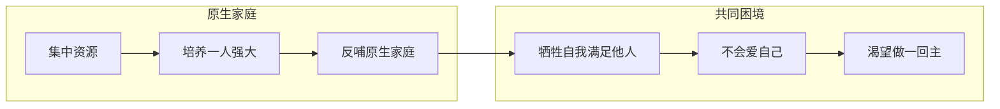
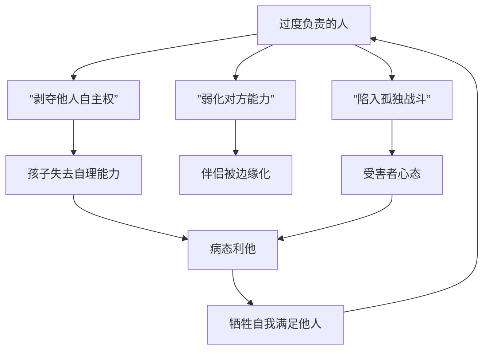
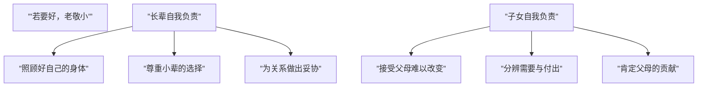

# 第22课：代际纠缠与自我负责

## 凤凰男与樊胜美：原生家庭的工具化命运

**凤凰男**：出身贫寒，通过努力考上大学留在城市，但面对原生家庭的诉求无条件满足。

**樊胜美**：通过自己能力闯出一片天地后，被家人不断索取，内心委屈却无力拒绝。

这两个群体的共同特征：

### 相似的认知系统

凤凰男和樊胜美的认知系统建立于延伸家庭，与普通人的认知存在巨大冲突。他们之间存在特殊的吸引力——因为彼此理解这种被家庭裹挟的痛苦。

### 不会爱自己

他们的人生完全被家人裹挟，难以找到自己。即使为自己买点东西、吃顿好饭，内心都会产生强烈的愧疚感。

### 报复性心理

- **凤凰男**：大男子主义重，选择温顺的伴侣，通过控制伴侣来补偿自己被控制的命运
- **樊胜美**：偷偷将小家庭的资源补贴原生家庭，剥夺伴侣的知情权

> [!WARNING] 凤凰男和樊胜美对亲密关系的破坏
> 对于原生家庭，他们是**提供者**；但对于自己的小家庭，他们是**索取者**——将小家庭的资源不断搬运回原生家庭，导致伴侣感到被欺骗、被剥夺。

### 如何摆脱工具化角色

1. **接受现实**：承认自己曾经被工具化，接受和面对这个事实
2. **与原生家庭分离**：区分什么是父母需要解决的，什么是自己需要解决的
3. **承受内心冲突**：道德感冲突、价值感冲突是必然的，必须经历
4. **面对愧疚感**：我们无法永远牺牲自己满足别人
5. **接受自己的平凡**：走出"无所不能"的幻想世界

## 过度负责的负效应

> [!NOTE] 核心悖论
> 一个过度负责的人，也是一个不断**剥夺**家人独立和成长机会的人。

### 为什么有人如此尽责？

- **内心带着指责**：一边包办一边嫌弃对方做得不好
- **弱化对方能力**：关系是动态平衡——当你投入太多，对方自然变弱

### 病态利他

病态利他是指**不惜放弃自己的需求来满足别人的愿望**。明明自己过得十分糟糕，还想着怎样让家人过得更好。这实际上是通过关系中的贡献来证明自己有价值。

### 过度负责给家庭的伤害

- 让孩子失去**自我照顾**的能力（冷了不知加衣、饿了不知吃饭）
- 让伴侣感到**无能**和**被排斥**
- 让自己陷入**孤独战斗者**的角色，身心俱疲

> [!EXAMPLE] 案例：一位能干的父亲动用自己的社会关系让成绩不好的孩子进入名校。结果每次考试垫底，孩子感到极度挫败，最后直接表示不想上学了。父亲的负责只是在满足自己"好父亲"的形象，孩子成了他证明自己的工具。

## 纠缠型家庭的特征

纠缠的关系是相互消耗的过程，因为没有边界，双方融为一体。

### 表现形式一：不分你我

- 对方一有事，自己必须马上行动
- 存在"降乎逻辑"：我发生了什么和你有关，你必须为我负责
- 双方被捆绑在一起，没有拒绝的机会

> [!WARNING] 纠缠关系的典型场景
> 一个男生说："妈妈身体一不舒服就打电话给我。我请了保姆，但她还是每次都要告诉我。我不回去就担心，但工作又很忙。"胡老师回答："你妈妈完全有能力照顾自己，下次你可以尝试不回去。"

### 表现形式二：彼此不合适

- "你给我的我不要，我要的你给不了"
- 强行捆绑只会带来窒息感
- 亲子之间也常出现：孩子想通过纠缠获得关注

### 纠缠关系的伤害

| 伤害维度 | 具体表现 |
|----------|----------|
| **利益损害** | 双方的物质、时间资源都被消耗 |
| **情绪损耗** | 如同打地鼠游戏，随时防备，身心疲惫 |
| **绝望感** | 双方都感到被关系勒得喘不过气 |

### 如何走出纠缠

1. **拉开距离**：分清楚"你的""我的"
2. **停下来**：谁痛苦谁改变，一方停下后另一方也会调整
3. **寻求专业帮助**：如果这是你惯用的人际模式，单靠自己很难脱离

## "若要好，老敬小"：自我负责的真义

### 核心概念

**"若要好，老敬小"**——如果家庭氛围要和谐，长辈需要对小辈有尊重和包容。这不是道德绑架，而是**自我负责**的体现。

### 如何与长辈相处

1. **接受父母难以改变**：他们的行为模式已经固化
2. **尊重差异**：不需要改变彼此，只需要保持空间
3. **分辨需要与付出**：你以为的付出可能只是自己的需要
4. **让父母感到有价值**：适当示弱，让他们感受到被需要

> [!TIP] 让父母感受到价值的小技巧
> 胡老师每次回老家都对妈妈说"我想吃你做的菜"。虽然妈妈年纪大了动作慢，但知道自己被需要，会感到非常开心。这既是一种成全，也是对爱的表达。

---

## 下一课推荐

下一课 [[0023-bian-jie-yu-qi-dai|第23课：家庭边界、期待与自尊]] 将深入探讨边界设立的矛盾、面面俱到的困境、改变他人vs改变自己的智慧，以及选择性断绝关系的勇气。

## 应用练习

1. **辨识练习**：回顾你与家人的互动中，是否存在"不分你我"的纠缠模式？尝试明确区分"这是我的事""那是你的事"
2. **放手练习**：本周尝试"少做一点"，让家人自己处理自己的事情，观察变化
3. **自我负责检查**：列出三个你对父母或家人的"期待"，问自己：这些期待是否合理？是否在试图让别人为自己的情绪负责？