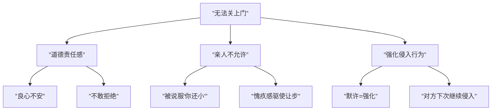
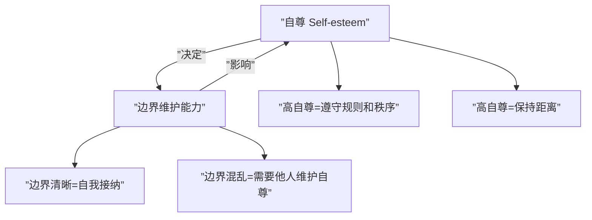

# 第23课：家庭边界、期待与自尊

## 渴望尊重边界却开着门

> [!WARNING] 核心矛盾
> 你渴望别人尊重你的边界，但你却**开着门**——这是一个理想化的期待。别人看不到你的边界，又如何尊重它？

### 为什么无法"关门"？

1. **道德责任感**：认为家人有困难就必须帮忙
2. **亲人不允许**：父母用"你还是个孩子"否定你的能力，侵入你的空间
3. **强化侵入行为**：默许了对方的侵入，导致行为被强化

### 如何温柔而坚定地拒绝

- **不带怒气地拒绝**："实在抱歉，我帮不了你。我知道你一定遇到难处了，我也很想帮你，但现在的我实在帮不了。"
- **承认感受**：关上门后可能感到孤独、担心、愧疚，这些都是必须经历的过程
- **独立自主才能关门**：一旦依赖别人，就会想控制对方

> [!TIP] 关门意味着保护自己的边界，这是成年人的能力。只有独立自主的人才能把门关上。

## 面面俱到是完美主义陷阱

> [!NOTE] 核心观点
> 一个人想要做到面面俱到，本质上是在追求做一个**完美的人**——满足别人对自己的完美期待。但完美更多是一种**自恋状态**。

### "好人"人设的代价

- **拖延症**：想要面面俱到→无法选择→只能拖延
- **无法拒绝**：担心拒绝会破坏人设，只能回避

**忠孝不能两全**——人的精力有限，能力有局限性。

### 案例：好人蜕变营

胡老师的朋友伍志宏办了一个"好人蜕变营"，目标是"将好人变成一个人"。因为他发现做"好人"太累了——为了维护人设，接受了与付出不成正比的讲座报酬，不敢拒绝任何请求。

> [!WARNING] 面面俱到的危害
> 表面上你是在平衡关系，实际上你把自己变成了一个"失职的为难别人的人"——因为你不给明确答复，对方无法获得确定的信息，反而耽误了解决问题的时间。

### 如何从"好人"中解脱

1. **接受失去**：接受自己原来没有那么好，接受真实
2. **重新看待他人**：他们究竟是提供价值的人，还是需要照顾的人？
3. **承认平凡**：不完美也是独特的你

## 期望家人改变是自寻烦恼

人生两个主要烦恼：**得不到**和**已失去**。期望家人改变就属于"得不到"的烦恼。

### 为什么总想改变家人？

- **理想课题**：脑海中有一个完美的人的形象
- **童年经历**：被父母改变的经历内化为自己的行为模式
- **不劳而获的期待**：如果家人变成理想中的人，自己就能被照顾
- **自恋满足**：改变家人能证明自己的正确和强大

> [!WARNING] 要求对方改变会导致的恶性循环
> 要求改变 → 激发对方的防御机制 → 对方反抗 → 你更加努力要求改变 → 关系从合作变成对立

### 从强迫性重复中走出

1. **承认家人原本的样子**：承认他的好与坏，而不是否认
2. **抽离旁观**：把自己变成"朋友"，从第三人称看问题
3. **觉察强迫性重复**：是否在重复童年的相处模式
4. **为自己负责**：能改变的只有自己的人生

## 有些亲戚不要也罢

### 没有边界感的亲戚特征

- **用自己的道德标准评判你**：掺杂风俗、家族规章和个人经验
- **对你的人生指指点点**：自己过得很糟糕却要做你的人生导师
- **像菟丝花寄生一样纠缠你**：不断索取价值直到榨干

### 应对策略

| 策略 | 具体方法 |
|------|----------|
| **设立边界** | "他们的人生和你的人生不能混淆" |
| **学会取舍** | "我做不到"——直接表达拒绝 |
| **调整归属意识** | 不需要让所有人满意 |
| **保护利益** | 低调、明确边界，救急不救穷 |

> [!EXAMPLE] 案例：一位事业有成的人每次回家都非常低调。当被问收入，他只说"跟你们差不多"。他明确告诉亲戚"救急不救穷"——这既是对别人的尊重，也是对边界的保护。

## 总结：边界与自尊

边界与自尊的关系：

### 人生重要度排序

在一个流行的排序话题中，许多人把父母排第一，孩子排第二，自己排最后。但当把自己排最后时，**自尊感也就没有了**。

> [!QUESTION] 自测问题
> 你的人生重要度排序是怎样的？如果把父母、伴侣、孩子和自己排序，你怎么排？
>
> 

> 
查看参考回答

> 一个健康的排序应该是：自己>伴侣>孩子>父母。这听起来可能有些"自私"，但只有自尊感高的人才有能力真正去爱别人。把自己放在最后，最终会变成一个委屈的受害者，无法给予任何人健康的爱。
> 

### 建立高自尊的要点

1. **尊重规则和秩序**：一个高自尊的人自然遵守秩序，而非通过"插队"获得特殊对待
2. **保持距离**：即使是亲近的家人也需要距离
3. **不要同情自己**：同情自己就会把自己放在受害者的位置上
4. **真正的自尊来源于贡献**：觉得对他人有用、有贡献，才是自尊的核心

---

## 下一课推荐

下一课 [[0024-bing-shan-yuan-li|第24课：冰山原理——理解家人隐藏的感受与渴望]] 将学习萨提亚冰山理论，探索家人行为背后的深层需求。

## 应用练习

1. **边界日记**：记录一周内边界被侵入的时刻，以及你没有"关门"的原因
2. **拒绝练习**：找一件你一直勉强自己去做的事，今天温柔而坚定地说"不"
3. **排序反思**：重新思考你的生命中的重要度排序，看看自己排在什么位置