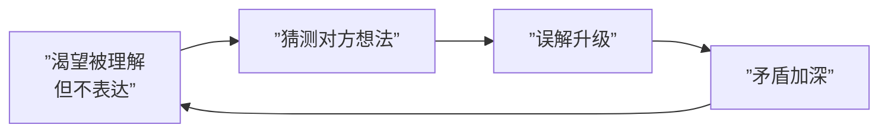

# 第24课：冰山原理——理解家人隐藏的感受与渴望

## 萨提亚冰山理论

萨提亚认为，人的自我就像一座冰山。我们能看到的只是露出水面的部分——**行为**，而更多的部分藏在水面之下，包括感受、期待、渴望等七个层次。

```mermaid
flowchart TD
    subgraph ”水面之上”
        L1[”行为 Behavior<br/>（可见的言行）”]
    end
    
    subgraph ”水面之下”
        L2[”应对方式 Coping<br/>（讨好/指责/超理智/打岔）”]
        L3[”感受 Feeling<br/>（喜/怒/哀/惧）”]
        L4[”感受的感受<br/>（对自己感受的评判）”]
        L5[”观点 Viewpoint<br/>（信念、假设、想法）”]
        L6[”期待 Expectation<br/>（对自己/对他人/来自他人）”]
        L7[”渴望 Yearning<br/>（被爱/被接纳/被认可/有意义）”]
        L8[”自我 Self<br/>（生命力、本质）”]
    end
    
    L1 --> L2
    L2 --> L3
    L3 --> L4
    L4 --> L5
    L5 --> L6
    L6 --> L7
    L7 --> L8
```

### 案例：为什么妻子什么都不说？

一位来访者看到妻子神情悲伤（行为），问她发生了什么，妻子不说。多问几次，妻子反而指责他。用冰山理论来看：

- **行为**：神情悲伤，不愿意回应
- **感受**：可能感到委屈、疲惫
- **观点**："他应该懂我"
- **期待**：希望丈夫主动关心而非被追问
- **渴望**：渴望被理解、被看见

## 为什么我们宁愿互相猜测？



### 不敢表达的原因

1. **不合理期待**：希望对方能在自己不说的情况下"猜中"
2. **童年经历**：小时候表达需要换来的是指责
   - "妈妈我想买玩具" → "你都这么多玩具了还买！"
   - 久而久之，表达需要变成一件"羞耻"的事
3. **恐惧被批评**：说出想法可能被说"自私""不可理喻"

> [!WARNING] 这种模式导致的结果是：我们只能用谎言来掩饰冰山下的情绪感受，家人之间的距离越来越远。

## 如何运用冰山理论理解家人

### 第一步：停止猜测，开始共情

**猜测**和**共情**有本质区别：

| 猜测 | 共情 |
|------|------|
| 把自己放在对方的对立面 | 把自己放在对方的角度 |
| "他肯定是想..." | "他经历了什么才会这样？" |
| 带有评判和防御 | 带着好奇和接纳 |

### 第二步：共情的两个层次

1. **看见脆弱**：看见对方无法用言语表达出来的感受
2. **承认努力**：认可对方在此过程中所做的一切

### 案例：共情的力量

一位丈夫事业遇到困难，对家里经济造成很大损失。他以为妻子会责怪他，但妻子不仅没有责备，反而拿出存折说"我们一起度过难关"。丈夫说："那一刻我在心里发誓，这个女人我一定要好好对她。"

> [!TIP] 共情的核心不是"解决问题"，而是"站在对方身边"。当对方感受到被看见，关系就有了修复的可能。

### 第三步：用身体接触建立链接

除了语言，身体接触（拥抱、握手、亲吻）也能帮助建立链接。一个充满爱意的行为，可以让家人放下无端的猜测。

## 冰山下层的共性与个性

每个层次都可能影响家人关系：

| 冰山层次 | 常见问题 | 健康状态 |
|----------|----------|----------|
| 行为 | 沉默、争吵、回避 | 开放表达 |
| 应对方式 | 讨好、指责、超理智、打岔 | 一致性沟通 |
| 感受 | 压抑愤怒、伪装开心 | 坦然面对情绪 |
| 观点 | "男人不该哭""家人就该付出" | 灵活有弹性 |
| 期待 | "你应该懂我""你要改变" | 合理且可沟通 |
| 渴望 | 被爱、被接纳、被认可 | 得到充分满足 |
| 自我 | 低价值感、不配得感 | 高自尊、完整 |

> [!QUESTION] 自测问题
> 回想最近一次与家人发生的不愉快。在那一刻，你的"冰山"下面发生了什么？你的感受、观点、期待和渴望分别是什么？
>
> <details>
> <summary>查看参考回答</summary>
> 举例：你和伴侣因为家务分工吵了起来。
> - 行为：吵架
> - 感受：愤怒、委屈
> - 感受的感受："我不应该这么生气"
> - 观点："家务应该一人一半"
> - 期待："他应该主动分担"
> - 渴望：被尊重、被公平对待
> - 自我："我的需求是值得被看见的"
> </details>

## 应用冰山理论的日常练习

1. **家人出现负面行为时**，先问自己：他冰山下面发生了什么？
2. **自己情绪激动时**，觉察自己的冰山各层次
3. **勇敢表达脆弱**："我现在感到...，因为我需要..."——这是打开沟通的第一步

---

## 下一课推荐

下一课 [[0025-si-chong-gou-tong-mo-shi|第25课：从不良沟通到一致性沟通]] 将介绍四种不良沟通模式及其危害，以及如何通过一致性沟通建立美好关系。

## 应用练习

1. **冰山日记**：每天选一次与家人的互动，画出互动中你和对方的"冰山"各层次
2. **共情练习**：当家人表达情绪时，先不急着给建议，尝试说"我理解你现在感到...，因为..."
3. **自我探索**：找一个安静的时刻，深入探索自己"冰山"最底层的渴望——我最渴望从家人那里得到什么？