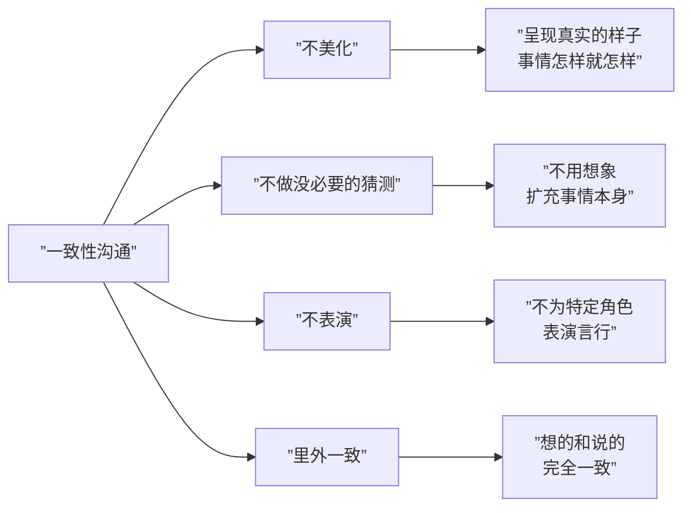

# 第25课：从不良沟通到一致性沟通

## 沟通三要素

沟通包含三个要素：**我**、**你**和**场景（情境）**。

如果只在意自己，忽略对方和情境，就不是沟通，而是"使用暴力"。

## 四种不良沟通模式

萨提亚提出了四种功能不良的沟通模式：

```mermaid
flowchart TD
    subgraph ”不良沟通模式”
        A[”讨好 Placating”]
        B[”指责 Blaming”]
        C[”超理智 Super-reasonable”]
        D[”打岔 Irrelevant”]
    end
    
    A --> A1[”忽视自己<br/>关注他人和情境”]
    B --> B1[”忽视他人<br/>关注自己和情境”]
    C --> C1[”忽视自己和他人<br/>只关注情境”]
    D --> D1[”忽视自己、他人、情境<br/>全部回避”]
```

### 1. 讨好型

把自己放在"随时可能被抛弃"的位置上，把对方放在"暴君"的位置上。

**带来的感受**：
- **恐惧**：害怕被抛弃、被不满
- **羞耻感**：认为自己做了不好的事，需要用讨好来掩盖

> [!EXAMPLE] 案例：《如懿传》中的富察皇后，太后和皇帝稍加指责就埋怨自己做得不够好，一生都在讨好他人。

### 2. 指责型

通过矮化或贬低对方来证明自己的优越和完美。

**两种层次**：
- **意识层面**：明显的权力斗争，"红花还需绿叶衬"
- **无意识层面**：藏在讨好背后——表面讨好，内心指责

> [!NOTE] "嘴里捧着脸上笑着，心里恨着"——这是讨好背后的无意识指责。

### 3. 超理智型

沟通中不谈情感，只讲逻辑，让对方感到被忽视。

> [!WARNING] 超理智的危害
> 当伴侣遇到事故需要安慰，得到的却是一通分析事故原因的分析，这会让人感到"跟机器人说话没有区别"。人需要情感上的交流，超理智会切断情感链接。

### 4. 打岔型

用转移话题的方式化解尴尬或回避冲突。

**使用场景**：
- 化解尴尬（父母讲你小时候的糗事）
- 回避冲突（丈夫忘记生日礼物时说"你今天穿得真漂亮"）

**代价**：对方感到"我不想跟你说话"或"我不屑于跟你说话"

### 四种模式的共同问题

| 共通问题 | 表现 |
|----------|------|
| 关系对立 | 非合作关系，无法体验亲密链接 |
| 自我否定 | 感觉自己对关系没有贡献，甚至是麻烦 |
| 要素缺失 | 每种模式都忽视了沟通三要素中的某一项 |

## 一致性沟通

### 什么是角色定位？

在沟通前，先思考：
- **你把对方看成谁**？是伤害你的人？还是合作者？
- **你把自己看成谁**？是受害者？施害者？还是朋友？

> [!TIP] 如果你把自己定位为受害者，对方就一定处在攻击者的位置。但如果你把对方看成合作者，沟通才变得有意义。

### 一致性沟通的四大原则



### 一致性沟通的完整示例

**场景**：孩子考试成绩不理想，妈妈想与孩子沟通。

**一致性沟通示范**：

> "我看到了你这次的成绩不太理想，跟我们的预期有一定差距。我知道你很难受，我也会有一些失落，但我不会因为这件事责怪你，因为我看到了你的努力和用心。
>
> 现在我们不妨一起来想想，为什么成绩跟预期出现这么大的落差？是爸爸妈妈对你的要求太高了吗？如果是的话，告诉我们，我们会进行调整。
>
> 当然，要是你学习上确实碰到了一些困难，需要我们的帮助，我也很乐意。我相信我们一定可以齐心协力去解决这个问题。"

### 一致性沟通的核心

1. **真诚表达感受**：说出自己的真实想法
2. **看见对方感受**：不激发矛盾行为（不指责、不埋怨）
3. **共同寻找方案**：双方共同努力
4. **明确合作关系**：让对方知道"我值得信任"

> [!NOTE] 一致性沟通最核心的一点是：**沟通是为了建设关系，而不是毁灭关系**。

### 四种不良模式 vs 一致性沟通对比

| 维度 | 讨好型 | 指责型 | 超理智型 | 打岔型 | 一致性沟通 |
|------|--------|--------|----------|--------|------------|
| 对自己 | 忽视 | 维护 | 忽视 | 忽视 | 重视 |
| 对他人 | 重视 | 贬低 | 忽视 | 忽视 | 重视 |
| 对情境 | 迁就 | 掌控 | 执着 | 回避 | 面对 |
| 关系状态 | 依附 | 对立 | 隔离 | 逃避 | **合作** |

> [!QUESTION] 自测问题
> 你最常见的沟通模式是哪一种？回忆最近一次沟通不畅的场景，你能用一致性沟通重新表达吗？
>
> <details>
> <summary>查看参考回答</summary>
> 假设你之前用指责型的语气对伴侣说："你从来不帮忙做家务！"一致性沟通可以是："我注意到最近家里的家务主要是我在做，我感到有点疲惫。我知道你工作也很忙，我们能不能一起商量一个分工方案？"
> </details>

---

## 下一课推荐

下一课 [[0026-jian-kang-guan-xi|第26课：建设健康关系的七个要素]] 将介绍家庭仪式感、爱的成全、告别消耗关系、合作表达等健康关系的核心要素。

## 应用练习

1. **模式觉察**：本周注意自己在沟通中最常使用哪种不良模式，记录下来
2. **一致性练习**：每天至少进行一次一致性沟通练习，遵循四原则
3. **角色定位**：沟通前先问自己"我把他看成谁？我把自己看成谁？"，调整到合作者角色再开口