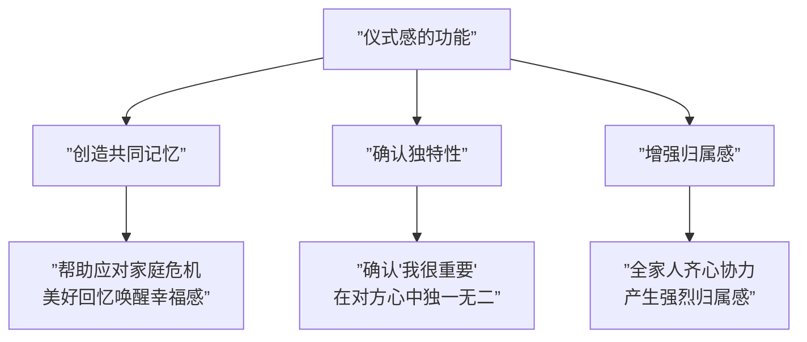
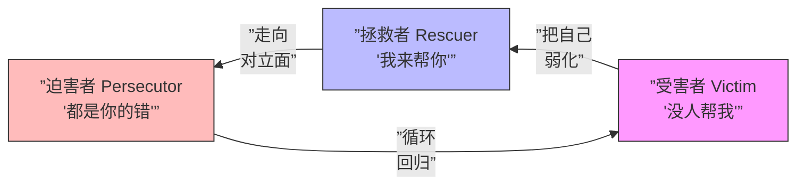
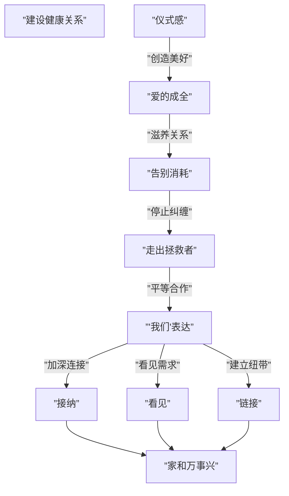

# 第26课：建设健康关系的七个要素

## 一、家庭需要仪式感

仪式感不是形式主义，而是情感的载体：



### 仪式感的三个作用

1. **创造共同记忆**：美好的回忆可以帮助应对家庭危机
2. **确认独特性**：单独的庆祝活动让人确认"我很重要"
3. **增强归属感**：全家人一起做事产生强烈的归属感

> [!EXAMPLE] 案例：一位朋友跟太太结婚25年依然恩爱。他们的三条约定：每周空出3小时专属时间、每年一次双人旅行、每个节日用心准备礼物。这些仪式感给婚姻带去非常好的影响。

## 二、爱的感觉是成全

### 爱的五种语言

Gary Chapman在《爱的五种语言》中提到，爱需要五方面内容：
1. 肯定的语言
2. 精心的时刻
3. 接受礼物
4. 服务的行动
5. 身体的接触

**爱的本质是成全**：如你所示，而非如我所愿。

> [!WARNING] 以爱为名的控制
> 妈妈希望孩子成为钢琴家，风雨无阻地送孩子去学琴。孩子累了想休息，妈妈认为只是懒惰。这看似是爱，实际上是在成全自己——妈妈没有看到孩子的需求，只是被自己的付出感动。

### 被爱的感觉是滋养

- 没有被好好爱过的人，容易把自己定位成"不值得被爱的人"
- 收到礼物时第一反应不是开心而是焦虑，觉得自己不配
- 总会去寻找"对方不爱我"的证据

> [!TIP] 爱与被爱是相互成就的。不要像法官一样通过行为裁定对方是否爱自己。每个人都有自己要面对的问题和压力，不能要求对方天天围着自己转。

## 三、告别消耗式关系

### 消耗关系的三个信号

| 信号 | 表现 |
|------|------|
| **价值被否定** | 辛苦付出被一句话否定（"怎么这么难吃"） |
| **没有获得感** | 需要不被看见、不被满足 |
| **被束缚感** | 被迫接受不需要的东西 |

### 一段关系从滋养变成消耗的标志

- 生活琐事不断重复，没有建设性
- 对方从爱人变成了"敌人"
- 拒绝对方的帮助，因为怕被控制

> [!NOTE] 消耗式关系中，对方不再是亲人和朋友，而是对立的人。当我们不断要求对方改变时，对方变成了工具而不是人。

## 四、救世主没有合作者

### 拯救者心态的真相

**拯救者的背后，藏着一个受害者。**

受害者三个特点：
1. 觉得别人都是来伤害自己的
2. 只有自己在付出，别人都是索取者
3. 自己是制造麻烦的人



### 亲密关系的匹配

> [!WARNING] 如果你是一个拯救者，就一定会遇到需要被拯救的人（或者你把对方看成需要被拯救的人）。这是一个匹配的关系。

案例：一个勤劳的妻子不停地为赌博的丈夫还债，一边抱怨一边继续。当她说"我不会再管你的事"后，丈夫反而去找工作了。

### 如何走出拯救者角色

1. **明确每个人为自己的人生负责**——世界不需要你来拯救
2. **不要贬低别人来烘托自己**——弱化他人不能让自己变强
3. **告别病态利他**——牺牲可能是别人不需要的

## 五、以"我们"开头是合作的开始

```mermaid
flowchart LR
    subgraph ”不良关系”
        A1[”只有'我'<br/>自体课题”] 
        A2[”分开的'你和我'<br/>服从与控制”]
    end
    
    subgraph ”健康关系”
        B[”'我们'<br/>合作与亲密”]
    end
    
    A1 -->|”只有自己<br/>没有他人”| B
    A2 -->|”对立状态<br/>需要条件”| B
```

### "我们"的作用

- **支持感**："我们一起来想办法"——给予对方力量
- **陪伴感**："没事，我们就在这里"——提供温暖
- **链接**：表明是合作而非对立关系

> [!TIP] 日常生活中尝试多用"我们"开头："我们一起出去吃饭"比"你要不要跟我一起出去吃饭"更能拉近距离。

## 六、爱的接纳、看见与链接

### 接纳

**自我接纳是第一关**。只有接纳自己的真实，才能接纳他人的真实。

> [!EXAMPLE] 案例：一位妈妈打了孩子后非常自责。胡老师建议她坦诚地跟孩子道歉。孩子反而说："没事的妈妈，我知道你爱我，那天我确实做错了。"妈妈没想到孩子能接受一个真实的妈妈。

### 看见

一个**没有被看见的人**，一定会用各种方式来让自己被看见。

- 恋爱中女生的"作"——只是希望被看见
- "作"的背后是"我需要一句问候或一个拥抱"
- 看见是一种能力——"自己无法表达的感受被读懂了"

> [!NOTE] 看见别人和被别人看见，都是一件幸福的事情。

### 链接

一个没有链接的人等于生活在孤岛上。

- 主动建立链接比被动等待更有效
- 春节时祖孙三代一起打扑克——这就是主动的链接
- 有时不是孩子不愿意出门，是我们没有真正放手

## 七个要素的关系总览



## 本课总结

| 要素 | 核心含义 | 一句话口诀 |
|------|----------|------------|
| 仪式感 | 创造共同记忆和独特感 | 生活需要闪光点 |
| 爱的成全 | 如你所示，非如我所愿 | 爱是成全不是改变 |
| 告别消耗 | 识别价值否定、无获得感、被束缚 | 停止消耗才能滋养 |
| 走出拯救者 | 不为他人人生负责 | 救世主没有合作者 |
| "我们"表达 | 合作开始，对立结束 | 从我和你变成我们 |
| 接纳 | 接纳真实自我，接纳他人 | 接纳不完美才是真实 |
| 看见与链接 | 看见需求，主动建立纽带 | 被看见就是被爱 |

> [!QUESTION] 自测问题
> 你目前最重要的亲密关系中，这七个要素中哪个最匮乏？你可以从哪一步开始改善？
>
> <details>
> <summary>查看参考回答</summary>
> 如果你发现自己总是在关系中感到疲惫，可能是"告别消耗"和"走出拯救者"这两个环节出了问题。尝试问自己：这段关系是在滋养我还是消耗我？我是不是在扮演拯救者的角色？
> </details>

---

## 应用练习

1. **仪式感计划**：本周为家人创造一个小仪式（一起做饭、固定时间聊天、送小礼物）
2. **消耗关系检查**：列出一段消耗你的关系，尝试做出一个改变
3. **"我们"表达练习**：与伴侣/家人沟通时，刻意用"我们"开头来替代"你"和"我"
4. **接纳练习**：找一个你自己不完美的部分，今天试着接纳它，并分享给家人