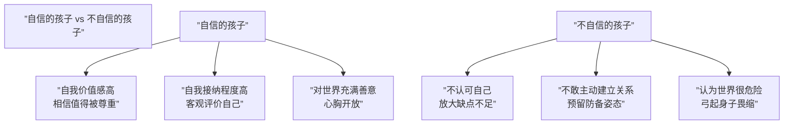

# 第27课：彩蛋——亲子关系常见问题（上）

## 自信的孩子是如何失去热情与自信的

### 孩子不自信的原因：被"吞噬"

**吞噬**的概念：父母过于权威、过于强大，把孩子"包裹"起来，禁止他向外探索。

具体表现：
- 孩子想参加文体比赛 → "你不一定能拿名次，还会耽误学习"
- 孩子是父母的一部分，像器官一样没有自我
- 情感是单向灌输而非流动

### 如何培养自信的孩子

1. **孩子是独立的个体**：需要自己去学习，尤其是社会化的功能
2. **给予挑战和探索机会**：让孩子获得"我可以的"的认知
3. **引领参与真实生活体验**：父母以身作则是最好的示范
4. **允许试错**：自信不是无所不能，而是犯错后不否定自己

> [!TIP] 孩子需要试错的机会。一个自信的孩子并不是觉得自己无所不能，而是哪怕失误了，也不会因此否定自己——他会认为这是一个学习的过程。

## 家有宅孩子

### 孩子为什么不愿意出门

孩子在日积月累中形成"宅"的状态，不是突然出现的。主要原因：
- 没有从人际关系中获得好的体验
- 没有在别人眼里看到更好的自己

### 如何帮助孩子走出家门

#### 培养兴趣爱好
任何兴趣爱好的培养都需要投入时间和精力，孩子会主动去学习相关知识，自然涉及社交。注意要分清是孩子自己想学还是父母想他学——被迫培养的爱好会适得其反。

#### 提升社交兴趣

| 原则 | 说明 |
|------|------|
| **不剥夺探索机会** | 不要替代孩子做事情，剥夺成就感 |
| **父母做社交榜样** | 以身作则引领孩子建立人际关系 |
| **培养受挫力** | 允许孩子有挫败感，陪他分析原因 |

> [!NOTE] 让一个宅在家里的孩子走出家门，就像一艘轮船出港——需要把绑在码头的那条绳子松开，他才能真正离开。有时候不是孩子不愿意出门，是我们内心希望孩子待在家里，没有真正放手。

## "穷人家的富二代"

### 现象

家里的经济状况不好，但孩子喜欢追求昂贵的东西，让自己看上去像个富二代。

### 原因

1. **从小没有得到满足**：各方面需求未被满足→长大后物欲强烈
2. **父母惯出来的**：父母把自己的虚荣心让孩子去释放
3. **同情自己**：父母同情"曾经的自己"→补偿性地对待孩子

> [!WARNING] 给孩子买东西不能带着责怪或条件。"这件礼物花了爸爸妈妈好多钱"——这种话不会让孩子满足，反而促使报复性消费。

### 解决方法

1. **呈现真实的生活**：把家庭真实状况告诉孩子（八九岁就能理解）
2. **满足不带愧疚**：不要用补偿心理去满足孩子
3. **灌输"付出才有收获"**：四五岁开始让孩子知道收获和付出之间的关联

## 你在培养"不敢反抗的孩子"吗

### 孩子"胆小"的可能原因

- **性格尚未定型**（尤其是三岁多的孩子）：不能随意判定他胆子大或小
- **需要较多试错机会**：内向性格的孩子需要更多时间去检验自己的能力
- **不被及时回应**：孩子表达后得不到支持，就越来越不敢表达

### 严厉的两种层面

| 显性严厉 | 隐性严厉 |
|----------|----------|
| 训斥、打骂 | 内心的挑剔和失望 |
| 直接控制 | 孩子感知到"我让父母失望了" |
| 孩子停止表达 | 孩子假装配合但内心封闭 |

### 父母需要做的

- **允许沉默**：沉默也是一种表达，可能是在思考
- **身教重于言传**：让孩子看到爸爸妈妈如何与人交流
- **创造练习机会**：让孩子把学到的东西应用到实际中

> [!QUESTION] 自测问题
> 当你的孩子不敢表达时，你内心的情绪是什么？是愤怒、失望还是羞耻？
>
> 

> 
查看参考回答

> 这些情绪背后往往隐藏着我们对孩子的"期待"——我们希望孩子符合我们心目中的样子。但孩子是独立的个体，他们的沉默可能只是在思考或需要时间消化。允许不表达，比强迫表达更重要。
> 

---

## 下一课推荐

下一课 [[0028-cai-dan-xia|第28课：彩蛋——亲子关系常见问题（下）]] 将探讨穷养富养的误区、二孩竞争处理、分床睡时机和青春期叛逆的本质。

## 应用练习

1. **观察练习**：观察你的孩子，记录他哪些行为来自"天性"、哪些来自你对他的"期待"？
2. **放手练习**：本周给孩子一次独立探索的机会（即使他做得很慢），不替代、不催促
3. **真实对话**：如果孩子有消费问题，尝试开诚布公地讨论家庭经济状况