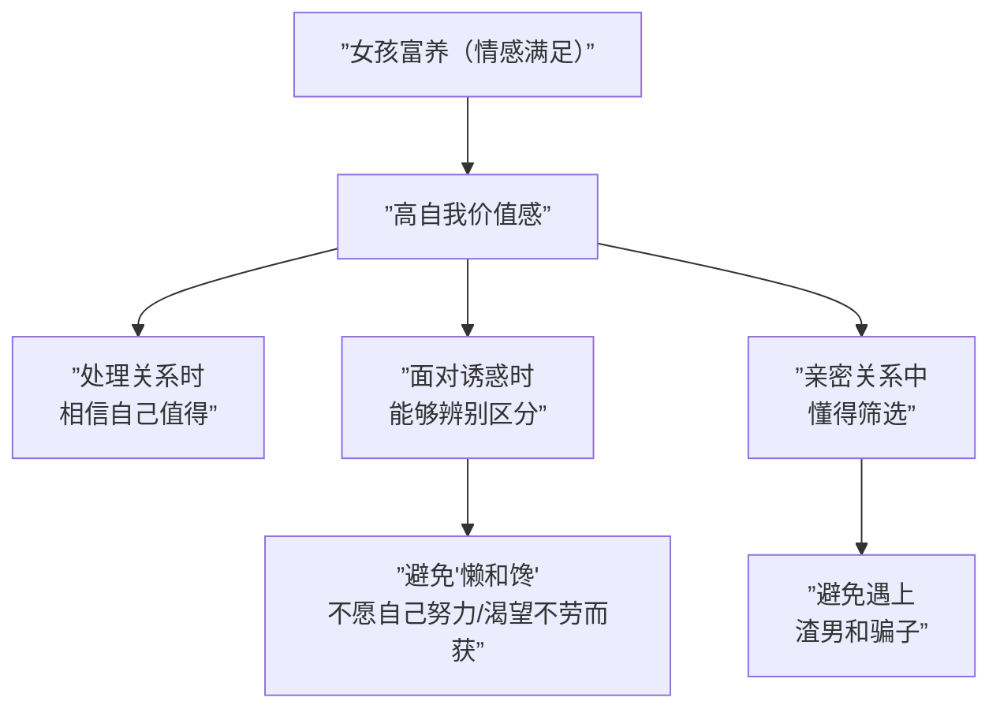
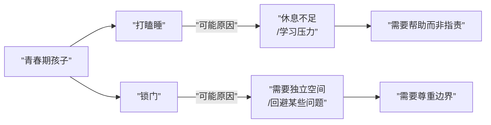

# 第28课：彩蛋——亲子关系常见问题（下）

## "男孩穷养，女孩富养"的真相

### 男孩穷养的正确理解

**穷养不是让儿子生活一穷二白**，而是让他懂得如何通过自己的努力和创造性去获得想要的东西。

从男性的生物性来看，雄性的价值体现在竞争力——能否在社会中通过能力获得资源，养起自己和未来的家。男性在亲密关系中需要提供的四种价值：

| 价值类型 | 含义 |
|----------|------|
| 生存价值 | 是否有能力生存下来（金钱、地位、资源） |
| 繁衍价值 | 能否延续后代 |
| 情绪价值 | 能否提供情感支持 |
| 陪伴价值 | 能否给予时间和关注 |

### 女孩富养的正确理解

**富养不是给女儿花不完的钱**，而是满足孩子**情感上的需求**，让她有更高的自我价值感。

> [!NOTE] 女性最糟糕的两点是"懒"和"馋"——懒是不愿自己努力，馋是很渴望得到什么、容易被诱惑。这通常代表情感需求没有得到满足，长大后渴望有人给予自己一切。

### 总原则

**不需要刻意制造人为的东西去对待孩子**——不要故意表现得很穷，也不要不计成本地满足。呈现一个真实的世界，真诚地对待孩子，孩子自然会跟着一起成长。

## 二孩竞争：需要制止他们的争夺吗？

### 核心问题：要不要介入？

| 年龄差距 | 建议 |
|----------|------|
| 悬殊太大（5-7岁） | 需要人为干预（力量不对等） |
| 年龄相仿 | 让孩子自己解决 |

### 兄弟姐妹竞争的好处

兄弟姐妹之间的有限竞争可以增强孩子的竞争力——人际关系中的竞争力、社会上的竞争力。这是独生子女没有的机会。

### 家长需要注意的两点

1. **不要同情自己投射到孩子身上**
   - 如果你小时候被要求"让着弟弟"，你可能会将委屈投射到老大身上
   - 这种同情会导致对两个孩子态度不公

2. **尊重家庭的内在秩序**
   - 家庭有自己的平衡方式，不一定符合我们的期待
   - 不要因为不符合想象就去破坏这个平衡

> [!WARNING] 误区：不要用"理想期待"评判孩子
> 家里有两个苹果，一大一小。老大肚子饿了想吃大的，老二哭喊也要大的。如果你直接说"老大你真自私，要让着弟弟"——这是在用自己的理想期待伤害孩子。老大只是单纯想吃多点，不是自私。

## 孩子几岁分床睡？

### 分床睡的两个原则

1. **夫妻关系是家庭关系的第一位**
   - 如果把亲子关系放在第一位，分床睡只是在形式上分开，心理上没有分离
2. **分离都有悲伤，但悲伤不等于创伤**
   - 只有处理不好的悲伤才会成为创伤

### 分床睡的时间参考

| 年龄段 | 说明 |
|--------|------|
| **3-5岁** | 可以分床睡，有独自面对黑暗和入睡的能力 |
| **5岁左右** | 必须完成分床睡，在自己房间里睡 |
| **青春期前** | 如果还未分床，问题会很大 |

> [!WARNING] 青春期还与异性父母睡在一张床上，孩子会因过度依赖父母而失去自己，长大后无法建立良好的亲密关系。

### 如何顺利分床睡

1. **给孩子心理准备**：提前商量好什么时候分床
2. **给予适应期**：即使分房间，也要每天陪伴孩子直到入睡
3. **避免错误做法**：
   - 不要粗暴强制（"你必须一个人睡！"）
   - 不要一哭就心软抱回来
   - 不要欺骗孩子（说陪着等睡着，结果提前溜走）

> [!TIP] 当孩子养成比较稳定的习惯后，他就会感到安全，更有力量面对一个人睡的场景。

## 青春期叛逆的本质是成长

### 青春期孩子的行为解读

很多父母看到孩子上课打瞌睡、回家锁门就担心。但首先要弄清楚**为什么**：

- **打瞌睡**：可能头一天在家休息不好
- **锁门**：可能内心不想与家庭成员接触，在回避某些事

> [!NOTE] 青春期孩子锁门是正常现象，他需要一个属于自己的独立空间去思考。与其指责，不如先想：孩子遇到什么问题了？他此时需要的是帮助，而不是判断。

### 与青春期孩子沟通的原则

| 原则 | 具体做法 |
|------|----------|
| **角色定位** | 把自己当成孩子的朋友，而不是上司 |
| **明确沟通目的** | 目的是交流感受，不是发泄情绪或改变对方 |
| **少就是多** | 多听他说，多让他自己做决定 |
| **基于信任** | 相信他有能力解决问题，不替代做决定 |

### 如何提供帮助

> 如果孩子不愿意说，可以给他一个态度："不管你遇到什么困难或挫折，爸爸妈妈都一定会站在你背后支持你。"

关键是不指责——不说"你为什么不说""你怎么这样"——这种指责性的话只会将关系推入对立面。

当孩子不愿意回答时，**安静的等待**就是最好的沟通。

---

## 本课总结

四个话题的核心都在于**尊重孩子的独立性和成长节奏**：

| 话题 | 核心原则 |
|------|----------|
| 穷养富养 | 呈现真实世界，真诚对待 |
| 二孩竞争 | 尊重秩序，不过度介入 |
| 分床睡 | 夫妻关系第一，处理分离不创造创伤 |
| 青春期 | 孩子的沉默是成长需要，少即是多 |

## 应用练习

1. **性别教育反思**：审视你对孩子的教养方式，是否陷入了"穷养/富养"的误区？
2. **观察孩子间的冲突**：下次孩子间发生争执，先观察3分钟再决定是否介入
3. **尊重练习**：如果你的孩子（尤其是青春期孩子）今天锁了门，尝试不敲门追问，让他拥有自己的空间