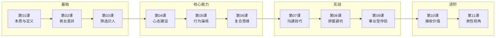

## 课程地图

## 推荐学习顺序

### 快速入门（3 课）
如果时间有限，先读这三课：
1. [[lessons/0001-emotional-value-basics|第01课]] — 理解核心概念
2. [[lessons/0002-gender-differences|第02课]] — 理解差异
3. [[lessons/0007-communication-skills|第07课]] — 马上能用

### 系统学习（全部 11 课）
按课程地图顺序学习即可。

### 按需查询
- 想改善沟通 → [[lessons/0007-communication-skills|第07课]] + [[lessons/0008-common-mistakes|第08课]]
- 想控制情绪 → [[lessons/0004-mindset-building|第04课]] + [[lessons/0005-behavior-practice|第05课]]
- 想理解伴侣 → [[lessons/0002-gender-differences|第02课]] + [[lessons/0009-career-partner|第09课]]
- 男性想学 → [[lessons/0011-men-providing|第11课]]
- 怕被套路 → [[lessons/0010-receiving-value|第10课]]