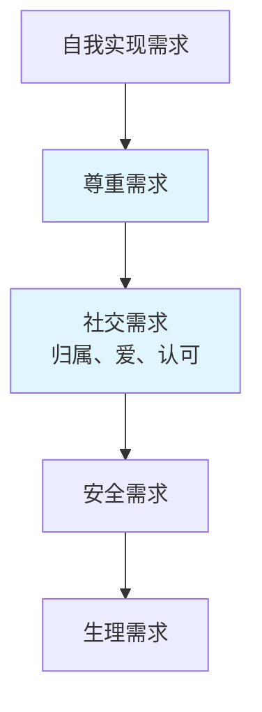

## 定义

情绪价值一词源于经济学和营销领域。美国爱达荷大学商学院杰弗里教授将其定义为：

> **情绪价值 = 情绪收益 - 情绪成本**

- **情绪收益**：对方从你这里获得的积极情绪体验（关心、鼓励、支持、理解、信任、体贴等）
- **情绪成本**：对方承受的负面情绪体验（指责、打压、冷落、忽视等）

一个人越能给他人带来舒服、愉悦和稳定的情绪，其情绪价值就越高。

## 马斯洛需求层次与情绪价值

情绪价值主要对应**第三层级（社交需求）** 和**第四层级（尊重需求）**，包括归属感、爱、尊重、信任等。

核心逻辑：**生理需求满足后，精神需求成为主导**。物质丰富的边际效用递减，人们越来越追求精神愉悦。

## 提升情绪价值的两种路径

1. **增加情绪收益**：在情绪成本不变的情况下，多给予积极反馈
2. **降低情绪成本**：在情绪收益不变的情况下，减少负面反馈

**优先级：先止损，后增益**。先停止做关系的破坏者，再谈如何提供正面价值。

## 情绪价值 vs 讨好型人格

| 维度 | 情绪价值 | 讨好型人格 |
|------|----------|------------|
| 出发点 | 我有能力、我愿意给 | 我怕失去、我必须给 |
| 心态 | 强者心态：我能决定是否供给 | 弱者心态：我不给就会被抛弃 |
| 独立性 | 精神独立，随时可以离开 | 精神依附，害怕离开 |
| 结果 | 关系更亲密，双方都舒服 | 强买强卖，双方都不舒服 |

**核心一句**：讨好是交换，情绪价值是自我的意愿。

## 常见负面反馈类型

- **指责**：遇事甩锅，"都是因为你……"
 - **打压对比**：拿对象缺点比别人优点，"你看别人……"
- **负面评估**：先入为主否定对方，"我早就知道你会这样"
- **恶意揣测**：揣测恶毒动机，"你是不是故意的？"
- **上纲上线**：一切归结为"不爱我"
- **阴阳怪气**：话里带刺，拐弯抹角

> [!TIP] 练习建议
> 下周开始，记录每一次自己产生负面反馈的时刻。问自己：这句话说出来，是在增加情绪收益，还是在增加情绪成本？