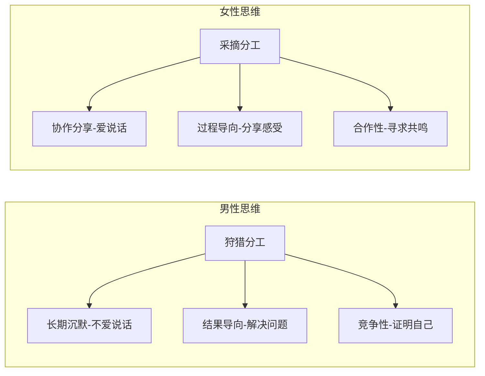

## 进化心理学基础

**需要说明**：这是统计意义上的刻板印象，具体到个人未必如此。不要用这个框架去给身边人贴标签，而是用来**理解差异并调整沟通方式**。

## 三个经典场景

### 场景一：开车迷路
男士开车迷路却不问路，女士建议去问人，男士生气冷战。

- **女士视角**：迷路问人很正常，我在提供帮助
- **男士视角**：让我问人 = 你不信任我 = 你觉得我不行

### 场景二：职场倾诉
女士被领导批评回家倾诉，男士给她分析问题、出主意，女士更生气了。

- **女士需要**：倾听、共情、拥抱（不是解决方案）
- **男士认为**：她遇到问题了，我要帮她解决

### 场景三：各自疲惫
男士工作受挫回家想安静，女士也加班累了想倾诉，双方都觉得自己被忽视。

- **男士**：只想安静待着恢复能量
- **女士**：需要通过分享来获得连接感

## 男女最需要的情绪价值

### 男性（排序由高到低）
1. **信任** — "我相信你能搞定"
2. **尊重** — 不替他做决定，不指手画脚
3. **欣赏** — 肯定他的能力和付出
4. **接纳** — 允许他有脆弱和沉默的权利

### 女性（排序由高到低）
1. **聆听** — 认真听，不打断，不急于给建议
2. **关心** — 主动询问她的感受和状态
3. **理解** — 懂她的情绪而非评判对错
4. **尊重** — 尊重她的感受和选择

## 男性给女性的情绪价值

> [!NOTE] 男性版 · 实操指南
> 女性倾诉时，她需要的不是解决方案，而是**情绪共鸣**。你的任务不是"修好她"，而是"陪着她"。

- **积极倾听**：放下手机，眼神接触，点头回应
- **情感确认**："那确实让人难受"、"换我我也会生气"
- **安全感提供**："不管怎样有我呢"、"你值得更好的"
- **细节关注**：记住她说过的细节，在合适的时候提起
- **情绪涵容**：在她情绪波动时保持稳定，不被她的情绪带走

## 女性给男性的情绪价值

> [!NOTE] 女性版 · 实操指南
> 男性在解决问题时，他需要的不是你的建议，而是**信任和空间**。你的信任就是对他最大的肯定。

- **信任放权**：相信他能处理好，不替他做决定
- **不越界帮助**：在他求助之前，忍住不主动给建议
- **肯定能力**：关注他的成就和努力，及时给予肯定
- **尊重独处**：理解他需要"洞穴时间"，不是不爱你是需要恢复
- **竞争性共鸣**：理解他在"无意义竞争"中的快乐（比如打游戏、比技能）

> [!TIP] 关键思维转变
> 不要用自己的思维模式去代入对方。他（她）不是你想的那样，他（她）本来就和你想得不一样。差异不是错误，而是需要理解的事实。