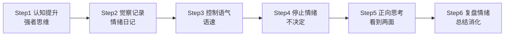

## 核心思维

情绪管理是一种**肌肉记忆**，就像骑自行车——学会了一辈子不会忘。需要通过反复练习，让它成为本能反应。

## 六步情绪控制法

### 第一步：提升认知——强者思维

**核心心法**：理解是单边输出，强者不需要被理解。

- 你站得越高，越能理解对方 → 你是强者
- 对方理解不了你也很正常 → 因为对方站得低
- 不需要跟"傻子"争对错——被狗咬了不会咬回去

**这不是阿Q精神**，而是"我可以选择生气，但我不这么做"。主动选择包容 vs 被迫妥协自我安慰，是本质区别。

### 第二步：觉察记录——情绪日记

每次有负面情绪时，立刻问自己：

1. 这个情绪从什么时候开始的？
2. 具体是什么事件/哪句话/哪个动作引发的？
3. 我当时的感受是什么？

**工具**：准备一个"情绪记录本"，把每次情绪的诱因、经过、反应记下来，越细越好。

### 第三步：控制语气和语速

情绪来临时，身体会先出卖你——声音变大、语速变快，反过来又会加剧情绪。

**干预方法**：
- 有意识地放慢语速
- 降低音量
- 提醒自己"慢慢说、小声说"

把"慢慢说话"和"控制情绪"建立条件反射。

### 第四步：停止——情绪来时不做任何决定

> 情绪来的时候，**什么都不做比做什么都好**。

因为情绪之下的所有决定都是为了发泄，发泄完了你回头看八成会后悔。

**操作口诀**：停停停停停停停。不要思考，先停下来。

### 第五步：正向思考

事情都是一体两面的，你盯着哪面，哪面就放大。

例子：
- 伴侣吵架 → 这是一次暴露问题、深度磨合的机会
- 工作被骂 → 这是查漏补缺的提醒
- 失恋了 → 这促使我反思自己在关系中的缺失
- 伴侣粗心大意 → 说明他思维跳脱有创造力

**练习**：在情绪记录本上，每个事件后面都要写出它积极的另一面。

### 第六步：复盘情绪

事情过后，把整件事重新过一遍：

1. 当时发生了什么？
2. 哪个点让我产生了情绪？
3. 那是什么样的情绪？
4. 有情绪后我说了什么、做了什么？
5.最后事情往哪个方向发展了？
6.下一次再遇到同样情况，我怎么做才能更好？

## 常见误区澄清

> "这样不会让我变成没有情绪的木头人吗？"

不会。你永远都会有情绪，也永远不可能100%控制住情绪。

**求其上者得其中**——你往最好的方向练，实际做到七八成就已经很厉害了。

**真正的情绪管理不是消灭情绪**，而是：
- 更快觉察情绪
- 更快走出情绪
- 不被情绪控制行为决策

> [!WARNING] 避免纵容自己的"控制不了"
> 绝大多数时候，你所谓的"控制不了情绪"，其实不是控制不了，是**根本没控制**——你选择了发泄，然后回头说"我控制不了"。