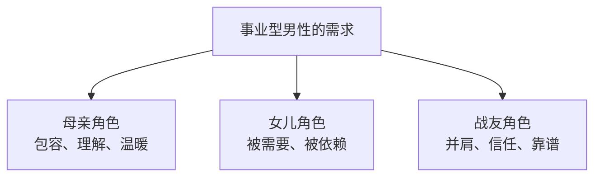

## 事业型男性的核心特点

事业型男性（不仅指事业成功，也包括正在奋斗的）理性思维占主导，他们的核心逻辑是**解决问题**。

- 精力 80%+ 在工作上
- 连自己身体和情绪都不太在意，更难关注你的小事
- 不喜欢麻烦，最需要"省事"的伴侣

## 读书期 vs 工作期的需求变化

| 维度 | 学生时期 | 工作时期 |
|------|---------|---------|
| 精力充裕度 | 高，有大把时间 | 低，每天像打仗 |
| 对情绪价值需求 | 享受推拉、竞争、小作小闹 | 需要稳定、省事、安全感 |
| 有效策略 | 制造嫉妒、神秘感 | 给信任、不给压力 |
| 无效策略 | 过度依赖 | 作闹、引入竞争 |

> 很多女性的困扰在于：把学生时代有效的方法沿用到了工作后的关系中，结果发现全部失灵。

## 事业型男性需要的三种角色

在男人的不同阶段和场景中，他需要你扮演三种角色：

### 母亲角色（低谷时）
他受伤挫败时，需要你提供包容和温暖。让他觉得在你身边可以放松、可以做自己。

### 女儿角色（被需要时）
他需要被需要的感觉。适当示弱，让他感觉自己对你有用、被依赖。

### 战友角色（奋斗时）
他创业或事业关键期，需要你坚定地站在他这边。这是最深层次的情绪价值——**战友情**。

> 案例：一位男士创业时不被妻子看好，妻子还带着孩子回娘家、抽走流动资金。后来他成功了，不愿和妻子分享任何成果——"她从来没有相信过我"。

## 如何给事业型伴侣提供情绪价值

### ✅ 核心原则

1. **信任先行**：信任他的能力，不指手画脚
2. **别找事就是最大的情绪价值**：不搞小情绪、不制造危机
3. **抓大放小**：大事上沟通，小事上不管
4. **要"省事"而非"没事"**：省事 = 不消耗他的情绪能量

### ✅ 如何提要求

- **撒娇式而非命令式**：❌"你怎么又这么晚回来！" → ✅"你回来这么晚人家都睡不着了……"
- **提他容易给的东西**：事业型男最易给物质（钱），最难给的是时间。不要硬要陪伴，要他会给的

### ✅ 建立"游戏化"激励机制

像游戏一样设置阶段目标和奖励：

1. 设定长期目标（共同蓝图）
2. 分解为短期小任务
3. 每次完成给予及时奖励（夸一句、一个吻、一顿饭）
4. 逐步引导他投入更多

### ✅ 当他出现误会时（紧急处理步骤）

1. **安抚情绪先**："对不起让你不开心了"
2. **肢体接触**：抱住或牵手
3. **平静描述事实**：不带指责地还原事情经过
4. **表达爱意**："我真的很在乎你"

> [!WARNING] 千万别做的事
> - 引入竞争让他吃醋 → 他会觉得你不靠谱、直接放弃
> - 在他忙时连环call → 他会觉得你影响事业
> - 用"你不爱我了"威胁 → 事业男不吃这套，只会加速退出

## 适用所有男性的通用原则

男女通用的"省事哲学"：

- 情绪稳定 → 对方不需要处理你的情绪
- 不给压力 → 和你在一起是充电而非耗电
- 有事说事 → 不搞推拉猜谜
- 相互信任 → 不查岗不控制