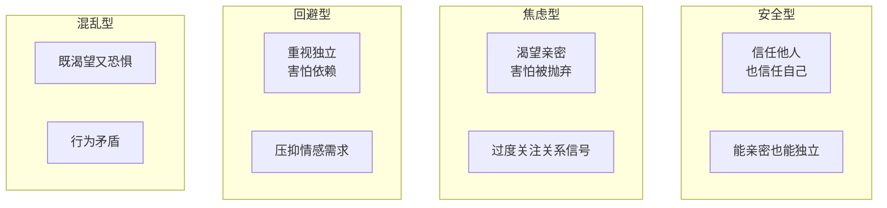
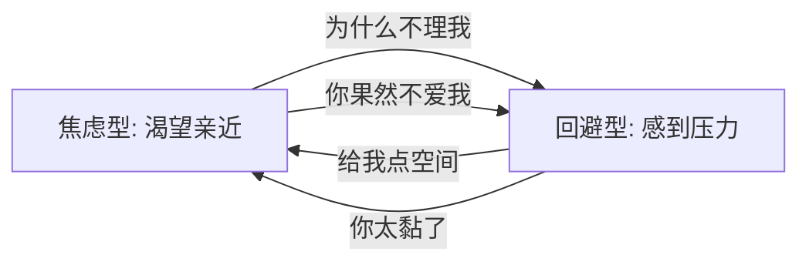

## 什么是依恋理论

依恋理论由英国心理学家约翰·鲍比（John Bowlby）提出，后经玛丽·安斯沃斯（Mary Ainsworth）的"陌生情境实验"验证。核心观点：

> **人在婴幼儿时期与主要照料者形成的互动模式，会影响成年后在亲密关系中的行为模式。**

## 四种依恋类型



| 类型 | 占比 | 核心信念 | 关系表现 |
|------|------|---------|---------|
| **安全型** | ~55% | "我值得被爱，他人值得信任" | 能自然给予和接收情绪价值，关系稳定 |
| **焦虑型** | ~20% | "我不够好，随时可能被抛弃" | 索取情绪价值多，需要不断确认被爱 |
| **回避型** | ~20% | "靠别人会受伤，独立才安全" | 不太会给予情绪价值，也不习惯接收 |
| **混乱型** | ~5% | "既想靠近又怕受伤" | 忽冷忽热，情绪价值波动大 |

## 各类型与情绪价值的关系

### 安全型 — 情绪价值的高手

**特点**：
- 情绪稳定，能自然地给予赞美和肯定
- 接收情绪价值时不会感到亏欠或压力
- 对方有情绪时能稳稳接住，不被带偏

**为什么**：安全型的人内化了一个信念——**"我是有价值的，即使对方暂时没有回应，也不代表我不好。"** 这让他们的给予没有附加条件。

**这一课的价值**：情绪价值课程的终极目标，不是学话术，而是**朝向安全型依恋发展**。

### 焦虑型 — 情绪价值的索取者

**模式**：
```
感到不安 → 索取确认（"你爱我吗？"）→ 得到安抚 → 短暂安心 → 再次不安
```

**在情绪价值上的困境**：
- 自己给出去的情绪价值，会立刻要求"回报"（"我都夸你了你怎么不回夸我"）
- 对方稍微冷淡就恐慌，用自己的焦虑破坏关系的稳定
- 容易成为"作女/作男"——不是坏，是太怕失去

**改善方向**：
- 第04课的心态建设（自我接纳）对焦虑型尤其重要
- 学会自我安抚，不把全部安全感建立在对方回应上
- 觉察自己的"确认需求"，有意识减少查证行为

### 回避型 — 情绪价值的绝缘体

**模式**：
```
对方靠近 → 感到压力 → 需要空间 → 疏远 → 恢复舒适 → 再次靠近
```

**在情绪价值上的困境**：
- 不是不想给，是**不知道**怎么给——成长经历中没有示范
- 接收情绪价值时会感到"有压力"、"欠人情"
- 伴侣说"我爱你"时，第一反应是"你想从我这里要什么"

**改善方向**：
- 从小事开始练习给予（一个拥抱、一句"辛苦了"）
- 学习接收情绪价值而不急于"还回去"
- 让伴侣知道"我需要空间不是不爱你"（第09课的洞穴时间）

### 混乱型 — 情绪价值的过山车

**特点**：焦虑和回避交替出现。今天黏人，明天冷漠。

**困境**：无论给予还是接收情绪价值都充满矛盾。给予时用力过猛，接收时又怀疑对方动机。

**改善方向**：建议寻求专业心理咨询，混乱型的成因通常涉及创伤经历。

## 如何判断自己和他人的依恋类型

### 自测问题

以下描述，哪个最符合你？

1. **安全型**：我很容易与人亲近，也享受独立空间。不担心被抛弃，也不怕对方太黏。
2. **焦虑型**：我经常担心伴侣不够爱我，需要对方不断确认。亲密关系让我既快乐又焦虑。
3. **回避型**：太亲密让我不舒服。我重视独立，伴侣想要更多亲密时我会想逃。
4. **混乱型**：我渴望亲密但又害怕受伤。在关系中情绪起伏很大，行为连自己都难以预测。

### 观察对方

- **焦虑型**：消息没回就连续追问、频繁问"你爱我吗"、容易吃醋、把小事解读为"你不爱我了"
- **回避型**：很少说情话、不习惯肢体接触、遇到矛盾就沉默、强调"个人空间"
- **混乱型**：忽冷忽热、吵架时极端行为（拉黑后又加回）

## 不同依恋组合的相处指南

### 焦虑型 × 安全型（最易改善）

- 安全型给焦虑型提供稳定的"锚"
- 焦虑型需要学习：**对方没回应≠被抛弃**，只是对方在忙
- 安全型需注意：别因为焦虑型的索取而耗尽自己，适当设立边界

### 焦虑型 × 回避型（最常见但也最难）

这是"追逃模式"——焦虑追、回避逃，越追越逃、越逃越追。



**打破循环**：
- 焦虑型：给回避型预定的"洞穴时间"，到时再连接
- 回避型：主动报备"我需要安静一会，XX时间后找你"
- 双方都需要理解：**她的索取不是控制，他的逃避不是不爱**

### 安全型 × 回避型

- 安全型可以提供稳定的安全感
- 回避型需要感受到：靠近你是安全的，你不会吞噬我
- 安全型不要因为回避型的疏远而自我怀疑

## 依恋类型可以改变

> 依恋类型不是命运。通过安全的关系体验和自我觉察，不安全依恋可以转向安全型。

**改变的路径**：
1. **觉察**：了解自己的依恋模式（这一步你已经做到了）
2. **理解**：你的模式在童年是有适应功能的——它不是"病"，是曾经的生存策略
3. **练习**：在安全的关系中尝试新的行为（如焦虑型尝试延迟回应、回避型尝试主动靠近）
4. **整合**：把新的经验内化为新的工作模型

> [!TIP] 与情绪价值课程的联系
> - 如果你是焦虑型 → 重点看第04课（自我接纳）+ 第05课（情绪控制）
> - 如果你是回避型 → 重点看第07课（如何夸人）+ 第11课（男性视角中的表达练习）
> - 如果你的伴侣是焦虑型 → 重点看第02课（ta需要什么）+ 第09课（给安全感）
> - 如果你的伴侣是回避型 → 重点看第09课（给空间）+ 第10课（保护自己情绪）