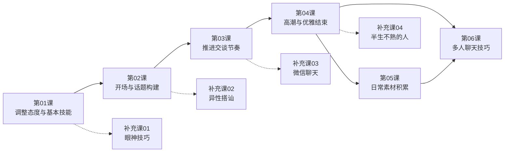

# 课程地图

## 学习路径

> 实线为推荐主路径，虚线为对应模块的补充延伸。

## 模块详解

### 第一阶段：基础心态与技能（第01课）

从认知层面调整对闲谈的态度，理解闲谈的真诚与意义。建立两个关键心理暗示——「我是主人」和「我们是还没有认识的朋友」。学习贯穿全程的三大基本技能：问出让人自如的问题、一问二答、倾听扩展。

### 第二阶段：开场破冰（第02课）

用「冷读者+热捧者」的身份说出第一句话。从三条思路寻找话题切入点：周围道具、对方本人、当下状态。用猜谜游戏和诚心请教为开场增色。

### 第三阶段：推进节奏（第03课）

掌握万用的「说问说」三部曲节奏。学会三个冷场急救术：另起炉灶、正反回应、扮演苏格拉底。

### 第四阶段：高潮与结束（第04课）

运用俄罗斯套娃法和原子核法定位优势话题。掌握剥洋葱法（套话→事实→观点→感受）逐层深入。学会与大人物交谈的技巧。掌握五种优雅退场的方式。

### 第五阶段：素材准备（第05课）

准备三类出镜率高的故事：共同点故事、自己的故事、关于吃的故事。积累跨时空对比的聊天素材。

### 第六阶段：多人聊天（第06课）

学会在多人局中创造新话题、用四种声音加入讨论、制造矛盾主导聊天。

## 补充模块

- [[lessons/s01-yan-shen-ji-qiao|补充课01：交谈时的眼神技巧]] — VDR视觉支配比理论，眼神四原则
- [[lessons/s02-yi-xing-da-shan|补充课02：如何与异性搭讪]] — 讨喜偏误理论三要素
- [[lessons/s03-wei-xin-liao-tian|补充课03：微信聊天技巧]] — 微信聊天的开场、进行与结束
- [[lessons/s04-ban-sheng-bu-shu-zhi-jian|补充课04：与半生不熟的人聊天]] — 聊历史、聊现在、聊未来

## 推荐学习顺序

1. 先完成第01-04课，掌握闲谈的完整流程（开场→推进→高潮→结束）
2. 学习第05课，丰富聊天素材
3. 学习第06课，升级到多人局场景
4. 结合自身需求选择相应的补充课