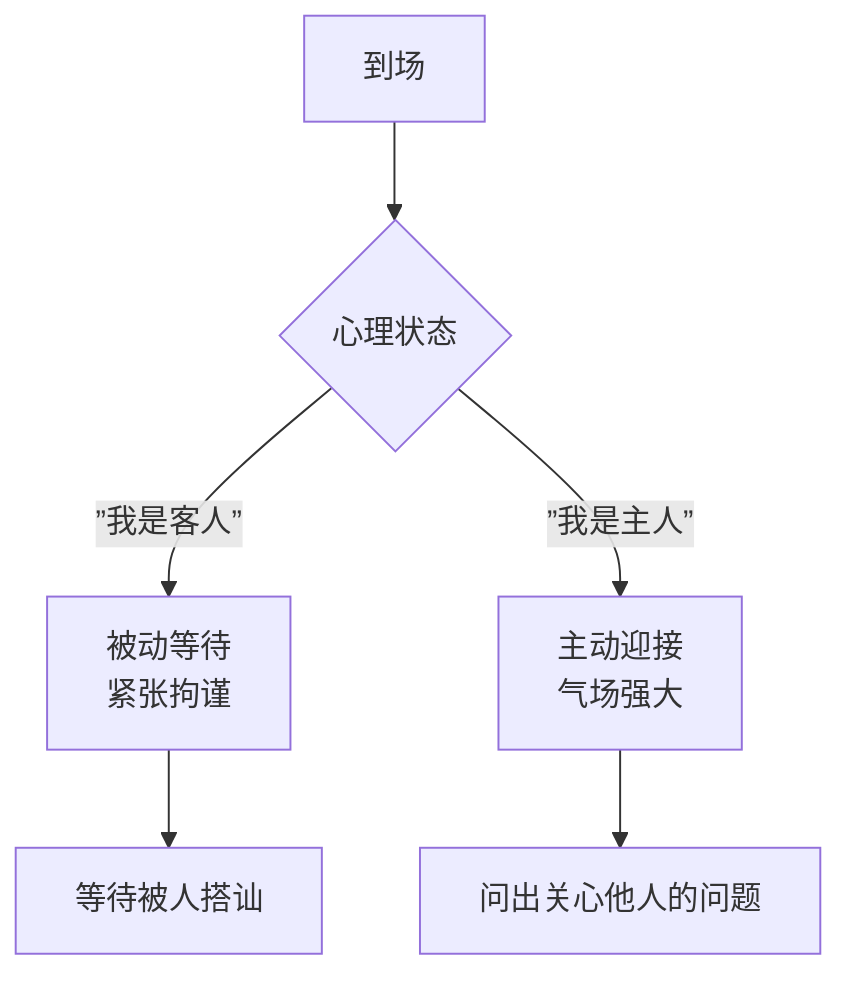
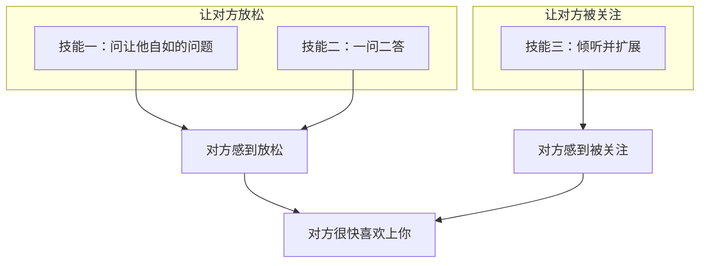

# 第01课：闲谈是社交的敲门砖

## 学习目标

- 理解闲谈（Small Talk）的真正价值，消除对社交的偏见
- 掌握两个心理暗示法，建立主动自信的社交心态
- 学会三大基本技能，让每一次闲谈都让对方感到舒适和被关注

## 核心认知：闲谈不是什么？

闲谈不是虚伪的客套，也不是功利的利用。真正的社交不是为了利用别人，而是**帮助别人成功**。你拥有自己的专业知识、人脉和看世界的视角——这些都可以帮到别人。一旦找到了自己的价值，你的底气就不一样了。

> 社交不是操纵索取，而是合作互助。你和他人共享信息，蛋糕就会越做越大。

### 为什么闲谈如此重要？

| 作用 | 说明 |
|------|------|
| **让对方愉悦** | 电子时代人人渴望被关注，被你面对面地倾听，会带来分享的愉悦 |
| **获得第一手资讯** | 每个人都知道一些手机和书本上看不到的资讯，闲谈帮你调整对行业、城市甚至时代的见解 |
| **精英教育的核心** | 精英教育不同于技能教育，它要求你具备协同资源的能力，去成就更大的事业 |

### 东西方社交文化对比

```mermaid
flowchart LR
    subgraph 椰子文化（东方）
        A1[外壳硬<br>不擅与陌生人交往] --> A2[内部空间大<br>熟人社交极强]
    end
    subgraph 桃子文化（西方）
        B1[外皮软<br>擅长与陌生人打交道] --> B2[内核硬<br>深交门槛高]
    end
    中国人 --> 椰子文化
    C[学习闲谈技巧] --> 融合桃子文化的优势
```

中国人天然处在"椰子文化"中——外壳硬，不擅与陌生人交往；但内部空间大，熟人社交能力极强。本课程要帮你打开椰子壳，同时保留那份真诚。

> [!TIP] 关键洞察
> 闲谈（Small Talk）是带着社交的心态与陌生人聊上几分钟，说一些没有清晰目的但很有意思的话。它不是深沉对话的对立面——恰恰相反，它是深沉对话的**前奏**。

---

## 两个心理暗示法

在你学习技巧之前，先调整心态。两个心理暗示法让你从被动变为主动。

### 暗示一：我是主人

提前到场，假设这个活动就是你组织的。就像踢足球，你踢的是**主场**。

一旦心理状态到位，你的气场会强大很多倍。你会主动问出这样的问题：

- "你对今天的活动感觉怎么样？"
- "喜欢放的这个音乐吗？"
- "食物还合口味吗？"



### 暗示二：我们是还没有认识的朋友

这个世界就是一个好玩的大 Party。在这个聚会上没有陌生人，只有**还没有认识的朋友**。资讯大交融，乐趣大冲撞。

> [!WARNING]
> 大多数人比你想象的更友善宽容。根据培训中的问卷调查，**没有出现过一例善意的搭讪遭到对方拒绝的情况**。最糟糕的情况无非是对方不理你——那又有什么关系呢？

---

## 三大基本技能

这两个心理暗示的心理学依据是**马斯洛需求层次理论**——人有安全需求，再往上还有尊重需求。所以，要获得他人的好感，请让他：

1. **感觉放松**（安全需求）
2. **感觉被关注**（尊重需求）



### 技能一：问一个让他自如的问题

**原则**：对方可以把对话引导到任何方向，进退自如。

#### 不要问一个词就能回答的问题

一个词回答后，对话就死掉了。对方会觉得自己是"谈话终结者"，有压力去找新话题。

| 终结者问法 | 达人问法 |
|-----------|---------|
| "你会回美国吗？" | "如果你有一天选择回美国，会是什么原因？" |
| "你常去海边度假吗？" | "你喜欢去哪里度假？" |
| "你喜欢恐怖电影吗？" | "你喜欢哪种类型的电影？" |
| "你想念家人吗？" | "离开家这么久，你感觉怎么样？" |

#### 不要问太泛或太深的问题

❌ "你对**一带一路**怎么看？" —— 对方瞬间感到思考的重担

✅ "一带一路对你们那个行业有什么影响？" —— 问题欲弱则弱，欲强则强，怎么答都可以

> [!TIP]
> 这个技能并不是禁止你问 Yes/No 的封闭式问题。在实际操作中，**封闭式和开放式问题经常穿插使用**。关键是在一组对话里，你要能问得出让对方自由发挥的问题。

**示例**：
- 你问："一带一路对你们那个行业有什么影响？"（开放式）
- 他答："在跨文化培训中，明显感觉到央企国企客户突然增多了。"
- 你插问："电信类算不算投资最大的？"（封闭式）
- 他答："电信类确实多，最多的应该是能源类吧。"（开放式继续）

### 技能二：一问二答

平时我们回答对方的问题是"一问一答"。如果能**在回答对方问题本身之外，稍作延展**，说一些和答案相关的其他信息，这就是"一问二答"。

> [!EXAMPLE] 经典案例：新西兰总理的一问二答
> 凤凰卫视阮次山见到新西兰总理约翰基时问："听说你的手臂摔伤了，现在好些了吗？"
>
> 总理答："已经没事了。（一问一答）我当时是在庆祝中国牛年春节的活动中，不小心划了一下，用手撑地就折了。他们给我打了石膏，后来这个石膏拍卖的款项都捐给了慈善基金会。"
>
> 总理一下子抛出这么多信息，让阮次山可以轻松接下话茬。

**日常生活中的一问二答**：

| 问 | 一问一答 | 一问二答（推荐） |
|---|---------|----------------|
| "你喜欢下雨天吗？" | "喜欢。" | "我喜欢。我和男朋友就是在一个雨天认识的，细雨绵绵，配上江南水乡，很有意境。" |
| "你们家乡也会这么冷吗？" | "没这么冷。" | "没这么冷。不过今年的冬天咱们这儿真的是少有的冷，我今天穿了发热衣，最新科技，好像在身上发热。" |

### 技能三：仔细倾听，扩展再扩展

你扩展的素材**完全来自对方说的话**。

> [!WARNING] 常见误区
> 有些人的聆听仅仅是在等待自己发言的机会。还有些人的聆听停留在表面技巧——一边听一边点头、重复对方的最后几个词、看着对方的眼睛。**请把这些技巧忘掉**。当一个人真正在听的时候，是不需要有意展示这些聆听技巧的。

**闲谈是延展关键词的技术**——对方讲完一段话后，你不是去做总结浓缩（总结浓缩是封闭的），而是用自己的发散、跳跃的思维，抓住原信息中的关键词，扩展出一堆新的信息。


**案例：健身房的邂逅**

对方说："上个月我刚从**上海**搬到**深圳**，这儿**空气**很好。"

从中可以听出的关键词：
- 上海（住过的地方）
- 深圳（新城市）
- 空气（重视环境）
- 搬家（不固守一城）

> 接下来的扩展方向：
> - "搬到新的地方你还习惯吗？"
> - "你还在哪里居住过？在哪个城市住得最久？"
> - "有没有去过深圳的海滩、红树林？那可是天然氧吧。"
> - "我在深圳住过八年，你有什么特别想了解的，我能帮忙。"

**更多扩展练习**：

| 对方的话 | 可用关键词 | 扩展方向 |
|---------|-----------|---------|
| "昨天和朋友去**宝安体育馆**打**网球**了。" | 宝安、体育馆、网球、运动 | 网球爱好、宝安楼盘价格、体育馆游泳池、网球魅力 |
| "我们公司**赞助**的。" | 公司、赞助、市场部 | 哪家公司、公关部、经常赞助科技活动、今天的收获 |

场景中大家都像有水的鸭子——看起来气定神闲，但在平静的水面下，脚蹼却在拼命地扑扑扑。大家都在**拼命地玩扩展游戏**。

---

## 实战案例

> [!EXAMPLE] 酒会场景
> 你走向一位男士说："我注意到你今天来得很早啊，你会一直待到七点钟的晚宴吗？"
>
> 他答："应该会的。七点钟的时候正好肚子饿了。你呢？"

**分析**：
- 一问二答的机会：应"该会的"是第一答，"七点钟的时候正好肚子饿了"是延展
- 可扩展的关键词：**肚子饿了**（说明对食物有期待）、**你呢**（把话题抛回来）
- 你可以扩展："说到美食，我听说今天晚宴的主厨是从意大利请来的，特别擅长做海鲜。你也喜欢意大利菜吗？"

---

## 练习与自测

> [!QUESTION] 自测题1
> 以下哪个问题能让对方感觉自如？
>
> A. "你读过《红与黑》吗？"
> B. "你度假时一般会带上什么类型的书？"
> C. "你读过《基督山伯爵》吗？"
> D. "你对文学感兴趣吗？"

<details>
<summary>查看答案</summary>

**答案：B**

A、C 都是"一个词就能回答"的封闭式问题，对方答"读过"或"没读过"后话题就死了。D 太泛，让对方不知从何说起。B 给对方充分的发挥空间，可以答小说、散文、专业书籍，甚至说"我其实不带书"，都毫无压力。
</details>

> [!QUESTION] 自测题2
> 对方说："我老家在成都，来深圳五年了。" 请运用"一问二答"和"扩展关键词"技巧设计你的回应。

<details>
<summary>查看答案</summary>

**参考答案**：

一问二答回应："成都啊，好地方！（一问一答）我去年去成都出差，火锅吃得太过瘾了，晚上还在锦里逛到不想回酒店。（一问二答——延展）"

扩展关键词方向：
- **成都** → "成都是美食之都，你最推荐哪家火锅？" / "成都和深圳感觉完全不一样吧，更喜欢哪里？"
- **五年** → "五年了，也算是深圳人了。这五年深圳变化很大吧？" / "你见证了前海从一片滩涂到金融中心的蜕变。"
- **老家** → "你还会经常回成都吗？" / "家里人还在成都吗？"

**扩展的关键在于用心聆听对方话里的每一个词，每一个词都可能是一条新的话题线索。**
</details>

> [!QUESTION] 自测题3
> 在马斯洛需求层次理论中，三大基本技能分别对应哪两个层次的需求？

<details>
<summary>查看答案</summary>

**答案**：
- **安全需求**（让对方感觉放松）→ 技能一（问自如的问题）+ 技能二（一问二答）
- **尊重需求**（让对方感觉被关注）→ 技能三（倾听并扩展）

当一个人既感到安全又感到被尊重，他就会很快喜欢上你。
</details>

---

## 课后作业

在酒会上，你向一位男士走过去说："我注意到你今天来得很早啊，你会一直待到七点钟的晚宴吗？"

他说："应该会的。七点钟的时候正好肚子饿了。你呢？"

请分析：
1. 这句话里隐藏了哪些信息可以供你扩展？
2. 你可以怎样"一问二答"？
3. 在谈话进行中，你可以问一个什么样的开放式问题，让对方觉得进退自如？

## 复习检查清单

- [ ] 我能说出闲谈的三点重要价值
- [ ] 我能理解"椰子文化"和"桃子文化"的区别
- [ ] 我记住了"我是主人"和"我们是还没有认识的朋友"两个心理暗示
- [ ] 我能区分"一答即死"的问题和"进退自如"的问题
- [ ] 我在生活中练习了"一问二答"
- [ ] 我尝试过抓住对方话中的关键词进行扩展

---

## 下一步

继续学习 [[0002-kai-chang-zen-yang-gou-jian-yi-ge-hua-ti|第02课：开场——怎样构建一个话题]]，掌握用"冷读者+热捧者"的身份说出第一句话。

需要快速回顾关键知识点？请查阅 [[../reference/quick-reference|社交闲谈速查手册]] 和 [[../reference/glossary|术语表]]。