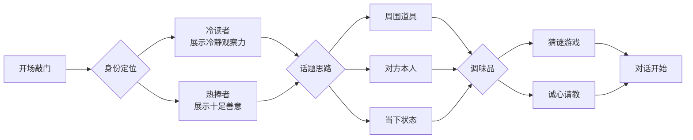

# 第02课：开场——怎样构建一个话题

## 学习目标

- 理解"冷读者+热捧者"的身份定位，学会说出不唐突的第一句话
- 掌握从周围道具、对方本人、当下状态三条思路寻找话题
- 学会两个开场调味品——猜谜游戏和诚心请教
- 理解"是的……而且……"模式，避免成为聊天中的挑战者

## 核心认知：开场只是敲门

面对陌生人的第一步至关重要，但请记住——**开场的话不需要很机智，你只是敲个门而已**。为了"芝麻开门"，傻白甜的问题都可以，明知故问也行。

> 开场就是一道开胃品，轻松即可。开胃品为的是引出主餐。



---

## 冷读者 + 热捧者

### 身份一：冷读者（Cold Reader）

展示你**冷静的观察力**，让第一句破冰的话显得不唐突。你不是随口说的，而是经过观察得出的结论。

### 身份二：热捧者（Warm Supporter）

展示**十足的善意**，这次谈话以给对方制造愉悦为己任。

> [!TIP] 关键洞察
> 冷读者+热捧者满足了两层核心需求——**被关注的需求**（冷读：我注意到你了）和**被尊重的需求**（热捧：我欣赏你）。

### 对比案例

| 场景 | 普通问法 | 冷读者+热捧者 |
|------|---------|--------------|
| 搭讪 | "你是做什么的？"（唐突、不够温和） | "你讲话很有条理，你是从事培训的吗？"（冷静观察 + 由衷赞美） |

短短一句话，既有冷读（讲话有条理）也有热捧（夸赞）。对方听了很高兴——既被关注了，还被表扬了。

> 哪怕冷读错了、猜错了，又有什么关系呢？你的善意已经传达到了。

---

## 三条找话题的思路

### 思路一：从周围道具找话题

周围的道具多得很——饮料、电脑、Logo、鱼竿、照片、狗狗、胸卡……线索无处不在。

| 场景 | 道具 | 冷读者+热捧者的话 |
|------|------|------------------|
| 酒会 | 饮料 | "这个饮料看上去不错，这是什么呢？" |
| 会议厅 | 邻座装备 | "你的装备真齐全，能借支笔吗？" |
| 咖啡馆 | MacBook Pro | "你这是苹果今年初的高端款吧，我一直都想买，请教一下这款好用吗？" |
| 客户公司 | Logo | "你们公司的Logo设计得很有艺术感，有什么故事吗？" |
| 客户办公室 | 鱼竿 | "这是很专业的那款富士鱼竿吧，你也爱好钓鱼？" |
| 墙上的照片 | 团队合影 | "像温馨的一家人，这是什么时候拍的？" |
| 小区遛狗 | 狗狗 | "好帅气的狗狗，是秋田犬吗？" |
| 年会 | 胸卡 | "你这个名字好特别，这个字取它的什么意思？" |

### 思路二：从对方本人身上找话题

包括对方的**外在服饰、身材、气质、内在特质**等。

```mermaid
flowchart TD
    Person[从对方身上找话题] --> Body[身材]
    Person --> Style[气质风度]
    Person --> Trait[个性特质]
    Person --> Clothes[服饰搭配]
    Body --> ”看你这挺拔的身材，常去健身的吧？”
    Style --> ”这双高跟鞋超有女人味，你驾驭得炉火纯青，是学过舞蹈的吧？”
    Trait --> ”这里很多人都认识你，你最有人气呢！您是从事什么工作的？”
    Clothes --> ”你这身西服相当别致合体，定做的吧？”
    Clothes --> ”很少看见中国男士穿法式衬衣，这袖扣相当别致，猜您是海归。”
```

> [!TIP] 倒推出来的技巧：提前穿戴一个有话题的东西
>
> 我（戴愫）有一个很漂亮的项链坠，是棕榈树造型的，是我哥在夏威夷买的毕业礼物。我经常在重要场合佩戴它。这个项链坠赢得过各种称赞，我顺着对方的称赞，往下讲故事的技术也越练越纯熟。
>
> **你也可以试试**：参加活动前，选一件能引发好奇心的小饰品、领带、胸针或手表。

### 思路三：从那时那刻的状态找话题

一个人的心情、表情、做事的认真或疲惫——稍加注意就能观察出来，并用作话题切入点。

| 观察到的状态 | 开场话 |
|-------------|-------|
| 聊得投机 | "看你们聊得这么投机，猜你们认识很久了吧？" |
| 听得很认真 | "我注意到你刚刚听得很认真，今天哪个嘉宾的发言你最喜欢？" |
| 兴致很高 | "看你今天兴致很高，有啥开心事吗？" |

> [!EXAMPLE] 出租车司机的故事
> 戴愫老师刚到上海时，遇到一位满脸笑容的出租车司机，帮她放行李、开门、哼着小曲。
>
> 她说："看你今天兴致很高，有啥开心事吗？"
>
> 司机话匣子一下就打开了——原来他做律师的女儿今天回国了，也正好是女儿的生日。一路上他们聊亲情、聊上海发展、聊海外生活。最后，这位司机竟成了她的房东，房租性价比超高。

如果你经常训练这三条思路，你会训练出一双**侦探的眼睛**——这双眼睛永远选择去发现生活里的美。

---

## 诚实开场法

如果一紧张，三条思路全忘了怎么办？

> 用最诚实的开场，直接说："**我在这儿一个人都不认识，你愿意和我聊聊吗？**"

或者你想加入一群人聊天，坦然地问：
- "看你们聊得这么开心，我可以加入吗？"
- "我对你们聊的话题很感兴趣，我可以加入吗？"

绝大多数人都会欣然答应。你趁热打铁做个自我介绍，他们会告诉你正在聊的话题，谈话就开始了。

---

## 不要做挑战者

> [!WARNING]
> 不管用哪种思路找话题，别忘了你的身份是**冷读者+热捧者**，而不是**挑战者**。

尤其是加入一个交谈组时，千万不要挑战他们正在谈的话题。人家正聊得起劲，你进去唱反调，会是什么感觉？

**错误示范**：
他们谈喝茶养生，你说："但是我觉得茶叶农药残留太多，现在很多人都喝咖啡了。"

**正确模式——"是的……而且……"**：
"是的，喝茶绝对养生。**而且**为了让农药残留减到最少，可以用滚水先洗两遍茶叶。用咖啡调剂一下也挺好的。"

> [!TIP]
> "是的……而且……"模式既表达了你的观点，也让对方感到愉悦。你是在**添砖加瓦**，而不是**拆台**。

---

## 两个开场调味品

在找到话题切入后，加入这两个调味品，能让开场更有滋味，让对方兴趣盎然地展开谈话。

### 调味品一：猜谜游戏

让人立刻放松，变得有趣起来。背后的心理机制仍然是——人们喜欢放松的感觉，喜欢被关注的感觉。

| 普通问法 | 加猜谜游戏 |
|---------|-----------|
| "你是从哪里来的？" | "你是从哪里来的？等等，让我猜猜——给我两个提示吧！" |
| "你最喜欢看哪部美剧？" | "你最喜欢看哪部美剧？等等，让我猜猜，给我两个提示吧！" |

> [!EXAMPLE] 地铁站猜手机运营商
> 在地铁站的月台上，你看到一位美女在玩手机。
>
> 你说："你的手机居然有信号！我猜是电信的。"
>
> 她答："不是，是联通。"
>
> 你说："怪了，我是联通的，怎么没信号？和你一说话，信号哗哗哗就来了。"
>
> 猜谜游戏很好玩，让人立刻放松。

### 调味品二：诚心请教

放低身段，真诚请教——让对方觉得自己的经验和看法受到了关注，参与度更高。

| 对话铺垫 | 诚心请教 |
|---------|---------|
| "你来上海多久了？三年了。" | "我刚来，正在考虑要不要留下来呢。请教一下，你最喜欢上海生活的哪些方面？" |
| "你们结婚多久了？十年了。" | "看到你们恩爱的样子，我想取取经。让一段感情持久保鲜的秘诀是什么？" |
| "我看你吃得好健康，盘子里都没有肉。我是素食主义者。" | "最近我也在研究健康饮食，请教一下，素食对你的生活有什么改变？" |

> 诚挚的请教，既是放低身段，也延展了话题范围，让对方更顺利地和你聊下去。

---

## 实战案例

> [!EXAMPLE] 电梯偶遇晨练回来的邻居

**场景**：早上你在电梯里遇到刚刚晨练回来的邻居。

**运用冷读者+热捧者**：
"看您这身装备，刚跑完步回来吧？（冷读）能坚持晨跑太厉害了，我试了几次都没起来。（热捧）"

**加调味品**：
"让我猜猜——您跑的路线肯定是沿着河边那条，对不对？给我两个提示吧！"（猜谜游戏）

**再加诚心请教**：
"我一直想养成晨跑的习惯，请教一下您是怎么坚持下来的？"（诚心请教）

---

## 练习与自测

> [!QUESTION] 自测题1
> 以下哪些话体现了"冷读者+热捧者"的身份？（多选）
>
> A. "你是做什么的？"
> B. "你讲话很有条理，你是从事培训的吗？"
> C. "你这身西服相当别致合体，定做的吧？"
> D. "吃了吗？"

<details>
<summary>查看答案</summary>

**答案：B、C**

A 是直接的查户口问法，没有观察也没有赞美。D 是毫无信息量的寒暄。B 体现了冷静观察（讲话有条理）+ 热捧赞美，C 体现了冷静观察（西服合体）+ 热捧赞美（别致合体），都是标准的冷读者+热捧者话术。
</details>

> [!QUESTION] 自测题2
> 对方穿着运动服、满头大汗地走进电梯。请用"从周围道具/对方本人/当下状态"三条思路分别设计一个开场话术。

<details>
<summary>查看答案</summary>

**参考答案**：

**思路一（周围道具）**：看到他的运动手环——"你这是最新款的运动手环吧？我正想买一个，心率监测准不准？"

**思路二（对方本人）**：观察到他的运动身材——"看你这身材，应该是长期坚持运动的吧？练了很久了吧？"

**思路三（当下状态）**：看到他满头大汗——"看你满头大汗，今天运动量不小吧？是跑步还是去了健身房？"

三条思路都结合了冷读（观察具体细节）和热捧（赞美或表达兴趣），没有一条是直接查户口。
</details>

> [!QUESTION] 自测题3
> 以下哪个回应符合"是的……而且……"模式？
>
> A. "喝茶虽然养生，但农药残留太多了。"
> B. "是的，喝茶绝对养生。而且为了让农药残留减到最少，可以用滚水先洗两遍茶叶。"
> C. "我不喝茶，我喝咖啡。"
> D. "喝茶养生是没错，但我觉得咖啡更好。"

<details>
<summary>查看答案</summary>

**答案：B**

A 是"是的……但是……"模式，本质上在否定对方。C 和 D 都是在挑战对方的选择。B 先说"是的"表示认同，再用"而且"补充建设性信息，既表达了观点，也让对方觉得被尊重。
</details>

---

## 课后作业

早上你在电梯里遇到刚刚晨练回来的邻居。

1. 请用"冷读者+热捧者"的身份设计一句开场白
2. 请从中选择一个开场调味品（猜谜游戏或诚心请教），加到你的开场白中
3. 请写出你的完整话术

## 复习检查清单

- [ ] 我能理解"冷读者"和"热捧者"各自的含义
- [ ] 我记住了三条找话题的思路（道具、本人、状态）
- [ ] 我能给出每个思路至少两个话术示例
- [ ] 我记住了诚实开场法作为备用方案
- [ ] 我知道在群体中要用"是的……而且……"而不是"是的……但是……"
- [ ] 我能自然地运用猜谜游戏和诚心请教两个调味品

---

## 下一步

继续学习 [[0003-ba-wo-jiao-tan-jie-zou|第03课：交谈——把握往来的节奏]]，掌握"说问说"三部曲和三个冷场急救术。

需要快速回顾关键知识点？请查阅 [[../reference/quick-reference|社交闲谈速查手册]] 和 [[../reference/glossary|术语表]]。