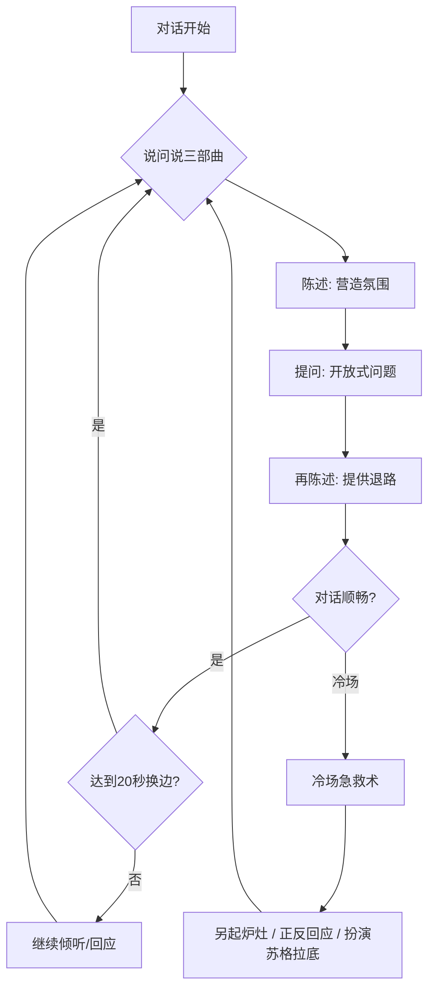
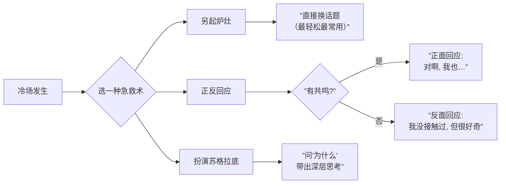

# 第03课：交谈——把握往来的节奏

## Learning Objectives

- 掌握说问说三部曲，让聊天像乒乓球一样有来有回
- 学会三种冷场急救术，从容应对尬聊和沉默
- 理解网球比喻的精髓：不让话语权在单边停留超过20秒

## Core Idea

上两节课我们解决了"敢不敢聊"和"聊什么"的问题，这一课解决的是"怎么聊"的核心问题——**交谈的节奏**。

一段好的对话就像一场**网球赛**，球在双方之间来回传递，不能总停留在一个人手里。一场舒服的闲谈，话语权在单边停留不应该超过 **20秒**，无论如何不要超过 **40秒**。



> [!TIP] Key Insight
> 好的对话不在于你说得多精彩，而在于你让对方说得舒服。说问说三部曲的底层逻辑是：**陈述让对方放松，提问让对方参与，再陈述让对方有路可退。**

## Core Content

### 一、说问说三部曲

说问说是推进一段交谈最基础、最核心的节奏工具。它的结构是：

```
陈述（Self-statement） → 问开放式问题（Ask） → 再陈述（Self-statement）
```

#### 第一步：陈述

为什么先要有这句陈述？因为你直接抛出一个问题，很像在**盘问**对方。加上一句陈述，对方就知道你不是在审问他，而是在开启一段对话。

**示例1：称赞穿搭**
- ❌ 直接问："你这裙子在哪里买的？"
- ✅ 先陈述再问："这条裙子颜色很衬你，可以问一下在哪里买的吗？"

**示例2：会议开场**
- ❌ "您做什么工作？"
- ✅ "刚才听您发言很有启发，尤其是关于用户增长的部分。可以请教一下，您在这个领域做了多久了？"

#### 第二步：问开放式问题

开放式问题是指那些**不能用一个词回答**的问题。这是第01课就学过的基本功，在这里再次强调。

| 类型 | 封闭式问题 | 开放式问题 |
|---|---|---|
| 工作 | "你在腾讯工作吗？" | "你在腾讯主要负责什么业务？" |
| 爱好 | "你喜欢看电影吗？" | "你最近看了什么好电影？" |
| 旅行 | "你去过日本吗？" | "日本旅行最让你难忘的是什么？" |

#### 第三步：再陈述

这是说问说中最容易被忽略的一步，极其重要。对方回答后，你给出一个自己的陈述——这个陈述的作用是**给对方一个离开的出口**。

- 如果对方很健谈，你的陈述会被忽略，对方继续说下去——这很好。
- 如果对方回答很简短，你的陈述可以接住话题，让对话继续——这也很好。

**示例：冰雕展上的对话**

> A（陈述）："这冰雕真是太美了，哈尔滨的师傅手艺确实了不起。"
> A（问）："您是第一次来看冰雕展吗？"
> B（答）："不是，我每年都来。"
> A（再陈述）："那你太有经验了！我去年春节也在哈尔滨旅游，当时零下三十度，差点把我冻哭了。"

注意最后那句再陈述——它给了B一个接话的抓手：可以聊春节旅游、聊怕冷、聊去过的北方城市。

**示例：Apple Store排队时**

> A（陈述）："这个新款等了这么久，终于要拿到了。"
> A（问）："你是从哪一代开始用iPhone的？"
> B（答）："从4S开始的。"
> A（再陈述）："那你是老果粉了，我第一台智能手机是安卓，后来才转过来的。"

"你是老果粉了"是赞美，"我第一台智能机是安卓"是再陈述——对方可以接"那你觉得安卓和iOS差别大吗？"之类的话题。

> [!EXAMPLE] 实战示范
> 在咖啡馆看到对方在读一本东野圭吾的书：
> 1. **陈述**："东野圭吾的书确实很抓人，特别是那种社会派推理。"
> 2. **问**："你最喜欢他哪部作品？"
> 3. **再陈述**："我最喜欢《白夜行》，看完后好几天都在想那个结尾。"
>
> 如果对方回答"我最喜欢《嫌疑人X的献身》"——你可以继续聊数学天才的爱情悲剧。
> 如果对方说"随便看看"——你的再陈述"我看完《白夜行》好几天都在回味"提供了新的话题入口。

### 二、冷场急救术

即使做了充分准备，冷场还是会发生的。关键在于不要把冷场归咎于自己——冷场是**双方**的事，你能做的就是从容地使用急救术。



#### 急救术1：另起炉灶（最常用）

最直接的方法——换一个话题。不需要过渡，不需要解释，直接抛出新话题。

**示例：**
> "聊完这个，我忽然想到今天早上看到的新闻……"
> "对了，刚刚那个嘉宾提到区块链，你是怎么理解的？"

人天生就喜欢谈论新的信息——"另起炉灶"利用了人类对新信息的天然偏好。

#### 急救术2：正反回应

根据你对对方话题是否有共鸣，选择正面或反面回应。

**正面回应**（你有共鸣时）：
> "对啊，我上周刚重温了《罗马假日》，赫本真的太美了——你最喜欢哪一段？"

**反面回应**（你没有共鸣，但表现出兴趣）：
> "我还没去过罗马，不过听你这么说，好想去看看——你觉得罗马最值得去的是哪个地方？"

关键不是你有多少共鸣，而是你**表现出对他话题的兴趣**。反面回应的本质是：我虽然没有这方面的经验，但**我对你的经验很感兴趣**。

#### 急救术3：扮演苏格拉底

用"为什么"来深入对方的话题。这不仅是急救术，还是一个让对话从浅层走向深层的技巧。

**对话示例：**
> A："我喜欢皮克斯的电影。"
> B："为什么你特别喜欢皮克斯？"
> A："因为他们的故事总是很打动人，不只是给孩子看的。"
> B："能举个例子吗？哪一部让你印象最深？"
> A："《寻梦环游记》，看完后我对家族有了新的理解……"

"为什么"是一个带魔力的词——它会强迫对方思考、组织语言、分享更多关于他自己的信息。但注意不要连续追问，否则会变成审讯。

> [!WARNING]
> 扮演苏格拉底时要注意语气，不要像审讯一样连续追问"为什么"。用"我很好奇，为什么……"或"能多说说你的想法吗？"会更温和。

### 三、网球比喻：掌控话语节奏

戴愫老师提出一个经典的比喻——**闲谈就像打网球**：

| 好球（好对话） | 坏球（坏对话） |
|---|---|
| 球在双方之间来回 | 球总在一个人手上 |
| 每边控球不超过20秒 | 一个人滔滔不绝超过40秒 |
| 双方都参与 | 一方被动听讲 |
| 有来有回，轻松愉快 | 压力大，想逃离 |

**怎么练习？**
- 自我监控：说话时注意时间感，感觉说了三四句后就停下来，把"球"打回去
- 观察对方：如果对方眼神开始飘忽，说明你的"球"握太久了
- 刻意练习：每次对话有意识地在20秒内把话语权交出去

> [!QUESTION] 自测题
> 在下列对话中，哪一段运用了正确的"说问说"结构？为什么？
>
> **对话A：**
> 甲："你做什么工作的？"
> 乙："我是产品经理。"
> 甲："在哪家公司？"
> 乙："在字节跳动。"
> 甲："做哪个产品？"
> 乙："抖音。"
>
> **对话B：**
> 甲："今天这天气真是热得不行。"
> 乙："是啊，我看天气预报说有38度。"
> 甲：（沉默）
> 乙：（沉默）
>
> **对话C：**
> 甲："你这款包很有设计感，是设计师品牌吗？"
> 乙："对，是一个国内新锐设计师的作品。"
> 甲："国内设计师现在越来越厉害了。我前段时间逛了一个设计展，好多本土品牌都让人眼前一亮。"

<details>
<summary>查看答案</summary>

**对话A**的问题是典型的"盘问模式"——甲一直在问封闭式问题，乙被动回答，没有陈述缓冲，不像聊天像面试。

**对话B**的问题是两个人都没有使用"说问说"——甲陈述后没有问问题，乙回应后也没有延伸，对话自然中断。

**对话C**是正确答案——甲使用了完整的说问说结构：
1. 陈述（称赞包的设计感）
2. 问开放式问题（是不是设计师品牌）
3. 再陈述（延展到设计展的经历，给了乙接话的入口）
</details>

## Worked Example

### 场景：公司年会，与隔壁部门的同事聊天

> 你：（环顾四周，看到对方胸牌）"今天年会的布置挺用心的，你是哪个部门的？"
> 对方："我是市场部的。"
> 你："怪不得，市场部肯定参与了年会策划吧？"
> 对方："对，我们团队忙了两个月。"
> 你："辛苦了！不过效果很好，尤其是开场视频，很有创意。"
> 对方："谢谢！那个视频是我们小王熬夜剪的。"
>
> *对话到这里有点接不下去了——冷场预警。*
>
> 你：（冷场急救——另起炉灶）"对了，你平时工作之余有什么爱好吗？"
> 对方："我喜欢户外徒步。"
> 你：（正面回应）"太棒了，我也喜欢徒步！你走过哪些路线？"
> 对方："最近刚走了雨崩，风景太震撼了。"
> 你：（再陈述）"雨崩一直是我想去的地方。我去年走了冈仁波齐，那种在路上的感觉确实不一样。"
>
> 对方眼睛亮了："你转过山？太厉害了！我计划明年去……"

这段对话中你先后使用了：
1. **说问说**多次
2. **正面回应**急救
3. **再陈述**提供退路
4. **开放式问题**持续挖掘对方兴趣

## Practice

> [!QUESTION] 场景练习
> 你在飞机上邻座是一位看起来像创业者的男士，他刚关掉电脑上显示了一份商业计划书。你会如何用"说问说"开启并推进对话？请写出至少三轮对话。

<details>
<summary>参考思路</summary>

**第一轮：**
你（陈述）："刚才看你一直在看计划书，是在准备融资吗？"
你（问）："你是做什么方向的创业？"
对方："我做AI医疗影像的。"
你（再陈述）："这个方向很有前景，我有个朋友也在做类似的事情，说这两年资本很关注。"

**第二轮：**
你（问）："你是怎么想到进入这个领域的？"
对方："我父亲之前生病，检查过程让我感受到医疗影像还有很多痛点……"
你（再陈述）："原来如此，有亲身体会才能做出真正解决问题的产品。"
（扮演苏格拉底继续深入）

**第三轮：**
你（问）："现在AI医疗影像最大的挑战是什么？"
对方："主要是数据标注的问题……"
你（再陈述）："确实，高质量标注数据太关键了。我之前看过一篇文章，说几家头部公司都在建自己的标注团队。"
</details>

> [!QUESTION] 自我检测
> 你在一个行业沙龙上，旁边是一位资深HR。你用"说问说"开启对话后，对方回答很简短（每次只说一两句）。你应该怎么做？
>
> A. 认为对方不想聊，赶紧离开
> B. 用更多开放式问题迫使对方多说
> C. 每次提问后给出更丰富的再陈述，提供更多接话入口
> D. 换成封闭式问题

<details>
<summary>查看答案</summary>

**正确答案是C。** 当对方回答简短时，你的"再陈述"部分就需要更丰富一些，为对方提供更多可接的话题点。如果用了丰富的再陈述后对方仍然简短，可能是他真的不想聊天，此时应该礼貌地结束对话。

B选项的问题在于——连续追问会让对方压力更大，更像审问。
</details>

## Summary

这一课的核心知识点：

| 技巧 | 要点 | 关键提醒 |
|---|---|---|
| 说问说三部曲 | 陈述→问→再陈述 | 再陈述是为对方提供退路 |
| 冷场急救1：另起炉灶 | 直接换话题 | 最轻松，不需要过渡 |
| 冷场急救2：正反回应 | 有共鸣正面，无共鸣反面 | 重点是表现出兴趣 |
| 冷场急救3：扮演苏格拉底 | 问"为什么" | 不要连续追问变审讯 |
| 网球比喻 | 话语权不超过20秒 | 有来有回才叫对话 |

## Review Checklist

- [ ] 我理解说问说三部曲的结构和每个步骤的作用
- [ ] 我知道再陈述的核心价值是为对方提供退路
- [ ] 我能说出三种冷场急救术并知道各自的适用场景
- [ ] 我理解"网球比喻"并知道20秒/40秒的时间概念
- [ ] 我能在实际对话中有意识地控制话语权时间

## Application Assignment

在接下来的一周内，完成以下练习：

1. **基础练习**：每天至少一次，在对话中有意识地使用"说问说"三部曲
2. **急救练习**：遇到冷场时，有意识地选择一种急救术并使用
3. **计时练习**：在对话中感受"20秒"有多长，练习在20秒内把话语权交出去
4. **记录反思**：每天记录一次对话中的使用情况，哪些地方做得好，哪些需要改进

> [!TIP] 进阶提醒
> 说问说是基础框架，冷场急救术是备用方案。初学者应该先熟练掌握说问说，因为大部分冷场都是因为没有使用说问说导致的——而不是真的无话可聊。

## Next Step

这一课我们学会了如何控制对话的节奏和应对冷场。下一课我们将学习如何把对话推向高潮——如何定位你的优势话题，如何逐层深入，如何与重要人物交谈，以及如何优雅地结束一段对话。

继续学习：[[0004-jia-tan-gao-chao-yu-jie-shu|第04课：怎样驾驭闲谈的高潮和结束]]

参考：[[../reference/quick-reference|速查手册]] | [[../reference/glossary|术语表]]