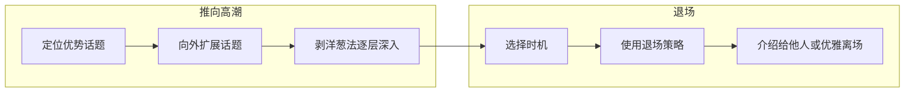
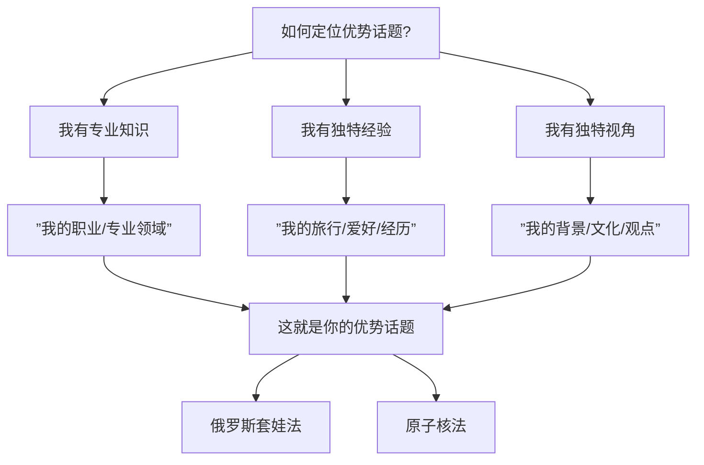
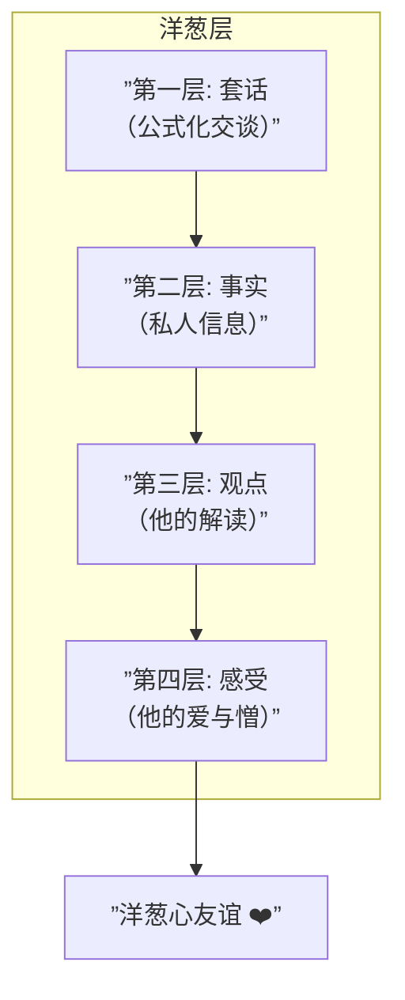
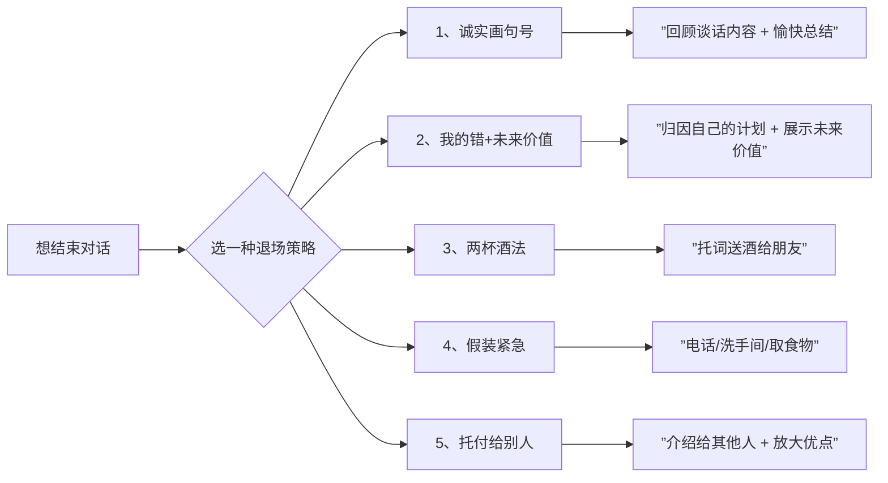

# 第04课：怎样驾驭闲谈的高潮和结束

## Learning Objectives

- 找到并定位自己的优势话题，让对话从平淡走向高潮
- 掌握俄罗斯套娃法和原子核法两种话题扩展技巧
- 学会剥洋葱法逐层深入，培育深层友谊
- 掌握与大人物交谈的时机、准备和话术
- 熟悉五种优雅退场策略，体面地结束对话

## Core Idea

前几节课我们学会了"敢聊"、"聊什么"和"怎么聊"。这一课解决的是如何把对话**推向高潮**以及**如何体面结束**的问题。

一段完整的对话就像一部电影——有开场、有推进、有高潮、有结尾。很多人不知道如何让对话升温，也不知道如何适时退场。这一课的内容恰恰是对这两个痛点的解答。



> [!TIP] Key Insight
> 闲谈的最高境界不是"聊得多"，而是"聊得深"和"走得美"。优势话题让你聊得深，退场策略让你走得美。

## Core Content

### 一、定位优势话题

所谓**优势话题**，就是你有专业知识或独特经验、能让你说得出彩的话题。与之相对的是"劣势话题"——虽然你知道很多，但对方可能不感兴趣或你无法展现出彩的话题。



**不同人群的常见优势话题：**

| 人群 | 常见优势话题 | 原因 |
|---|---|---|
| 成功男士 | 事业、行业趋势 | 最有价值感的话题 |
| 年轻女性 | 时尚、美食、旅行 | 日常生活中最投入的话题 |
| 年长男性 | 过去的辉煌、时代变迁 | 最愿意分享的人生积累 |
| 年长女性 | 子女、家庭生活 | 最有共鸣的话题 |
| 初入职场者 | 学习经历、兴趣爱好 | 最有自信的领域 |

### 二、两种话题扩展方法

找到优势话题后，如何围绕它展开丰富的对话？这里有**俄罗斯套娃法**和**原子核法**两种思路。

#### 俄罗斯套娃法

俄罗斯套娃是一层套一层的木偶。优势话题就是最小的那一层，然后一层层向外展开相关话题。

**示例：以"四川火锅"为优势话题**

```
最小层：四川火锅（你的专业优势）
    ↓
第二层：川菜（与四川火锅相关的中圈话题）
    ↓
第三层：中式美食（更广义的饮食文化）
    ↓
最外层：烹饪艺术（抽象的饮食哲学）
```

- 如果对方对火锅感兴趣 → 聊火锅（你的优势）
- 如果对方对火锅一般 → 聊川菜（扩展一层）
- 如果对方对川菜也无感 → 聊中式美食（再扩展）
- 如果对方喜欢烹饪 → 聊烹饪艺术（最外层）

俄罗斯套娃法的核心逻辑是：**从最专业的核心话题出发，逐层向外扩展，直到找到对方也能参与的话题。**

#### 原子核法

原子核法不同于俄罗斯套娃法的"逐层扩展"，它更像是**围绕一个核心，辐射出多个平行话题**。

**示例：以"四川火锅"为原子核**

```
                   推荐餐馆
                      ↑
      奇怪食材 →  四川火锅  ← 瑞士奶酪火锅
                      ↑
                   川蜀风情
```

这些话题没有层级关系，而是围绕核心平等展开。你可以根据对方的表情和反应，随时切换到另一个方向。

**两种方法的对比：**

| 维度 | 俄罗斯套娃法 | 原子核法 |
|---|---|---|
| 结构 | 层层递进 | 中心辐射 |
| 方向 | 由内到外 | 围绕核心 |
| 适用场景 | 深度对话 | 广度探索 |
| 对方参与度 | 逐步扩大 | 自由切换 |

#### 过渡语

无论使用哪种方法，你需要一些自然的过渡语来切换话题：

- "……让我想起了……"
- "说起……不得不提……"
- "对啊对啊，我恰巧最近……"
- "说到……你看可以换个角度理解吗？"

> [!EXAMPLE] 实战示范
> A："我上周去了家新开的火锅店，底料很正宗。"
> B：（俄罗斯套娃——向外扩展一层）"说到火锅，你觉得川菜里最讲究的是什么？"
> A："我觉得是花椒和辣椒的搭配艺术。"
> B：（原子核法——切换到平行话题）"你这么懂行，我听说重庆当地人吃火锅还涮很多奇怪食材，你试过吗？"
> A："试过！我第一次吃黄喉的时候还以为是肉……"

### 三、剥洋葱法：逐层深入

闲聊和高潮的分水岭在于——你是否愿意**向对方展示真实的自己**。戴愫老师提出"剥洋葱法"，从外到内分为四层：

```
套话（Cliché） → 事实（Fact） → 观点（Opinion） → 感受（Feeling）
```



**逐层深入的示范：**

**场景：去HR办公室办事，看到桌上有一张全家福**

第一层——**套话**：
> "你家宝宝好有灵气！"

这是社交场合的公式化赞美，每个人都这么说。停留在这一层，对话就是浅层的。

第二层——**事实**：
> "你们孩子上兴趣班吗？"

你开始获取对方的私人信息——这是建立信任的第一步。但还停留在事实层面。

第三层——**观点**：
> "你是怎么看待孩子上兴趣班这件事的？"

你不再问"上什么"（事实），而是问"怎么看"（观点）。这说明你在意他的想法，而不只是表面的信息。

第四层——**感受**：
> "我自从有了孩子之后，多多少少也会有些焦虑，生怕让他输在起跑线上。你有这样的感觉吗？"

这是最深的一层——你分享了自己的内心感受，也邀请对方分享他的感受。当两个人都愿意袒露感受时，**洋葱心友谊**就诞生了。

> [!WARNING]
> 剥洋葱的关键是**循序渐进**，不要一上来就问感受——那会显得太冒犯。从套话开始，层层递进，每一层都在确认对方是否愿意继续深入。

### 四、与大人物交谈

与大人物（领导、前辈、行业大咖）交谈是很多人最紧张的场景。戴愫老师给出了系统的建议。

#### 1. 时机：在他发言之前

大人物在发言之后会被很多人包围，那时你很难接近。最佳时机是在**他发言之前**——那时他相对轻松，也有时间和你交谈。

#### 2. 准备：三个步骤

| 步骤 | 内容 | 目的 |
|---|---|---|
| 找中间人 | 通过熟人引荐，降低唐突感 | 获得接近的合法性 |
| 背景调查 | 了解他的职业经历、近期动态 | 避免说外行话 |
| 了解行业 | 知道行业的基本术语和热点 | 展现专业和诚意 |

#### 3. 交谈中：90%围绕他

话术上，戴愫老师提出"**静默式话语**"的理念——不是你真的沉默，而是你以欣赏者的姿态说话：

> "今天能见到您这样的前辈，感觉荣幸之至。"
> "您在××领域的经验，对我们年轻人真的很有启发。"

原则是：**90%的时间在聊他，10%的时间适当展示自己。**

#### 4. 四大要点

| 要点 | 做法 | 避免 |
|---|---|---|
| 感知他的难处 | 理解他面临的挑战，而不是只看到他的光环 | 过度恭维，显得虚伪 |
| 提供价值 | 分享对他有用的信息或视角 | 只索取，不付出 |
| 展现风度 | 语速适中，语调沉稳，不卑不亢 | 紧张结巴或过分自来熟 |
| 不打断 | 耐心听完表达，再回应 | 急着插话显示自己 |

> [!WARNING]
> 与大人物交谈，你的**冷静和风度**比你的**言辞和内容**更重要。一个语速适中、目光坚定、不卑不亢的年轻人，比一个说了很多精彩的话但紧张慌乱的人，给人的印象要好得多。

### 五、五种优雅退场策略

一段好的对话需要一个好的结尾。强行尬聊不如体面结束。戴愫老师给出了五种退场策略：



#### 策略1：诚实画句号

回顾刚才的谈话内容，做一个愉快的总结。这是最高级的退场方式——因为它让对方感到被尊重。

> "王总，很高兴认识您。尤其感谢您给我介绍内地和香港保险的差别，让我开阔了眼界。希望以后还有机会向您请教。"

#### 策略2："我要撤了，是我的错" + 展示未来价值

把退场归因于自己的计划，同时展示未来价值，让对方愿意再次见面。

> "李总，我来之前给自己下了个任务——今天要认识三位前辈，您是第一位，收获太大了。下次有机会再向您请教。"

#### 策略3：两杯酒法

手里端着两杯酒，托词要给朋友送酒——这让你退场的动作显得很自然。

> "不好意思，我需要把这杯酒给我的朋友送过去。刚才听您分享的关于新能源车的观点特别有意思，期待下次接着聊。"

#### 策略4：假装紧急

看手机、找洗手间、取食物——这些都是自然的退场理由。

> "不好意思，我去一下洗手间，先失陪了。"
> "我去取点吃的，回头再聊。"

> [!WARNING]
> 假装紧急虽然好用，但不要频繁使用。如果被人看穿你在"假装"，反而会显得不真诚。建议优先级：策略1 > 策略2 > 策略3 > 策略4。

#### 策略5：托付给别人

把对方介绍给你认识的另一个人——这是最"双赢"的退场方式，因为你不仅自己脱身，各方都满意。

关键在于**如何介绍**——戴愫老师强调，要**放大对方的优点**：

> ❌ "这是小王，也是做互联网的。"
> ✅ "这是小王，人工智能界90后新秀，他在自然语言处理方面的研究最近拿了国际大奖。"

好的介绍让你在退场的同时，为双方创造了价值。

> [!TIP] Key Insight
> 最好的退场不是"逃走"，而是"成就他人"。尤其是策略5——托付给别人，你同时成就了三个人：你自己（体面退场）、对方（认识了新朋友）、被介绍的人（获得了一个高质量的连接）。

## Worked Example

### 场景：行业交流酒会

> 你来到一位行业前辈面前。
>
> **定位优势话题：**
> 你的优势话题是"用户增长"，这是你的专业领域。
>
> **俄罗斯套娃扩展：**
> - 最小层：用户增长策略（你的专业）
> - 第二层：互联网营销趋势
> - 第三层：数字化商业变革
>
> **对话：**
>
> 你（陈述+开放问题）："张总，刚才听您分享的关于流量见底的观点很有启发。您觉得接下来用户增长的主要机会在哪里？"
>
> 张总："我觉得内容社交是一个方向……"（聊了3分钟）
>
> 你（剥洋葱——从事实层到观点层）："您说的这个很有道理。我好奇的是，您怎么看现在企业都在做短视频，但真正做好的却很少这个问题？"
>
> 张总继续分享观点……（聊天进入高潮）
>
> *——10分钟后，你觉得该结束了——*
>
> 你（诚实画句号退场）："张总，今天能听到您这些分享真的很值，尤其是关于内容社交的判断，让我重新思考了我们公司的策略。希望以后还有机会向您请教。"
>
> 你（托付给别人）："对了，那边那位是刚才在会上分享AI产品的李博士，我觉得你们对技术趋势的看法可能很合拍，要不要我给你们介绍一下？"

在这段对话中，你综合运用了：
1. **优势话题定位**
2. **俄罗斯套娃法**扩展话题
3. **剥洋葱法**从事实走到观点
4. **诚实画句号+托付给别人**双重退场

## Practice

> [!QUESTION] 自测题1
> 你的优势话题是"烘焙"，请用俄罗斯套娃法扩展到三层。

<details>
<summary>查看答案</summary>

参考扩展：
- **最小层**：烘焙技巧（你的专业强项——面种发酵、温度控制等）
- **第二层**：西式甜点文化（提拉米苏的意大利传统、马卡龙的法国故事）
- **第三层**：饮食中的匠心精神（从烘焙引申到任何需要耐心和热爱的事物）

你的扩展不需要和参考完全一致，只要是逐层向外延伸的逻辑即可。
</details>

> [!QUESTION] 自测题2
> 你在朋友聚会上认识了一位投资人的妻子。你问她"孩子多大了"之后，她回答"3岁了，在上幼儿园"。请使用剥洋葱法，写出从第二层到第四层你应该问什么。

<details>
<summary>查看答案</summary>

**第二层——事实：**
> "孩子上的幼儿园怎么样？适应吗？"

**第三层——观点：**
> "现在幼儿园选择太多了，你是怎么判断一个幼儿园好不好的？"

**第四层——感受：**
> "我虽然没有孩子，但听身边朋友说，送孩子去幼儿园那天，妈妈反而比孩子更焦虑——你有这种感觉吗？"

注意第四层你分享了一个"听说的感受"来引导对方分享自己的真实感受——这在对方不熟悉你时是个很温和的进入方式。
</details>

> [!QUESTION] 自测题3
> 你在一个行业峰会上和一位前辈聊了15分钟。你觉得时机合适退场了，但对方还在兴头上。你应该怎么做？
>
> A. 继续陪聊，直到对方主动结束
> B. 直接说"不好意思我还有事"
> C. 使用策略3或策略5，体面退场
> D. 假装接电话离开

<details>
<summary>查看答案</summary>

**正确答案是C。** 既不能强行打断（B和D会显得不礼貌），也不能无限制聊下去（A消耗双方时间）。用策略5（托付给别人）是最好的选择——你可以介绍另一位朋友过来，说"这位也是做××领域的，你们一定聊得来"，既体面退场，又成就了双方。

策略3的两杯酒法也适用，但需要手里确实有道具。
</details>

## Summary

| 技巧 | 核心要点 | 关键提醒 |
|---|---|---|
| 俄罗斯套娃法 | 优势话题→逐层向外扩展 | 找到对方能参与的那一层 |
| 原子核法 | 优势话题→平行辐射多个方向 | 灵活切换，避免卡在一个方向上 |
| 剥洋葱法 | 套话→事实→观点→感受 | 循序渐进，不可跳级 |
| 与大人物交谈 | 时机（发言前）+准备（背景调查）+风度 | 冷静比精彩更重要 |
| 五种退场策略 | 诚实最佳，托付最双赢 | 归因于自己，给对方台阶 |

## Review Checklist

- [ ] 我能清楚说出自己的1-2个优势话题
- [ ] 我理解俄罗斯套娃法和原子核法的区别并能举例
- [ ] 我理解剥洋葱法的四层结构并能实际应用
- [ ] 我知道与大人物交谈的最佳时机和三个准备步骤
- [ ] 我能说出至少三种退场策略并知道什么时候用哪一种
- [ ] 我理解"介绍别人时要放大优点"的原则

## Application Assignment

1. **定位你的优势话题**：写下三个你最有自信聊的领域，每个领域用俄罗斯套娃法扩展三层
2. **剥洋葱练习**：在下一次社交中，刻意练习从套话走到事实，再从事实走到观点
3. **退场练习**：在接下来的三次社交活动中，每次使用不同的退场策略，记录对方反应
4. **高手观察**：观察你在社交场合中遇到的"社交高手"，分析他们是怎么退场的

> [!TIP] 综合提醒
> 第01-04课是这门课最核心的"基本功"部分。如果你能把这几课的内容熟练运用，你的社交能力已经超过80%的人了。后面的课程会补充素材积累和多人社交的技巧。

## Next Step

这一课我们学习如何把对话推向高潮和优雅结束，覆盖了从优势话题定位到退场策略的完整对话周期。下一课我们将学习如何在日常生活中积累谈资素材——有了技巧，还需要有内容。

继续学习：[[0005-ri-chang-su-cai-ji-lei|第05课：日常可做的素材积累]]

参考：[[../reference/quick-reference|速查手册]] | [[../reference/glossary|术语表]]