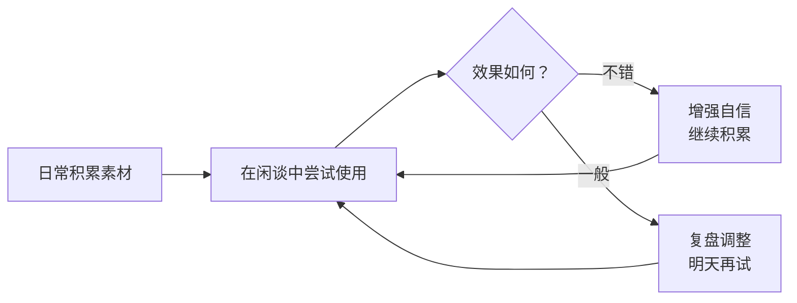

# 第05课：日常可做的素材积累

> 闲谈的功夫不仅在嘴上，更在日常积累里。日常有意识准备的素材，在关键时刻能让你言之有物、游刃有余。

## Learning Objectives

- 掌握三类出镜率高的故事类型及其讲述技巧
- 学会用跨时空对比素材增加聊天深度
- 理解"没有完美的交谈"这一心态，放下完美主义包袱

## 为什么需要素材积累

闲谈中的流畅感，很大程度上依赖于你大脑里"库存"的多寡。就像即兴喜剧演员需要丰富的素材库一样，一个优秀的闲谈者也会在日常生活中随时收集可用的谈话素材。

你有没有这样的经历——明明想和对方多聊几句，话到嘴边却发现没什么可说的？这不是你表达能力的问题，而是你的素材库需要补充了。

> [!TIP] 核心观念
> 好的闲谈者不是天才，而是有准备的人。日常花 10 分钟做素材积累，就能让下一次聊天质量翻倍。

## 三类出镜率高的故事

以下是闲谈中最高频出现的三类故事，每一种都有其独特的讲述技巧。

### 1. 共同点故事

**核心思路**：找到双方共同的连接点——共同认识的人、共同的家乡、共同的母校，然后围绕这个连接点展开故事。

**关键技巧**：加入对话（直接引语），让故事更生动。

举例说明：
- 同乡故事："你是杭州人？那你知道西湖边那条龙井路吗？我小时候天天从那儿经过……"
- 校友故事："你也是 XX 大学毕业的？我们那时候食堂有个阿姨，打菜手从来不抖——不对，是抖得特别厉害，一勺肉能抖掉半勺……"
- 共同认识的人："你也认识老王？他上次跟我说起你，他摸着肚皮说，'吃得太多，坐着难受'——那表情我现在都记得。"

> [!TIP] 为什么对话让故事更生动
> 直接引语把听众"拉进"场景中，让对方感觉自己就在现场。一句"他摸着肚皮说"，比"他说他吃撑了"有趣十倍。

### 2. 自己的故事

**核心思路**：分享内心感受或糗事，让对方感受到你的真实和温度。

**职场故事模板**：
```
我是从事 XX 的，
我做这个是因为 XX，
这个工作有意思的是 XX，
我感觉……
```

**爱好故事模板**：
```
我爱好 XX，
我喜欢这个是因为 XX，
这个爱好最吸引我的是……
```

**为什么自嘲比炫耀更讨喜**：
- 自嘲故事展示你的真实和脆弱，让对方更容易接近你
- 成功故事容易让人产生距离感，甚至引发比较心理
- 糗事是"社交平等器"——每个人都有过尴尬时刻

> [!WARNING] 注意事项
> 自嘲要掌握分寸——自嘲的是**行为**而非**人格**。说"我那天迷路了半小时"可以，说"我就是一个路痴白痴"就不合适。

**自嘲故事示例**：
"我刚来这个城市的时候，有一次坐地铁坐反了方向，一直到终点站才发现。那天本来约了朋友吃饭，迟到了四十分钟。到了餐厅我第一句话是'我坐地铁环游了这座城市'，把朋友逗得不行。"

### 3. 关于吃的故事

**为什么食物话题永远有效**：
- 人人都吃饭，人人都对食物有感受
- 食物话题轻松、无压力
- 容易引发共鸣和分享

**讲述技巧**：多用细节——外观细节、品尝细节、意想不到的细节。

**中餐故事示例**：

| 菜品 | 细节切入点 |
|---|---|
| 龙井虾仁 | 茶香与虾的鲜甜如何融合，虾仁晶莹透亮的质感 |
| 东坡肉 | 肥而不腻的口感秘诀，苏东坡与这道菜的历史典故 |
| 麻婆豆腐 | 麻辣在舌尖层层递进的感觉，豆腐嫩滑的技巧 |

> [!EXAMPLE] 食物故事示范
> "我第一次吃龙井虾仁的时候，被惊艳到了。虾仁是那种半透明的白，入口是清甜的味道，但紧接着一股龙井茶的清香就在嘴里散开了——不是浓烈的茶味，而是若有若无的，好像在跟你玩捉迷藏。这道菜的故事也很有意思，相传是杭州师傅在做虾仁时不小心把茶叶掉进去了，结果反而成就了一道传奇菜。"

## 跨时空对比素材

跨时空对比是展示你思想深度的利器，也是让话题从"八卦"上升到"见识"的桥梁。

### 三种对比视角

**1. 中外人物对比**

同一时代、不同文明的智者对比，是永不过时的话题：

| 人物 | 核心主张 | 对人际关系的看法 |
|---|---|---|
| 孔子（中国，约前551-前479） | 仁者爱人，克己复礼 | 人际关系建立在"礼"和"仁"的基础上 |
| 释迦牟尼（古印度，约前565-前485） | 众生平等，放下执念 | 超越世俗关系，追求内心的解脱 |
| 苏格拉底（古希腊，约前470-前399） | 认识你自己，理性追问 | 通过对话和追问探索真理 |

这三人生活在几乎同一时代，却在完全不同的文明背景下，给出了各具智慧的回答。这样的对比本身就是绝佳的聊天素材。

> [!QUESTION] 思考
> 如果你和一位新认识的朋友聊到"现在的年轻人为什么越来越不愿意社交"，你可以怎样用上述三位智者的视角来展开讨论？

**2. 古今对比**

| 对比维度 | 过去 | 现在 | 话题切入点 |
|---|---|---|---|
| 教育理念 | 学而优则仕，科举制度 | 素质教育、国际视野 | 当代家长的教育焦虑 |
| 城市发展 | 城墙内的生活 | 都市圈、通勤经济 | 从北京城墙到五环外 |
| 恋爱婚姻 | 父母之命媒妁之言 | 自由恋爱、相亲App | 婚恋观的变迁 |

**3. 圣经故事 vs 东方典故**

东西方文化的对比，往往能碰撞出有趣的火花。例如西方文化中的"以眼还眼，以牙还牙"与中国文化中"以德报怨"的对比，就极富讨论价值。

> [!TIP] 素材积累习惯
> 每天花 5 分钟刷新闻时，顺手存一个可以作为话题的素材——一个有趣的数据、一个冷知识、一句有意思的话。用手机备忘录随手记录下来。

## 没有完美的交谈

最后，也是最重要的一点：**放下追求完美交谈的包袱**。

- 每一次闲谈都是一次练习，不是考试
- 冷场是正常的，不需要为冷场自责
- 对方紧张时，你的轻松就是最好的礼物

> [!WARNING] 常见误区
> 不要因为一次聊得不好就否定自己。闲谈是一门技能，需要刻意练习。今天的你比昨天的你进步一点点，就够了。



## Worked Example

**场景**：公司年会上，你遇到一位从杭州分公司调来的同事，你想和他打开话题。

**使用共同点故事**：
"你是杭州过来的？我去年去杭州出差，民宿老板推荐我去了一家藏在龙井村里的面馆。那家的片儿川，汤底是用老母鸡炖的，上面漂着一层薄薄的油花，喝一口整个人都暖了。那老板还跟我说，他们家的配方是他外婆传下来的——外婆九十多岁了还在厨房里指导。"

**切换到食物话题**：
"说到杭州的美食，我最馋的就是龙井虾仁了。你从小在杭州长大，有没有你特别推荐的馆子？"

**加入自嘲**：
"我自己在家试着做了一次龙井虾仁，结果茶叶放多了，吃起来像在吃茶叶拌虾仁——我朋友说这是'龙井淹没虾仁'。"

## Practice

> [!QUESTION] 自检
> 1. 三类出镜率高的故事分别是什么？每一类的讲述要点是什么？
> 2. 为什么自嘲故事比成功故事更讨喜？
> 3. 跨时空对比素材有哪三种视角？请各举一例。
> 4. 关于食物故事的讲述，最重要的技巧是什么？

<details>
<summary>参考答案</summary>

1. **共同点故事**：找到共同连接点，加入对话（直接引语）让故事更生动。
   **自己的故事**：分享内心感受或糗事，用职业/爱好模板组织。
   **关于吃的故事**：多用细节（外观、品尝、典故）。

2. 自嘲故事展示真实和脆弱，让对方感觉容易接近；成功故事容易引发比较心理，产生距离感。

3. 中外人物对比（如孔子/释迦牟尼/苏格拉底）、古今对比（如教育理念、城市发展）、东西方典故对比（如圣经故事 vs 东方寓言）。

4. 多用细节——外观细节、品尝细节、意想不到的典故或趣事。
</details>

## 课后作业

本周完成以下练习：

1. **准备三个故事**：准备一个共同点故事、一个自己的糗事、一个关于吃的故事。每一个写下来，练习讲给朋友听。
2. **积累一个跨时空对比素材**：找一组你觉得有趣的中外对比，可以是人物、事件或文化现象。
3. **日常素材记录**：每天花 5 分钟，在手机备忘录里记录一个可用作聊天素材的见闻。

## Review Checklist

- [ ] 我能用自己的话复述三类故事的讲述要点
- [ ] 我准备好了至少一个可以随时讲的故事
- [ ] 我收集了至少一个跨时空对比素材
- [ ] 我放下了追求"完美交谈"的包袱
- [ ] 我建立了日常积累素材的习惯

## 相关资源

- [[../reference/quick-reference|速查手册]] — 日常准备章节
- [[../reference/glossary|术语表]] — 相关术语定义
- 第06课：多人聊天时，好用的技巧 → 下一步学习

## Next Step

完成素材积累后，进入下一课学习如何在多人聊天局中灵活发声。

→ [[0006-duo-ren-liao-tian-ji-qiao|第06课：多人聊天时，好用的技巧]]