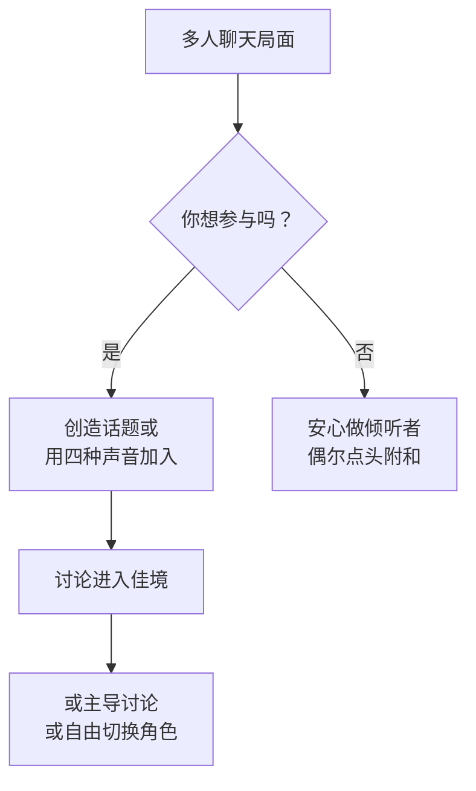
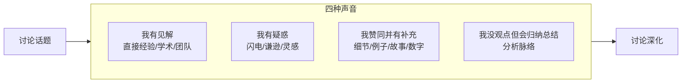

# 第06课：多人聊天时，好用的技巧

> 多人聊天不是单打独斗，而是一场即兴舞蹈——每个人都在互相托举、彼此成就。

## Learning Objectives

- 理解多人聊天中的"责任扩散"现象及其应对方法
- 掌握创造新话题的技巧：关键人物 × 新闻热点
- 学会四种声音灵活参与讨论
- 掌握主导讨论的"挑动正反方"技巧

## 为什么多人聊天更难

你是否有过这样的体验：在一场三五人的聚会中，大家都沉默地刷着手机，或者只有一两个人在说话，其他人只是偶尔点头？

这是因为多人聊天中存在一种心理现象——**责任扩散**。

> [!TIP] 责任扩散（Diffusion of Responsibility）
> 在场人数越多，每个人感受到的"我有责任接话"的压力就越小。两个人聊天时，你不说话就会冷场；十个人聊天时，你会觉得"总会有人说话的"。

### 责任扩散的两面性

| 对你的影响 | 说明 |
|---|---|
| 负面影响 | 你想说话时，可能要跟其他人"抢"话头 |
| 正面利用 | 你不想说话时，可以自然地做倾听者 |

**关键**：前几课学到的所有技巧（一问二答、说问说、冷读者+热捧者等）在多人聊天中同样适用。区别在于，你需要更有意识地争取发言机会。



## 技巧一：创造新话题

当聊天陷入沉默或流于表面时，你需要一个"话题催化剂"。

### 公式：关键人物 × 新闻热点 → 诚心请教

```
选择一个在场的关键人物 + 关联一个新闻热点 → 问他的看法
```

**三类关键人物**：
1. **组局者**——他最了解在场的人，也最想让大家聊起来
2. **最活跃的人**——他表达欲强，会积极回应
3. **最有影响力的人**——他说了算，别人会跟

> [!EXAMPLE] 创造话题示例
> 你注意到聚会上有一位做人工智能的朋友，而当天新闻说某大厂发布了新AI模型。你可以说：
> 
> "张老师，今天看到新闻说XX发布了他们的新AI模型，你在行业内怎么看这事？会不会对我们普通人的工作有影响？"
> 
> 这样既给了张老师表现的舞台，又为全桌人提供了一个共同话题。

## 技巧二：四种声音参与讨论

当大家已经进入讨论状态，你该如何自然加入？这里有四种"声音"供你选择，就像乐器合奏中你可以扮演不同的声部。

### 声音一：我有见解（我有见解）

当你对话题有观点时，用"三个砝码"给你的见解增加分量：

| 砝码类型 | 说明 | 示例 |
|---|---|---|
| 直接经验砝码 | 我亲身经历过 | "我在日本工作过三年，实际情况是……" |
| 学术砝码 | 我研究/学习过 | "我之前读过一篇论文，数据显示……" |
| 团队共识砝码 | 我们团队都这么认为 | "我们团队讨论过这个问题，共识是……" |

> [!TIP] 
> 不需要三大砝码齐全——有一个就足够让你的见解有说服力。

### 声音二：我有疑惑（我有疑惑）

当你没有太多观点时，提问是最好的参与方式。三种版本：

| 版本 | 使用场景 | 示例 |
|---|---|---|
| 闪电版 | 快速接话 | "等等，我没听懂——你的意思是说……？" |
| 谦逊版 | 给对方展示空间 | "这个问题可能问得很浅，但我一直没搞明白，为什么……？" |
| 灵感版 | 引出更多话题 | "你这么说让我想到另一个问题，如果……会怎么样？" |

> [!QUESTION] 思考
> 为什么"我有疑惑"在某些时候比"我有见解"更能推动讨论的深入？

<details>
<summary>答案</summary>

提问把聚光灯留给了别人，你反而成了"让讨论变精彩的人"。一个恰到好处的问题，比一个平庸的见解更有价值。
</details>

### 声音三：我赞同并有补充（我赞同并有补充）

当有人说了你认同的观点，不要只是点头——要做**增量贡献**。

你可以补充的内容类型：
- **细节**：补充对方没提到的具体信息
- **例子**：用另一个例子佐证他的观点
- **故事**：分享一个相关的亲身经历
- **数字**：用数据支撑观点

> [!EXAMPLE]
> 对方说："现在年轻人买房太难了。"
> 你可以补充："没错，我前两天刚看了一组数据，北京的平均房价收入比已经超过 40 了——就是说一个普通人不吃不喝 40 年才能买一套房。"

### 声音四：我没观点，但会归纳总结（我没观点，但会归纳总结）

当你既没见解也没问题时，你仍然可以做出贡献——做**总结者**。

分析式归纳的步骤：
1. 认真听每个人的发言
2. 找出不同发言之间的脉络和联系
3. 用自己的话总结出来

> [!EXAMPLE] 归纳总结示例
> "听了大家的讨论，我梳理了一下：A 认为年轻人买房难主要是房价太高，B 补充说其实首付比例也是个问题，C 从另一个角度说租房也是一种选择。我感觉大家可以分成两大派——'先上车派'和'租房自由派'——对吗？"
> 
> 这种归纳总结会让全场人觉得你"听懂了"，而且帮大家把散乱的讨论理出了头绪。



## 技巧三：主导讨论——制造矛盾

当你有意成为讨论的主导者时，最有力的武器是：**制造矛盾，挑动正反方**。

### 操作步骤

1. 提出一个具有争议性的话题
2. **先问："有没有反对方？"**
3. **再问："有没有赞同方？"**

### 为什么先问反对方

因为大多数人倾向于先说"大家都认同"的观点。如果你先问"有没有赞同的"，大家会觉得"既然都赞同就不说了"。

但**反对方的观点往往更有意思**——它们与众不同，更能激发讨论。人天生对"不一样"的声音更感兴趣。

> [!WARNING] 注意分寸
> 制造矛盾不等于制造冲突。你的目的是激发有质量的讨论，不是让人难堪。
> - 选的话题要有讨论空间（不是非黑即白的）
> - 保持轻松幽默的语气
> - 如果有人感到不适，及时化解

> [!EXAMPLE] 主导讨论示例
> 在一场聚会上，你可以说：
> 
> "我问大家一个有意思的问题——你们觉得每天通勤两小时以上的人，生活质量到底是高还是低？"
> 
> 先问反对方："有没有人觉得通勤时间长也挺好的？"
> 
> 等反对方说完，再问："那有没有人坚决反对这种说法？"
> 
> 这样讨论的张力就起来了，而且你在其中扮演的是"主持人"角色，天然占据了讨论的制高点。

## 核心心法：即兴舞蹈

把多人聊天想象成一场**即兴舞蹈**：

- 有时候你是领舞者（主导话题）
- 有时候你是伴舞者（补充和扩展）
- 有时候你退到旁边休息（安心做听众）
- **最重要的是——每个人都互相托举，让整场对话流畅、愉悦**

> [!TIP] 最后提醒
> 多人聊天不是要你一个人出彩，而是让在场的每个人都觉得"这场聊天真有意思"。当你让身边的人发光时，你自己也自然会被看见。

## Worked Example

**场景**：朋友聚会，5-6 个人坐在客厅，大家聊到"工作压力大"这个话题，但聊了几分钟就开始沉默了。

**第一步——创造话题**：
你看到在场的朋友阿杰上个月刚跳槽到互联网公司。你说：
"阿杰，你刚去了新公司，听说你们行业最近在裁员，你们公司的情况怎么样？"

**第二步——加入讨论（我有见解）**：
阿杰分享完，你说：
"我在上一家公司也经历过裁员。当时我们整个部门人心惶惶，但后来发现真正被裁的其实只有两种人——一种是业绩长期垫底的，另一种是薪资虚高的。所以我觉得，与其焦虑，不如定期看看自己在市场上的真实价值——这是我在上家公司学到的最重要的一课。"（直接经验砝码）

**第三步——主导讨论（制造矛盾）**：
"说到这个，我想问大家一个更有意思的问题——你们觉得，在一个公司待多久跳槽最合适？有没有人觉得应该待满三年以上？反过来，有没有觉得一两年就该走的？"

这样就成功地把大家从沉默中拉了出来，而且你始终掌握着话题的主动权。

## Practice

> [!QUESTION] 自检
> 1. 什么是"责任扩散"？它如何影响多人聊天？
> 2. 创造新话题的公式是什么？请写出完整的表达式。
> 3. 四种声音分别是什么？分别适合什么情况使用？
> 4. 主导讨论时为什么要先问"有没有反对方"？
> 5. "即兴舞蹈"比喻的核心含义是什么？

<details>
<summary>参考答案</summary>

1. 责任扩散：在场人数越多，个人感受到的接话责任越小。两个人聊天必须说话，十个人聊天可以"隐形"。
2. 关键人物（组局者/最活跃者/最有影响力者）× 新闻热点 → 诚心请教他的看法。
3. 我有见解（适合有观点时，用三个砝码增加分量）、我有疑惑（适合无观点时，用提问参与）、我赞同并有补充（适合听到认同观点时做增量贡献）、我没观点但会归纳总结（适合梳理讨论脉络）。
4. 大多数人的第一反应是附和主流观点，反对方的观点往往更有趣、更能激发讨论。
5. 多人聊天不是一个人出彩，而是互相托举，让所有人都觉得这场对话有意思。你在不同角色间自由切换。
</details>

## 课后作业

本周完成以下练习：

1. **练习"四种声音"**：在下一场多人聊天中，每种声音至少使用一次，记录下使用后的效果。
2. **主导一次讨论**：找机会在小范围聚会中，用"制造矛盾"法主导一次讨论，注意观察大家的反应。
3. **观察责任扩散**：在多人场合中，观察责任扩散现象如何发生。当你注意到冷场时，尝试用"关键人物 × 热点"公式打破沉默。

## Review Checklist

- [ ] 我能解释"责任扩散"现象并知道如何应对
- [ ] 我掌握了"关键人物 × 新闻热点"的话题创造公式
- [ ] 我熟悉四种声音的使用场景并能灵活切换
- [ ] 我知道如何用"制造矛盾"主导讨论
- [ ] 我理解了"即兴舞蹈"的心态，懂得在聊天中互相托举

## 相关资源

- [[../reference/quick-reference|速查手册]] — 多人聊天技巧章节
- [[../reference/glossary|术语表]] — 责任扩散等术语定义
- [[0005-ri-chang-su-cai-ji-lei|第05课：日常可做的素材积累]] — 回顾素材积累技巧

## Next Step

恭喜你完成了全部六节核心课的学习！现在你已经掌握了从开场到退场的全套社交技能。接下来可以学习补充课程，进一步提升特定场景的技巧：

- [[s01-yan-shen-ji-qiao|补充课01：交谈时的眼神技巧]]
- [[s02-yi-xing-da-shan|补充课02：如何与异性搭讪]]