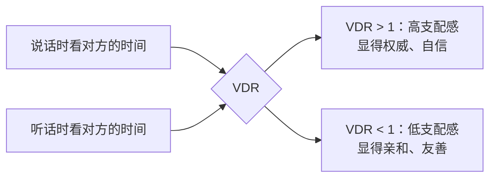

# 补充课01：交谈时的眼神技巧

## Learning Objectives

- 理解交谈中对视的矛盾心理，掌握四眼神原则
- 学会用 VDR（视觉支配比）调整自己的社交状态
- 运用眼神微表情传递情绪，增强沟通感染力

## Core Idea

与陌生人交谈时，眼神的尴尬感是完全正常的。动物行为学家德斯蒙德·莫里斯（Desmond Morris）指出：人类天生既渴望对视，又本能地回避对视——这是一种矛盾的社交信号。

掌握以下**四条眼神原则**，可以有效化解这种尴尬：

### 原则一：对方说话时，你必须看着 ta

当对方在发言时，你的眼神必须落在对方身上。这不仅表示尊重，更是获取信息的必要条件——对方的微表情、情绪变化都会通过眼神传达。

### 原则二：你说话时，可以移开视线，但不要过度游离

发言时偶尔看向别处是自然的（有助于组织语言），但频繁游离会显得你心不在焉或缺乏自信。一个实用技巧：每说一个完整的意群后，把视线收回到对方脸上，确认对方的反应。

### VDR 视觉支配比

VDR（Visual Dominance Ratio）是衡量社交中眼神使用的重要指标：

- **高 VDR**：说话时注视对方的时间 > 听话时注视对方的时间。这传递出自信甚至权威感，适合需要展现能力的场合（如面试、演讲）。
- **低 VDR**：说话时较少注视对方，听话时多注视。这传递出亲和与善意，适合需要建立信任的场合（如初次见面、安慰他人）。

> [!TIP] 核心洞察
> 不要死守一个 VDR 值。根据社交目标灵活调整：需要展现能力时提高 VDR，需要建立信任时降低 VDR。

### 原则三：空间越小，越不需要长时间对视

在电梯、地铁等狭小空间内，长时间对视会产生压迫感。此时可以自然地将视线落在对方的眉心、鼻梁或耳朵附近，既保持了礼貌，又不会让对方感到不适。

### 原则四：关系越熟，越不需要长时间对视

与老友相处时，你们可以一起看向别处（并肩走路、共同看手机），反而更自在。眼神的强烈程度与关系的亲密度成反比。

### 进阶：用眼神主动传递情绪

| 眼神动作 | 传递的情绪 |
|---------|-----------|
| 微微睁大眼睛 | 惊喜、好奇 |
| 轻轻眯眼 | 怀疑、思考 |
| 快速眨眼 | 好奇、俏皮 |
| 微笑时眼睛弯起 | 真诚、感谢 |

> [!WARNING] 注意
> 这些微表情一定要真诚。**假的微笑到不了眼睛**——如果眼睛没有一起动，对方会本能地感知到不真诚。

## Worked Example

**场景**：你在一场行业交流会上与一位前辈交谈。

- **开场**（建立信任）：你主要倾听，多用眼神注视对方，偶尔点头——低 VDR 模式。
- **轮到你分享观点时**：先说"关于这个趋势，我有个观察……"然后看向别处组织语言，说到关键结论时收回视线直视对方——提高 VDR，传递自信。
- **结束时**：你们在电梯口道别——空间变小，自然减少对视强度，看向对方的鼻梁或肩膀位置。
- **临别**：微笑时眼睛弯起，说"今天收获很大，谢谢您！"

## Practice

> [!QUESTION] 自测题
> 你和一位新同事在茶水间偶遇。你正在介绍自己上周完成的一个项目。按照今天学到的原则，你应该：
> 1. 一直盯着对方，展示你的自信
> 2. 说话时完全不看对方，避免尴尬
> 3. 说话时有节奏地看向对方，关键结论时保持对视
> 4. 因为空间小，全程不看对方
>
> 选择正确答案，并说明理由。

查看答案

正确答案是 **3**。

- 选项 1 的问题：在茶水间这种较小空间内长时间盯着对方会产生压迫感，让对话变得不自然。
- 选项 2 的问题：完全不看对方显得缺乏诚意和自信，对方会觉得你对话题不感兴趣。
- **选项 3 最佳**：有节奏地交替——说话时偶尔移开视线组织语言，到关键结论时直视对方。这是原则二的最佳实践。
- 选项 4 的问题：空间小确实不需要长时间对视，但完全不看也是不礼貌的。

关键要点：根据社交目标灵活切换 VDR。

## Review Checklist

- [ ] 我理解了为什么人对视既渴望又回避（德斯蒙德·莫里斯理论）
- [ ] 我记住了"对方说话时看对方；自己说话时可移开但不要过度游离"
- [ ] 我理解了 VDR 的含义：高 VDR 显权威，低 VDR 显亲和
- [ ] 我记住了"空间越小、关系越熟，越不需要长时间对视"
- [ ] 我学会了用眼睛微表情传递情绪

## Application Assignment

在接下来三天里，每天找一段自然对话练习：
1. 刻意观察对方的眼神，判断对方当前处于高 VDR 还是低 VDR 模式
2. 有意识地调整自己的 VDR：在前半段对话用低 VDR 建立信任，后半段用高 VDR 表达观点
3. 尝试一次用眼神配合笑容表达感谢

完成后记录感受，对照 [[../reference/quick-reference|快速参考]] 中的眼神原则条目做复盘。

## Next Step

继续学习 [[s02-yi-xing-da-shan|补充课02：如何与异性搭讪]]，掌握在有好感的人面前如何自然地打开话题。