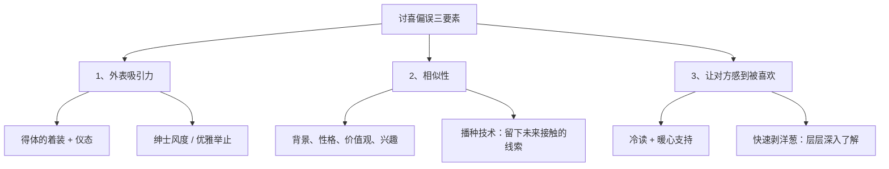

# 补充课02：如何与异性搭讪

## Learning Objectives

- 掌握讨喜偏误（Liking Bias）三要素：外表、相似性、让对方感到被喜欢
- 学会"播种技术"（Seeding）为后续接触埋下伏笔
- 掌握搭讪时机与拒绝后的优雅应对

## Core Idea

很多人不敢与有好感的异性搭讪，是因为内心预设了太多障碍："ta 会不会拒绝我？""我是不是不够好？""这样会不会很唐突？"

打破这种自我限制的第一步：做 **"机会朋友"（Opportunity Friend）**——把每一次相遇都当作一个自然的机会，而不是一场"要么成功要么死"的考试。

### 讨喜偏误理论

**讨喜偏误**（Liking Bias）是一个经典的社会心理学现象：一个人越讨人喜欢，我们就越愿意帮助 ta、和 ta 相处。

要让对方觉得你"讨喜"，有三个核心要素：

#### 要素一：外表吸引力

这不是要你长得多好看，而是：

- **第一印象**：衣着整洁得体，符合场合
- **仪态**：**男生**——绅士风度（开门、让座、注意餐桌礼仪）；**女生**——优雅从容（微笑、姿态大方）
- 你的外表传递的是你对这次相遇的重视程度

#### 要素二：相似性——播种技术（Seeding）

人们天然喜欢与自己相似的人。**播种技术**就是在第一次接触时，留下一些关于你（或对方）的线索，为未来的接触埋下伏笔。

**播种示例：**

| 场景 | 播种话术 / 动作 |
|------|----------------|
| 对方提到喜欢某个乐队 | "刚好我下周有这场演出的票，多了一张" |
| 对方在学某门技能 | "我存了一份很好的学习资料，下次带给你" |
| 共同参加某个活动 | 拍下活动照片，以后可以"上次活动那张照片我洗出来了" |

播种的关键：**要自然，不刻意**。你的"种子"应该是对当前对话的自然延伸，而不是生硬的转折。

> [!TIP] 核心洞察
> 播种技术的本质不是"追求"，而是**创造未来自然接触的理由**。一个好的"种子"让双方都感到舒服，因为你给了一个"合理的借口"让关系继续发展。

#### 要素三：让对方感到被喜欢

**冷读 + 暖心支持 + 快速剥洋葱**：

- **冷读**（Cold Reading）：基于观察做出一些推测性描述，让对方觉得"你很懂我"
  - "看你选这本书，我猜你是一个喜欢深度思考的人"
  - "从你刚才的发言能感觉到，你对自己的要求很高"
- **暖心支持**：在冷读后给予积极的肯定
  - "这种特质在这个时代真的很难得"
- **快速剥洋葱**（Peel Onion Quickly）：通过层层递进的对话，快速了解对方的深层特质
  - 第一层：表面话题（工作、兴趣）
  - 第二层：背后的动机（为什么喜欢这个工作）
  - 第三层：价值观（什么对你最重要）

### 搭讪时机

搭讪的黄金时机是对方**从静态切换到动态的瞬间**：
- 刚用完餐，服务员收拾餐盘的间隙
- 准备起身离开座位时
- 叫服务员结账时
- 在活动现场自由走动时

这个时刻对方处于"过渡状态"，心理防备较低，也更愿意接受新的人际接触。

### 如果被拒绝

> [!WARNING] 记住
> 拒绝不是对你这个人的否定，而是对"当前这个时间、这个地点、这个方式"的不匹配。

被拒绝时的正确回应：
1. **微笑**："没关系，很高兴认识你。"
2. **优雅退场**，不要纠缠，不要追问原因
3. **保持风度**：你的优雅退场反而会给对方留下好印象，未来可能有转机

## Worked Example

**场景**：咖啡馆，你注意到对面桌的一位异性正在看一本你也很喜欢的书。

1. **时机**：对方合上书、起身去吧台续杯时——从静态切换到动态，是搭讪的好时机。
2. **播种**："你好，抱歉打扰一下。我看你在读《人类简史》，这本书我也特别喜欢。第 X 章关于认知革命的部分写得特别精彩。"（播种了"共同兴趣"和"可以继续聊这本书"的线索）
3. **冷读 + 暖心**："会选择读这本书的人，通常对世界运行的底层逻辑有好奇心，这种特质现在很难得。"
4. **结束与再次播种**：交换联系方式后——"我刚好收藏了一个关于这个主题的纪录片清单，回头分享给你。"（为下一次联系播下种子）

## Practice

> [!QUESTION] 自测题
> 你在一个读书分享会上注意到一位异性，ta 分享了一本你也很熟悉的书。以下哪种做法最符合讨喜偏误理论？
> 1. 活动结束后直接过去说"你好，加个微信吧"
> 2. 在 ta 分享结束后，自然地走过去说"你刚才提到的观点很有意思，我之前读的时候也有类似的感受。特别是关于 XX 的部分……"，然后分享你的想法，最后说"我正好整理了一份相关的书单，如果你感兴趣，我可以发给你"
> 3. 等下次活动再找机会
> 4. 托共同朋友帮忙介绍

查看答案

正确答案是 **2**。

- 选项 1 的问题：没有"种子"的突然加微信会让对方觉得唐突，缺少合理的社交理由。
- **选项 2 最佳**：先建立相似的共鸣（共同读过同一本书），运用冷读肯定对方观点，再用播种技术（分享书单）为后续接触铺垫。完整运用了讨喜偏误的三个要素。
- 选项 3 的问题：错过机会不等于创造机会。被动等待可能再也没有下次。
- 选项 4 的问题：通过第三方介绍增加了社交成本，也放弃了当面建立连接的宝贵时机。

**被拒绝也没关系**：微笑着说"没关系，很高兴今天听到你的分享"，优雅退场。

## Review Checklist

- [ ] 我理解了"机会朋友"心态——把相遇当作自然机会而非考试
- [ ] 我记住了讨喜偏误的三要素：外表、相似性、让对方感到被喜欢
- [ ] 我学会了播种技术，能为未来接触埋下自然伏笔
- [ ] 我掌握了搭讪的黄金时机——对方从静态切换到动态的瞬间
- [ ] 我记住了被拒绝后的优雅应对方式

## Application Assignment

在接下来一周内完成一次"搭讪练习"：

1. 选择一个你感兴趣的社交场合（读书会、咖啡馆、展览等）
2. 提前准备一个"种子"——一个可以自然延伸的话题
3. 观察对方的"静态到动态切换"时刻，主动上前
4. 运用冷读 + 暖心支持进行 3 轮对话
5. 结束时播下另一颗"种子"
6. **如果被拒绝**——微笑着说"没关系"，然后记录你的感受

完成后，将你的经验和反思记录在 [[../reference/quick-reference|快速参考]] 的"搭讪与讨喜偏误"部分。

## Next Step

如果已经成功建立联系，下一步就是线上聊天。继续学习 [[s03-wei-xin-liao-tian|补充课03：微信聊天技巧]]，掌握微信聊天的开场、进行与结束礼仪。