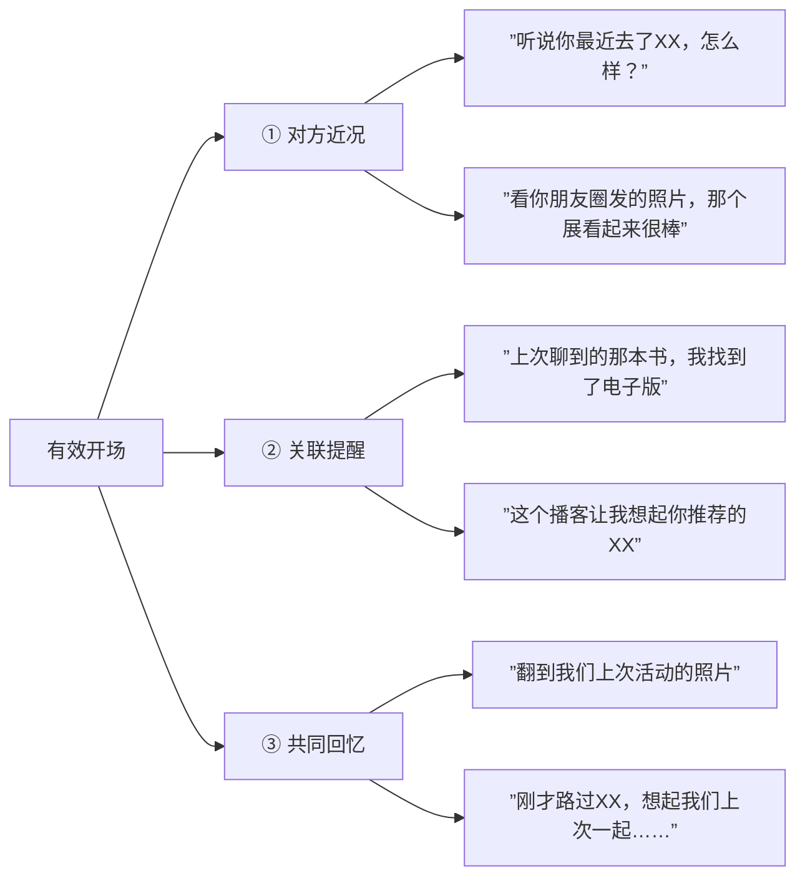

# 补充课03：微信聊天技巧

## Learning Objectives

- 掌握微信聊天的三种开场方式，避开三大"死亡开场"
- 理解信息密度的语言原则，学会用文字营造临场感
- 掌握"谁发起谁结束"的结束礼仪与微信聊天行为守则

## Core Idea

微信聊天是线下社交的延伸，但有其独特的规则。很多人线下交流很自然，一到微信就变得手足无措——因为缺少了表情、语气、肢体语言这些维度，文字表达需要更精细的设计。

### 开场：三种有效方式



#### 三大"死亡开场"——绝对不要用

| 死亡开场 | 为什么避免 |
|---------|-----------|
| "在吗？" | 给对方制造压力——对方需要决定"在还是不在"，好像在等待审判 |
| "有空吗？" | 同样的问题——对方不知道你要干什么，本能地防御 |
| "忙吗？" | 对方说"忙"你没法接，说"不忙"又好像很闲 |

> [!WARNING] 原则
> **有事说事**，直接说明来意。哪怕只是"刚才看到一个东西特别有意思，想分享给你"，也比"在吗"好一万倍。

### 进行：信息密度原则

#### 复杂逻辑 → 简洁（一条消息说清）

需要表达复杂想法时，用**一条消息**说清楚：

```
❌ 不好：
"在吗？"
"我想问个事情"
"就是关于上次那个项目"
"你觉得……"

✅ 好：
"关于上次那个项目的时间安排，我建议调整为周三下午。原因是 A 和 B 两个前置任务预计周二才能完成，周三上午留出缓冲。你觉得这个时间可以吗？"
```

**简洁的复杂信息**使用：一条完整的话 → 分点列表 → 分段陈述。层次越清晰，对方越容易回复。

#### 简单逻辑 → 完整句子（展示素养）

日常简单回应时，**用完整的句子**体现你的修养：

| 短回应 | 印象 | 完整回应 | 印象 |
|-------|------|---------|------|
| "好" | 我知道了（甚至带点冷漠） | "好的" / "好嘞" | 我很乐意 |
| "嗯" | 我知道了 | "嗯嗯" / "明白" | 我愉快地知道了 |
| "收到" | 公事公办 | "收到，谢谢！" | 感谢你的通知 |

#### 描述实时场景，创造临场感

微信聊天的优势在于可以创造"共同在场"的感觉：

```
"我现在正坐在那家我们上次聊到的咖啡馆，窗外的夕阳刚好照在桌子上"

"刚下班，今天路上特别安静，突然想跟你聊聊"
```

这种实时场景描述能瞬间拉近距离，让对方感受到你 Ta 分享当下的心情。

> [!TIP] 核心洞察
> 微信聊天的本质不是传递信息，而是**传递陪伴感**。最好的微信消息是让对方觉得"你就在我身边"。

### 结束：谁发起谁结束

**原则**：谁开启了这段对话，谁负责收尾。

- 你发起的对话 → 你来结束
- 结束语：**"时间不早了，你该休息了"**（不是"我该休息了"）
  - 把关心的焦点放在对方身上，而不是你自己
  - 对比："我该睡了" → 显得自我；"你该休息了" → 显得体贴

### 微信聊天行为守则

| 规则 | 说明 |
|------|------|
| 对方发了朋友圈 → 及时回复 ta 的消息 | 如果对方看到你发了朋友圈却不回消息，说明你不重视这段关系 |
| 打电话前先问一下，预约通话时间 | 突然的语音通话是一种打扰，除非是紧急情况 |
| 情绪性消息 → 投入时间或打电话 | 对方发来难过的消息，不要只回一个表情包，打个电话或认真回复 |
| 不要期待即时回复 | 每个人都有自己的节奏，等几个小时是正常的 |
| 语音消息尽量 < 30 秒 | 超过 30 秒的语音会增加对方的收听成本 |
| 能打字就打字，不滥用语音 | 文字可以快速浏览，语音只能线性播放，效率低 |

## Worked Example

**场景**：活动上认识了一位新朋友，想通过微信加深联系。

**第一天——开场**：

> "嗨！刚才翻到我们活动的照片，这张抓拍特别自然，发给你看看 [图片]。今天聊得很开心！"

→ 用"共同回忆"开场（照片），自然且不突兀。

**聊天进行中**：

> ❌ （错误示范）
> "在吗？"
> "有空吗？"
> "想问你个事"

> ✅ （正确示范）
> "刚才回家的路上一直在回想你提到的那个旅行计划。我之前走过一条类似的路线，有一段特别棒——从 A 到 B 那段山路，清晨的云海绝了。我整理了一份攻略，发给你参考？"

→ 一次说清来意，同时播种了"未来可以聊聊旅行"的种子。

**结束对话**：

> "时间不早了，你该休息了。攻略我整理好发你，晚安！"

→ 谁发起谁结束，把关心放在对方身上。

## Practice

> [!QUESTION] 自测题
> 以下哪些行为违反了微信聊天守则？（多选）
> 1. 对方发了朋友圈，但你忘了回复 ta 两小时前发的消息
> 2. 收到一条好消息，回复"好的"
> 3. 对方发来一条伤心的消息，你回了一个"抱抱"表情包
> 4. 你有急事找对方，直接打微信语音电话
> 5. 你发了一条 58 秒的语音消息

<details>
<summary>查看答案</summary>

**正确答案：1、2（视语境而定）、3、4、5 都有问题。**

- **1 违反了守则第一条**：如果对方看到你发了朋友圈却不回消息，ta 会感到被忽视。建议：要么先回消息再发朋友圈，或者发了朋友圈后立刻去回复消息。
- **2 的问题**：好消息应该用热情回应——"太好了！" / "真的吗？太棒了！"，而不是冷淡的"好的"。"好"表示"我知道了"，"好的"才表示"我高兴地知道了"。好消息值得更热烈的回应。
- **3 违反了守则第三条**：情绪性消息需要时间投入。至少认真回复一段话表达关心，最好打个电话。一个表情包在对方看来是敷衍。
- **4 的问题**：除非是真正的紧急情况，否则微信语音通话需要先文字问一句"方便电话吗？"
- **5 违反了守则第五条**：语音消息最好控制在 30 秒以内。58 秒的语音会让对方失去耐心。
</details>

## Review Checklist

- [ ] 我记住了三种有效开场方式：近况、关联提醒、共同回忆
- [ ] 我牢记三大"死亡开场"：在吗、有空吗、忙吗
- [ ] 我理解了信息密度原则：复杂逻辑简洁说，简单逻辑完整说
- [ ] 我掌握了"谁发起谁结束"的礼仪
- [ ] 我记住了六条微信聊天守则

## Application Assignment

接下来三天，在微信聊天中刻意练习：

1. **开场练习**：每次发起对话时，必须用"近况/关联/回忆"三种方式之一，禁止使用"在吗"
2. **回应练习**：把至少 5 个"好"改成"好的/好嘞"，把 5 个"嗯"改成"嗯嗯/明白"
3. **结束练习**：每次主动发起的对话，都由你来结束，用"时间不早了，你该休息了"
4. **守则检查**：检查自己的语音消息时长是否都控制在 30 秒以内

将练习中遇到的困惑记录在 [[../reference/quick-reference|快速参考]] 的"微信聊天"部分。

## Next Step

掌握了一对一的微信聊天后，继续学习 [[s04-ban-sheng-bu-shu-zhi-jian|补充课04：与半生不熟的人聊天]]，学会与熟悉但不够亲密的人深入交流。