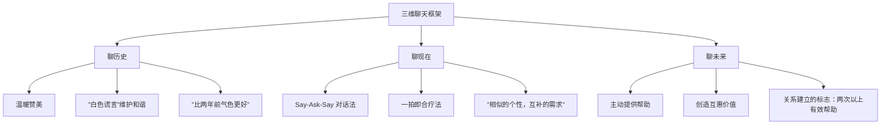

# 补充课04：与半生不熟的人聊天

## Learning Objectives

- 掌握"聊历史 — 聊现在 — 聊未来"三维聊天框架
- 学会使用白色谎言维护社交和谐
- 掌握 Say-Ask-Say 对话法和"一拍即合疗法"
- 学会在对话后建立信息卡片，巩固人际关系

## Core Idea

"半生不熟"是最微妙的人际状态——你们不是陌生人，但也算不上朋友。这种关系的关键突破口在于**逐步拉近距离**，而不是急于求成。

使用**三维聊天框架**，从历史到现在再到未来，层层深入：



### 维度一：聊历史

与半生不熟的人聊过去的重点是**温暖赞美**和**白色谎言**。

#### 白色谎言（White Lies）

白色谎言不是恶意欺骗，而是为了维护**社交和谐**而说的善意美化。这在东方社交文化中尤其重要。

**被误解的白色谎言**：

很多人认为"白色谎言就是不真诚"，但社交场合中，白色谎言是一种**社交润滑剂**：

- 对方问"我是不是胖了？" —— 你说"没有啊，气色看起来很好"（这不是欺骗，而是把焦点从负面转移到正面）
- 久别重逢说**"比两年前气色还要好"**——即使外貌有变化，你也可以加一句"心态看起来更好了"

> [!TIP] 核心洞察
> 白色谎言的本质是**选择性关注**——选择看到积极的方面并表达出来，而不是刻意忽略事实。社交和谐本身就是一种价值，白色谎言维护了这种价值。

#### 温暖赞美的技巧

| 错误示范 | 正确示范 |
|---------|---------|
| "你变老了一点" | "你比上次见面更有味道了" |
| "你那个项目做得好" | "能做出这样的项目，说明你看问题的角度很独特" |
| 泛泛而谈"你很好" | 具体化——"上次你在会上说的那个观点，我后来想了很久" |

### 维度二：聊现在

聊现在的核心工具是 **Say-Ask-Say 对话法**：

```
你：说说（Say）—— "我最近刚换了一份工作，现在做产品设计"
问：提问（Ask）—— "你呢，最近在忙什么项目？"
说：回应（Say）—— [对方回答后] "哇，这个方向很有意思……"
```

#### Say-Ask-Say 的三个要点

1. **先 Say 再 Ask**：先分享自己的近况，再问对方。直接问"你最近怎么样"就像在审问。
2. **Ask 的问题必须只有对方能回答**：
   - ❌ "你喜欢那个工作吗？"（换谁都能回答）
   - ✅ "你在这个项目中具体负责哪个部分？"（只有 ta 能回答）
3. **Say 要接住对方的内容**：对方回答后，你要提供支持性回应，而不是马上跳到下一个问题。

#### 一拍即合疗法

当对方分享了自己的情况后，你需要在第一时间提供"支持性证据"——证明你理解并认同对方。

**一拍即合公式**：认同 + 理由 + 延伸

> 对方："我刚从上海搬来北京。"
> 你："那太棒了！上海和北京的气质确实不同（认同），上海精致讲究，北京开阔大气（理由）。你来了之后最明显的感受是什么？（延伸）"

**"相似的个性，互补的需求"**——这是关系的理想状态：
- **相似**让对方感到"你懂我"
- **互补**让对方感到"你需要我"

### 维度三：聊未来

聊未来的核心是**主动提供帮助，创造互惠价值**。

#### 关系是否建立的检验标准

> 如果你还没有给对方提供过**两次以上的有意义的帮助**，你们的关系还没有真正建立。

"有意义的帮助"指的是：
- 基于对方当前挑战提供的帮助（不是泛泛的"有事找我"）
- 对方真正需要的帮助（不是你觉得对方需要的）
- 付出了你的时间或资源

#### 如何发现对方的"可帮助点"

在聊现在时，注意捕捉对方的**隐性挑战**：

| 对方提到 | 你的机会 |
|---------|---------|
| "最近在学 Python 但有点吃力" | "我认识一个不错的教程，发给你" |
| "项目 deadline 很紧" | "这部分我之前做过，需要帮忙看一下方案吗？" |
| "周末不知道去哪里" | "我上周刚去了一个特别好的徒步路线" |

> [!WARNING] 注意
> 帮助不是居高临下的施舍，而是**平等的价值交换**。在提供帮助时保持谦逊："我刚好有这方面的经验，如果你需要的话，随时说。"

### 聊天后：建立信息卡片

每次与半生不熟的人聊完后，创建一张**信息卡片**，记录你了解到的信息：

```
姓名：王小明
职业：互联网产品经理
家乡：成都
兴趣：徒步、摄影
关键细节：正在学 Python，最近刚搬家到北京
家人：有一个 3 岁的女儿（叫小月亮）
特别喜好：喜欢辣的食物
```

下次见面时，这些信息就是你最好的谈资——"小月亮最近上幼儿园了吗？"——这样的细节让对方感到你真正在乎 ta。

## Worked Example

**场景**：你在一次朋友聚会上遇到了一位以前见过两三次的人，你们之间一直有些尴尬，不知如何深入。

**第一步：聊历史**

> "上次见面还是在老张的生日会上，有半年了吧？（建立时间锚点）你当时穿的那件外套很好看，我一直记得（温暖赞美）。最近怎么样？感觉你状态不错，比上次见的时候精神多了（白色谎言——正向关注）。"

**第二步：聊现在**

> Say："我最近辞了职，开始自己做点小项目，主要是做独立开发。在做一个效率工具类的产品。"
> Ask："你呢，还在之前那家公司吗？最近在忙什么有意思的项目？"
> 对方回答后 —— Say："哇，智能家居这块确实正在风口上（认同）。我去年也研究过一阵子，技术栈是 IoT + 边缘计算对吧？（延伸——只有对方能确认的细节）"

**一拍即合疗法**：

> 对方说："对，IoT 那块坑特别多，设备兼容性让人头疼……"
> 你："太有同感了（一拍即合）！我之前的项目也被兼容性问题折磨过。不过这种挑战恰恰说明你在做真正有价值的事——简单的事情早就被别人做完了（支持性证据）。"

**第三步：聊未来**

> 捕捉到对方的挑战："设备兼容性确实是个大问题。我之前整理过一个各平台协议的对比表，回头发给你参考。"
> 提供帮助，播种未来机会。

**第四步：记录信息卡片**

聚会后记录：对方在做智能家居 IoT，遇到设备兼容性问题，性格偏务实，喜欢直接解决问题。

## Practice

> [!QUESTION] 自测题
> 你在公司年会上遇到了一个平时只打过招呼、没深入聊过的同事。以下哪种做法最符合"聊半生不熟的人"的三维框架？
>
> 1. 直接问"你最近在忙什么项目？"然后不断追问细节
> 2. 先说自己最近在做一个项目遇到的困难，再问对方负责什么项目，对方回答后说"这个很有意思"，然后继续问下一个问题
> 3. 先回忆上次团建时的一个共同经历（聊历史），再说自己最近的近况（Say），然后问对方最近的项目（Ask），对方回答后给出支持性反馈（Say），最后提出"我这里有份资料可能对你有帮助"（聊未来）
> 4. 只说自己的事情，等对方主动提问

<details>
<summary>查看答案</summary>

正确答案是 **3**。

- 选项 1 的问题：没有先 Say 就 Ask，像审问。而且没有提供支持性反馈，只是不断追问，对方会感到压力。
- 选项 2 的问题：流程基本正确（Say-Ask-Say），但缺少了聊历史和聊未来的维度，也不够深入。说"这个很有意思"是泛泛的认同，不是"一拍即合疗法"的深度支持。
- **选项 3 最佳**：完整运用了三维框架——
  - 聊历史（共同经历）
  - 聊现在（Say-Ask-Say + 支持性反馈）
  - 聊未来（主动提供帮助）
  同时在对话中注入了温暖赞美和一拍即合的元素。
- 选项 4 的问题：完全不问对方，会让对话变成单向的自我展示，对方会感到你不是真的想了解 ta。
</details>

## Review Checklist

- [ ] 我理解了"聊历史 — 聊现在 — 聊未来"三维聊天框架
- [ ] 我学会了白色谎言是社交润滑剂而非欺骗
- [ ] 我掌握了 Say-Ask-Say 对话法的三个要点
- [ ] 我理解了"一拍即合疗法"并提供支持性证据
- [ ] 我记住了"两次以上有意义的帮助"是关系建立的标志
- [ ] 我学会了对话后建立信息卡片

## Application Assignment

在接下来一周内，找到一位"半生不熟"的人（同事、同学、朋友的朋友），尝试完整运用三维聊天框架：

1. **准备阶段**：回顾你已有的关于 ta 的信息，想好一个"聊历史"的锚点
2. **对话阶段**：
   - 先用"聊历史"打开话题
   - 用 Say-Ask-Say 进入"聊现在"
   - 使用一拍即合疗法回应对方
   - 捕捉对方的挑战，进入"聊未来"并提供帮助
3. **对话后**：建立信息卡片，记录本次了解到的所有细节
4. **跟进**：兑现你的帮助承诺，发送之前说好的资料

完成后将信息卡片整理到 [[../reference/glossary|术语表]] 的"人际关系维护"章节，并与 [[../reference/quick-reference|快速参考]] 中的三维聊天框架做对照复盘。

## Next Step

你已经完成了所有四节补充课的学习。返回 [[../00-course-map|课程地图]] 查看你的整体学习进度，或参考 [[../reference/quick-reference|快速参考]] 中的综合社交礼仪速查表进行日常练习。