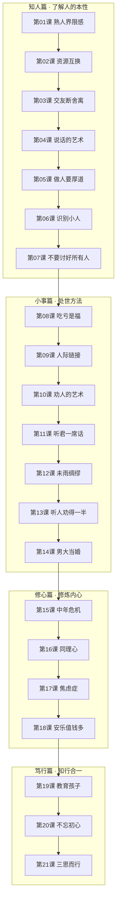

# 课程地图

## 学习建议

- **按顺序学习**：课程设计有内在递进关系，知人→小事→修心→笃行
- **每课约15-20分钟**：先读核心金句和故事，再做实践练习
- **重视练习**：每课结尾有可操作的练习，做一遍比读十遍管用
- **配合速查表**：遇到遗忘时，参考 [[reference/glossary|金句速查表]] 快速回顾

## 课程进度跟踪

- [ ] **知人篇**（第01-07课）
- [ ] **小事篇**（第08-14课）
- [ ] **修心篇**（第15-18课）
- [ ] **笃行篇**（第19-21课）